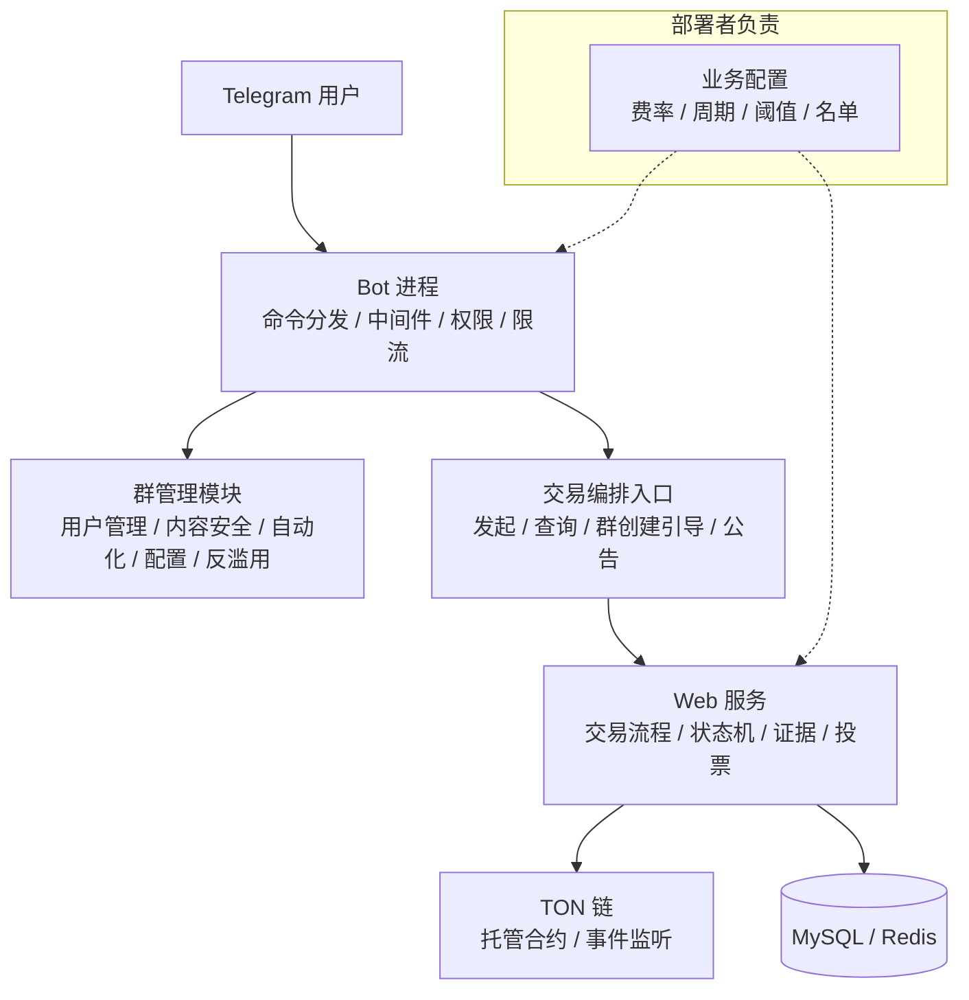

# TON Escrow Toolkit

> 一个通用的 Telegram 群管理 + 链上托管交易 **技术工具包**。
> 本项目只提供技术能力：不提供运营服务、不含业务参数、不含合规方案，也不针对任何特定运营主体。

---

## 1. 这是什么，不是什么

**是**：一套可复用的技术组件——Telegram 机器人框架、群管理能力、链上托管合约、交易状态编排引擎、争议与投票流程引擎。

**不是**：一个可以直接运营的业务系统。本仓库不包含任何业务数值（费率、质押额、周期、阈值）、不含牌照与合规方案、不含运营指导。所有业务参数由部署者自行设定，并自行承担其后果。

设计原则一句话：**代码回答"能不能做到"，配置回答"允许做到什么"。**

---

## 当前实现状态（与蓝图的差距）

本仓库处于**能力累积阶段**。上面 §5 列的是能力蓝图，以下是它的真实完成度——写在这里是为了不让使用者按蓝图去部署然后困惑。

**没有 Telegram Bot 代码。** `TelegramBots 10.3.0` 已在依赖里、Spring Boot 版本也是为它锁定的，但至今没有一行命令处理、权限校验或中间件。

**`tgg-app` 启动后会自行退出，这是预期行为。** 它目前是个空壳：既没有 Bot 长轮询，也没有 Web 容器，因此没有任何非 daemon 线程保活。`java -jar` 会打印 `Started EscrowBotApplication in ~2s` 然后正常关闭。**这不是部署失败**——常驻进程要等 Bot 或 Web 接入之后才有。当前它唯一的用途是承载集成测试（验证装配与迁移）。

**链上部分只有抽象。** `ChainSource` 没有真实实现——自建 liteserver 与公共 RPC 都还没接。`BalanceCrossVerifier` 的交叉验证与确认数门槛是完整的、有测试的，但它目前接的是测试替身。

**配置尚未与 `application.yml` 打通**（详见 §6 开头的说明）。

**未接入 Redis**，因此反刷屏与多级限流（G6 / G23）尚未实现——它们依赖滑动窗口。

已实现且经测试覆盖的，是那些**不依赖外部设施**的部分：担保订单状态机（8 态 + fail-closed 守卫）、裁决多签规则与验签链路（含生产接线）、联邦节点 Ed25519 密钥与验签、违禁词匹配、日志脱敏、入群风险评分、链上余额双源交叉验证。

---

## 2. 支持边界

本项目的维护范围明确限定，请先读到这一节再提 issue：

- 只处理**通用性**问题：缺陷、通用功能请求、文档修正
- **不提供**部署协助、不代为配置、不针对特定部署排查问题
- **不接受**定制开发需求
- 不对任何具体部署的合规性、可用性、资金安全作出承诺

这条边界是本项目定位的一部分，不是不友善。

---

## 3. 技术栈

| 组件 | 选型 | 用途 |
|---|---|---|
| 语言 | Java 21 LTS | 虚拟线程 |
| 框架 | Spring Boot 3.5.16（**刻意锁定，勿升 4.x**） | 自动装配——Boot 4.x 用 Jackson 3，与 TelegramBots 10.3.0 的 Jackson 2 注解不兼容，症状是 Update 反序列化**静默失败**；理由详见 `pom.xml` 注释 |
| Bot 框架 | TelegramBots | 机器人接入 |
| 数据库 | MySQL 8.0 | 持久化 |
| 缓存 | Redis 7.0 | 限流窗口 / 状态 / 投票 |
| 队列 | Kafka（可选） | 异步处理 |
| 区块链 | TON（ton4j + TON Connect 2.0） | 链上托管 |
| 合约语言 | Tolk | 强类型合约 |
| 限流 | Resilience4j | 限流 / 熔断 |
| 监控 | Prometheus + Grafana | 可观测性 |
| 部署 | Docker + Docker Compose | 编排 |

---

## 4. 架构

分层说明：
- **Bot 层**：入口、通知、查询、群管理。**不适合承载需要实名与留痕的流程**（见 §7）。
- **Web 层**：交易流程、状态机、证据、投票。可承载需要审计留痕的流程。
- **链上层**：资金托管与事件。合约只暴露能力，不内建业务数值。
- **配置层**：所有业务决策集中于此，由部署者提供。

---

## 5. 能力清单

编号保留用于追溯，均为**能力 ID**，不代表默认行为。所有行为的具体取值见 §6。

### 5.1 群管理（30 项）

| ID | 能力 |
|---|---|
| G1 | 踢出 / 封禁 / 解封 |
| G2 | 禁言 / 解除禁言（支持定时） |
| G3 | 警告 / 清除警告（累计计数） |
| G4 | 群主自主封禁（独立 API） |
| G5 | 违禁词过滤（Trie 树，精确 + 正则） |
| G6 | 反刷屏（Redis 滑动窗口） |
| G7 | 重复消息判定（消息哈希 + 计数，阈值可配置） |
| G8 | 消息自动删除（违规 + 服务消息） |
| G9 | 链接过滤（白名单 + 短链接检测） |
| G10 | 媒体过滤（文件类型白名单） |
| G11 | 欢迎新成员（模板 + 变量替换） |
| G12 | 入群验证（策略化配置，Mini App 问答） |
| G13 | 超时未验证踢出（超时可配置） |
| G14 | 功能开关（按群组配置） |
| G15 | 管理员配置（添加 / 移除） |
| G16 | 日志频道（操作推送） |
| G17 | 群组信息同步（定期） |
| G18 | 定时任务 + 自动回复（关键词触发） |
| G19 | 静默模式（时段配置） |
| G20 | 年龄门槛流程（可配置，默认关闭） |
| G21 | 分级权限策略（可配置） |
| G22 | 权限系统（角色 + 权限校验） |
| G23 | 三级限流（用户 / 群组 / 全局） |
| G24 | 日志脱敏（Token、用户 ID 不进日志） |
| G25 | 数据备份（MySQL + Redis） |
| G26 | 入群滑动窗口检测（窗口与阈值可配置） |
| G27 | 保护模式（暂时拒绝新申请） |
| G28 | 风险评分（多因子：语言 / 头像 / username / 账号新旧） |
| G29 | 阈值拒绝（阈值可配置） |
| G30 | 第二渠道验证入口（可插拔） |

### 5.2 交易编排 — Bot 内（6 项）

| ID | 能力 |
|---|---|
| T1 | 交易入口 |
| T2 | 交易状态查询 |
| T3 | 信用分联动接口 |
| T4 | 与群管理模块联动 |
| T5 | 交易群创建引导 |
| T6 | 交易群机器人公告 |

### 5.3 交易编排 — Web 平台（24 项）

| ID | 能力 |
|---|---|
| T7 | Web 交易界面 |
| T8 | Telegram OAuth 登录 |
| T9 | TON 代币支付接入 |
| T10 | TON 合约托管接入 |
| T11 | 资金冻结 / 释放 / 退款 |
| T12 | 交易状态机 |
| T13 | 超时自动处理（时长可配置） |
| T14 | 争议发起与冻结 |
| T15 | 多签裁决（阈值可配置） |
| T16 | 多签规则校验 |
| T17 | 证据提交 |
| T18 | 交易评价 |
| T19 | 链上事件监听 |
| T20 | 合约审计支持（构建产物与验证脚本） |
| T21 | 时间锁 + 紧急暂停（时长可配置） |
| T22 | 可插拔身份校验接口（默认不启用） |
| T23 | 并发交易上限（可配置） |
| T24 | 交易冷却期（可配置） |
| T25 | 争议期间并发冻结（可配置） |
| T26 | 维护期选择（选项集合可配置） |
| T27 | 超时自动确认（时长可配置） |
| T28 | 争议期间倒计时暂停（可配置） |
| T29 | 费用分配（费率与接收方可配置） |
| T30 | 多方费用分配（同上，支持多接收方） |

### 5.4 群聊留痕与投票（6 项）

| ID | 能力 |
|---|---|
| T31 | 交易群生命周期管理 |
| T32 | 交易群静默期（时长可配置） |
| T33 | 群成员投票 |
| T34 | 投票人回避机制（回避窗口可配置） |
| T35 | 证据双通道保存（机器人记录 + 可选上链存证） |
| T36 | 投票奖励分配（分配策略可配置） |

### 5.5 安全增强（7 项）

| ID | 能力 |
|---|---|
| T37 | 重放保护（每请求绑定唯一 seqno） |
| T38 | 交易阶段标注 |
| T39 | 代币真实性验证（可信合约地址列表由部署者配置） |
| T40 | 链上存证（存证点可配置） |
| T41 | 策略化准入配置 |
| T42 | 风险提示文案注入（文案可配置） |
| T43 | 可升级代理合约（默认不启用，见 §8） |

### 5.6 体验增强（6 项）

| ID | 能力 |
|---|---|
| T44 | 首单规则引擎（规则可配置） |
| T45 | 主动推送（关键节点通知） |
| T46 | 争议双方陈述流程 |
| T47 | 交易记录可视化 |
| T48 | 分级处置策略（策略可配置） |
| T49 | 社区提示调度（内容与频率可配置） |

### 5.7 反滥用（9 项）

| ID | 能力 |
|---|---|
| T50 | 设备关联检测（阈值可配置） |
| T51 | 循环交易模式检测（阈值可配置） |
| T52 | 新账号限制（判定规则可配置） |
| T53 | 信用累计抑制策略（可配置） |
| T54 | 可疑交易关系标记 |
| T55 | 评论区钓鱼提示文案 |
| T56 | 奖励发放渠道白名单 |
| T57 | 账号异常检测 |
| T58 | 定期提示调度 |

---

## 6. 配置面（部署者决定）

**这一节是本项目定位的核心。** 以下参数全部由部署者设定；仓库提供的默认值仅为**示例**，不构成建议。

> ⚠️ **实现状态（请先读这一段）**：下表是**设计意图与键名约定**，当前代码中**尚未实现任何 Spring 配置绑定**——全仓没有 `@ConfigurationProperties`，`application.yml` 里也还没有这些键。**照抄下表到配置文件不会有任何效果。**
>
> 已经实现的策略参数目前以 Java 对象承载、由调用方在构造时传入：
> - `RiskPolicy` — 入群风险的权重表、账号年龄门槛、允许语言列表、复核/拒绝阈值
> - `BannedWordMatcher.compile(exactWords, regexPatterns)` — 违禁词表与正则表
> - `EscrowMultiSigRule` — 裁决签名方规则（固定规则，非参数化）
> - `BalanceCrossVerifier.read(address, sources, requiredConfirmations)` — 链上确认数门槛与数据源列表
>
> 把这些与 `application.yml` 打通属于待办；届时下表的键名即为目标命名。在那之前，本表的作用是**记录设计意图与命名约定**，不是使用说明。
>
> 另需注意：本节与 §2「支持边界」并不冲突——即使配置项就位，本项目仍**不提供**合规方案、牌照指引或运营指导。

| 参数 | 含义 | 示例值 | 决定者 |
|---|---|---|---|
| `escrow.fee.rate` | 释放时扣除的费率 | `0`（示例） | 部署者 |
| `escrow.fee.recipients` | 费用接收方列表 | 空（示例） | 部署者 |
| `escrow.deposit.mode` | 保证金模式 | `none` | 部署者 |
| `escrow.arbitration.stake` | 投票质押额 | `0`（示例） | 部署者 |
| `escrow.arbitration.threshold` | 多签阈值 | `2-of-3`（示例） | 部署者 |
| `escrow.arbitration.signers` | 签名方构成 | 空（必须由部署者填充） | 部署者 |
| `escrow.limit.concurrent` | 同一用户并发交易上限 | `1`（示例） | 部署者 |
| `escrow.limit.cooldown` | 交易完成后冷却期 | `PT0S`（示例） | 部署者 |
| `escrow.maintenance.options` | 维护期可选时长集合 | `[PT1D, PT7D]`（示例） | 部署者 |
| `escrow.maintenance.autoConfirm` | 超时自动确认时长 | `PT7D`（示例） | 部署者 |
| `escrow.group.archiveDelay` | 交易群归档延迟 | `PT7D`（示例） | 部署者 |
| `escrow.group.silencePeriod` | 静默期时长 | `PT7D`（示例） | 部署者 |
| `timelock.upgrade` / `.pause` / `.resolve` | 时间锁时长 | `PT72H` / `PT24H` / `PT24H`（示例） | 部署者 |
| `verification.window.threshold` | 入群滑动窗口阈值 | `10/60s`（示例） | 部署者 |
| `verification.risk.threshold` | 风险评分拒绝阈值 | `70`（示例） | 部署者 |
| `abuse.deviceLink.threshold` | 设备关联判定阈值 | `0`（默认关闭） | 部署者 |
| `abuse.circular.threshold` | 循环交易判定阈值 | `0`（默认关闭） | 部署者 |
| `chain.trustedTokens` | 可信代币合约地址列表 | 空（必须由部署者填充） | 部署者 |
| `retention.policy` | 数据留存策略 | 空（必须由部署者决定） | 部署者 |
| `identity.provider` | 身份校验提供方 | 空（默认不启用） | 部署者 |
| `compliance.hooks` | 外部校验钩子 | 空（默认不启用） | 部署者 |
| `escrow.escapeHatch.mode` | 托管方失效时的逃生舱模式：`none`（仅披露）/ `timeout-refund`（超时默认退款给买方）/ `guardian`（引入独立第四签名方） | `none`（默认关闭） | 部署者 |

约定：**`0` / `空` / `默认关闭` 表示该能力未被启用**——即本项目不会替部署者做出任何业务决策。

---

## 7. 渠道约束（技术事实）

Telegram Bot **无法**做到可靠的地域限制，也**无法**满足需要实名与可审计留痕的流程要求。

因此本项目的设计约定是：
- Bot 层只承担入口、通知、查询、群管理
- 需要留痕与实名的流程放在 Web 层
- 若部署者需要限制服务地域，必须在 Web 层实现，Bot 层无法代劳

这是架构约束，不是建议。

---

## 8. 合约接口（Tolk）

合约只暴露能力，不内建业务数值。费率、阈值、接收方、时间锁时长均来自部署时注入或治理配置。

| 函数 | 用途 |
|---|---|
| `fund()` | 买方锁定代币 |
| `release()` | 按可配置规则释放给收款方 |
| `refund()` | 超时或取消后退回 |
| `dispute()` | 任一方发起争议，资金冻结 |
| `resolve()` | 多签裁决（签名方与阈值可配置） |
| `recv_internal()` | 处理弹回消息 |

实现约束：
- 所有状态变更函数使用 `impure` 修饰符
- 减法前校验余额充足，防整数溢出
- 使用 commit-reveal 生成随机数
- 转账前校验代币发送者合约地址（`chain.trustedTokens`）

**关于可升级性（T43）**：代理合约默认不启用。可升级意味着事后可以改变资金规则，这与"合约内不保留单方提款能力"是相反方向的取舍。若部署者启用，升级权限的持有者与时间锁由部署者决定——本项目不预设。

---

## 9. 中立性声明

本项目是通用技术工具，不内建任何用于规避监管、隐藏资金流向或混淆交易来源的功能。若部署者自行添加此类功能，属于其个人行为，与本项目无关。

---

## 10. 许可与免责

- 许可证：AGPL 3.0（见 `LICENSE`）
- 使用须知：见 `DISCLAIMER.md`

> AGPL 3.0 的要点提示：通过网络向用户提供本软件服务的一方，需向该等用户提供其修改后的完整源码。若你需要闭源使用，请先确认许可条件是否满足你的场景。
