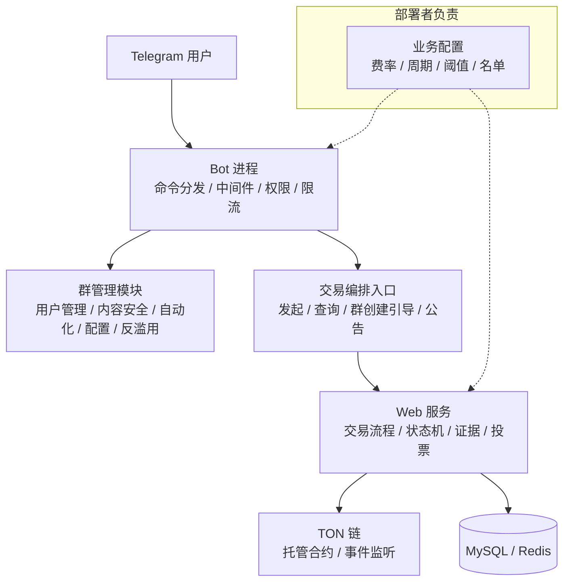

# TON Escrow Toolkit

> 一个通用的 Telegram 群管理 + 链上托管交易 **技术工具包**。
> 本项目只提供技术能力：不提供运营服务、不含业务参数、不含合规方案，也不针对任何特定运营主体。
>
> ⚠️ **2026-10-03 范围变更**：群管理功能已**整体移除**（管理命令/内容安全/入群风控/运维辅助全族），
> 项目现为**纯担保交易**工具包。本文中群管理相关章节**已失修**，深度清理批次待续
> （清单见 `.rivet/HANDOFF.md` 第 17 条）；保留者：**交易群**（ET-05/06/39/40）与群内 `/escrow` 命令。

> 📌 **新接手**：先读 `docs/INDEX.md`（文档地图——告诉你该读哪份、该信哪份）；
> **想直接跑起来**：`docs/QUICKSTART.md`（构建 / 测试 / 启动的最短路径）。

---

## 1. 这是什么，不是什么

**是**：一套可复用的技术组件——Telegram 机器人框架、群管理能力、链上托管合约、交易状态编排引擎、争议与投票流程引擎。

**不是**：一个可以直接运营的业务系统。本仓库不包含任何业务数值（费率、质押额、周期、阈值）、不含牌照与合规方案、不含运营指导。所有业务参数由部署者自行设定，并自行承担其后果。

设计原则一句话：**代码回答"能不能做到"，配置回答"允许做到什么"。**

---

## 当前实现状态（与蓝图的差距）

本仓库处于**能力累积阶段**。上面 §5 列的是能力蓝图，以下是它的真实完成度——写在这里是为了不让使用者按蓝图去部署然后困惑。

> **本节已于 2026-09-29 重写。** 此前版本称"没有 Bot 代码 / 应用启动即退出 / 链上只有抽象 / 配置未打通"，
> 那些描述在多个波次前即已失效。**本节也会过时**——引用具体数字前，请以
> `docs/CODE-VS-SPEC.md` 头部基线块（含可复算命令）为准，不要采信本文里的任何写死计数。

**Bot 层已接线。** 装配层按领域拆分为 `BotWiring`（核心出口链）
+ `TradeWiring`（交易/争议/信用/通知）+ `ChainWiring`（链上/钱包/部署/存证），共 49 个 bean
（2026-10-03 拆分，方法体逐字保留）：`BotDispatcher` 路由 `/escrow …`
（走 `TradeCommandHandler` → `EscrowTradeService`）、群管理命令（`/kick /ban /unban /mute /unmute /del /warn /unwarn`）、
违禁词（`BannedWordRegistry`）、内容安全处置（`MessageGuardService`：链接 → 媒体 → 可选重复检测 → 限流）。
`tgg-app` 含 Bot 长轮询与 Web 容器，**是常驻进程**——"启动后自行退出"的描述已不成立。

**交易命令清单（`/escrow` 子命令）。** `invite <金额> <币种>`（生成深链邀请，对方点开自动接单）·
`create <卖方ID> <金额> <币种>` → `confirm …`（两步流：先预览风险提示、再落单，不可跳过）·
`lock` / `deliver` / `release` / `refund` / `dispute <订单号>`（推进交易）· `status <订单号>` ·
`cancel <订单号>` · `review <订单号> <评分1-5>` · `rank [条数]`（交易榜，默认 10 条、上限 20，**默认脱敏**，
不显示完整用户 ID）· `credit`（**只查自己**的信用摘要：评分 + 等级徽标 + 五维拆解）·
`publish` / `unpublish`（ET-80：榜单公开 @username 的 opt-in / opt-out，**默认脱敏**；
无 @username 时 publish 会提示先去 Telegram 设置用户名，不落成无效开关）。

**免输 ID 的「回复式」用法（2026-10-03 起）。** Telegram 客户端不展示数字 ID——
在群里先**回复**对方的消息、再发 `/escrow create <金额> <币种>`，卖方即取被回复者，
预览回执也会引导你"回复同一条消息发 confirm"（全程不碰数字 ID）。管理命令同理：
回复某人的消息后发 `/kick`（不带 ID）即作用于被回复者，`/del`（不带消息号）删除被回复的那条消息。
显式参数优先于回复目标（同时给出时以参数为准）。

权威文案以 `TradeCommandHandler.USAGE` 为准——改命令请同步改它。

**Web 层已可用。** Mini App 端点 `/api/trade/{create,invite,accept}` 走 `initData` 验签；
`/miniapp` 提供表单页；`/admin/**`（违禁词管理、链上地址推导）已由 **Spring Security** 保护
（需 HTTP Basic；**未配置 `tgg.admin.*` 凭据时一律 401**，不是放行）。

**链上部分：provider 已落地，但未经真机验证。** jetton 钱包地址推导有已测的判定层
（`JettonWalletAddressResolver` + `TonAddresses` 的 CRC16 校验和判据），provider 为
`AdnlJettonWalletQuery`（纯 Java ADNL，免原生库；此前的 Tonlib 路线因线上加载不了 `libtonlibjson` 已删除）。
**但 `AdnlLiteClient` 的那一跳已有实测**：2026-09-29 以独立探针（复刻 `AdnlJettonWalletQuery` 的
`ownerArg → runMethod → addressFromResult`）在服务器上运行，**mainnet 已连上 liteserver**（`get_wallet_address`
返回 `exitCode=0`，解析出真实地址）、testnet 亦可连——**旧结论"从未真正连上 liteserver"已作废**。
仍未验的是**最后一跳的应用形态**：实例配上真实 `TGG_CHAIN_JETTON_MASTER` 后该端点返回 200（属部署者配置）；
`ChainSource` / `BalanceCrossVerifier` 也仍无真实数据源。

**配置面已部分打通。** `application.yml` 已绑定 `tgg.trade.*`、`tgg.pending.ttl`、`tgg.confirm.window`、`tgg.invite.ttl`、
`tgg.webapp.*`、`tgg.notify.*`、`tgg.join.*`、`tgg.protection.*`、`tgg.guard.*`、`tgg.chain.*`、
`tgg.admin.*`、`tgg.log.salt`、`tgg.warning.*`、`tgg.moderation.*`、`tgg.tonpay.*`、`tgg.welcome.template`、`tgg.trade-group.silence-days`、
`tgg.dispute.evidence-window`、`tgg.dispute.require-statements`、
`tgg.fee.*`（三费分离，默认 0 不收费；首单豁免默认开）、`tgg.risk.*`（入群风险评分，weights 留空 = 不启用）。
**注意 §6 表中那些"设计意图键名"与它们不是同一套**（那是更粗粒度的规划命名），照抄 §6 不会有任何效果。
**已落地配置键的权威清单见 `docs/CONFIG-KEYS.md`**（67 键 × 默认值/环境变量/行为说明，命令实测生成）。

**（⚠ 功能已随群管理移除——2026-10-03 起此键无代码消费者，保留供迁移期参考）原频道傀儡防御（GM-12）的开关是 `TGG_GUARD_ALLOWED_CHANNELS`**（允许以频道身份发言的频道名，逗号分隔、
忽略 `@` 前缀与大小写）。它的三个状态刻意不同：**不设该变量 = 不启用这项防御**（默认行为与从前一致）、
**设成空串 = 全拦**（空集即"谁都不许"，适合只允许个人发言的群）、**设具体名字 = 仅放行这些频道**。
未配置时把"全部频道帖"当成违规会删光群里正当的频道发言，故两者必须分开。

**入群风险评分（GM-24/25）的开关是 `TGG_RISK_WEIGHTS`**（形如 `NO_USERNAME=30,NEW_ACCOUNT=30`，
因子名取 `NO_AVATAR` / `NO_USERNAME` / `NEW_ACCOUNT` / `LANGUAGE_NOT_ALLOWED`）。**不设 = 不启用**（默认不评分、
照常欢迎）；配套阈值 `TGG_RISK_REVIEW_THRESHOLD`（默认 20）、`TGG_RISK_REJECT_THRESHOLD`（默认 50）、
`TGG_RISK_NEW_ACCOUNT_DAYS`、`TGG_RISK_ALLOWED_LANGUAGES`。命中 REJECT 会被移出；命中 REVIEW 照常欢迎、**不**在群里公开标记，只留痕，**若**配置了
`TGG_RISK_REVIEW_NOTIFY_CHAT`（管理会话 ID）则另把「待复核」**私下**投给管理员（**留空 = 不启用**，
退回只留痕；投递失败只留痕、不假装已通知）。

**信用分权重可配 `TGG_CREDIT_WEIGHTS`**（④ 差距 1；逗号分隔 5 值，顺序 = 完成数 / 争议率(反向) /
好评率 / 对手多样性(反向) / 活跃时长）。**留空 = 默认口径 `0.30,0.25,0.20,0.15,0.10`**（既有行为零漂移）；
非法值（项数≠5、项越界 [0,1]、**总和≠1**）启动期抛——分数系统性偏移比缺配置更危险，fail-fast。
配套 `TGG_CREDIT_DECAY`（④ 差距 2 轻量时间衰减；格式 `宽限天数,步长天数,每步因子,下限`，如 `365,180,0.9,0.3`）。
**留空 = 不衰减**；只作用于「活跃时长」维度，因子会写进 `/escrow credit` 的拆解文案（不静默改数）。
互刷剔除阈值复用 `TGG_FRAUD_CONCENTRATION_THRESHOLD`（默认 0.6）——评估链说"可疑"而评分链照加，
是最难查的自相矛盾，故两处**同一来源**。周榜惰性推送（④ 差距 4，ET-77）由 `TGG_CREDIT_WEEKLY_PUSH`
（默认 true）与 `TGG_CREDIT_WEEKLY_PUSH_SIZE`（默认 10）控制：**不引入调度器**，某个自然周内群里有
第一次交互时搭车推一条（每周每群最多一条，私聊不推，空榜不推）。去重状态在进程内——重启后同周可能
多推一次，这是"不做持久表"换来的已知边界。
**两个因子在生产里永远不命中且这是刻意的**：`NO_AVATAR`（需每成员一次头像 API 往返，未采集）与
`NEW_ACCOUNT`（Telegram 不暴露账号注册时间）——把它们配进权重表不会有任何效果，见
`JoinSignals` 的注释；写成未知因子名则在**启动期直接失败**。

**未接入 Redis**，因此依赖滑动窗口的能力目前是**进程内实现**（`SlidingWindowCounter` 等）：
单实例可用、多实例不共享——G6 / G23 的"Redis 滑动窗口"仍是蓝图而非现状。同理，本项目
**无调度器**，所有超时都是**惰性判定**（在命令触发或入群事件时才结算），不会自动到期执行。

已实现且**经测试覆盖**的部分：担保订单状态机（8 态 + fail-closed 守卫 + 乐观锁）、裁决多签规则与验签链路、
联邦节点 Ed25519、违禁词匹配、日志脱敏（带盐）、**入群风险评分**（信号/权重/阈值全配置驱动，默认不启用；命中 REJECT 才移出）、爆发保护 / 订阅门禁、
内容安全（链接 / **频道身份** / 媒体 / 限流 / 重复）、交易准入三规则、深链邀请、维护期与超时策略、
交易评价、应用层安全门禁、**交易者信用与榜单**（五维评分 + 等级 + 脱敏榜单，
`/escrow rank` / `/escrow credit`；仅对既有订单/评价表做聚合，未新增表）、
**订单列表 `/escrow my` 与 inline 动作按钮**（订单回执按「状态 × 角色」附此刻可执行的动作；
点击按钮只是"更友好的入口"——它解码成等价命令，走同一条权限/状态守卫链，**不是授权**）。
**逐项完成度与"是否接线"见 `docs/CODE-VS-SPEC.md`**，
**只能在真机核销的项见 `docs/ONLINE-VERIFICATION.md`**。

---

## 2. 支持边界

本项目的维护范围明确限定，请先读到这一节再提 issue：

- 只处理**通用性**问题：缺陷、通用功能请求、文档修正
- **不提供**部署协助、不代为配置、不针对特定部署排查问题
- **不接受**定制开发需求
- 不对任何具体部署的合规性、可用性、资金安全作出承诺

这条边界是本项目定位的一部分，不是不友善。

---

## 3. 技术栈

| 组件 | 选型 | 用途 |
|---|---|---|
| 语言 | Java 21 LTS | 虚拟线程 |
| 框架 | Spring Boot 3.5.16（**刻意锁定，勿升 4.x**） | 自动装配——Boot 4.x 用 Jackson 3，与 TelegramBots 10.3.0 的 Jackson 2 注解不兼容，症状是 Update 反序列化**静默失败**；理由详见 `pom.xml` 注释 |
| Bot 框架 | TelegramBots | 机器人接入 |
| 数据库 | MySQL 8.0 | 持久化 |
| 缓存 | Redis 7.0 | 限流窗口 / 状态 / 投票 |
| 队列 | Kafka（可选） | 异步处理 |
| 区块链 | TON（ton4j + TON Connect 2.0） | 链上托管 |
| 合约语言 | Tolk | 强类型合约 |
| 限流 | Resilience4j | 限流 / 熔断 |
| 监控 | Prometheus + Grafana | 可观测性 |
| 部署 | Docker + Docker Compose | 编排 |

---

## 4. 架构

```mermaid
flowchart TB
    U[Telegram 用户] --> BOT[Bot 进程<br/>命令分发 / 中间件 / 权限 / 限流]
    BOT --> GM[群管理模块<br/>用户管理 / 内容安全 / 自动化 / 配置 / 反滥用]
    BOT --> TX[交易编排入口<br/>发起 / 查询 / 群创建引导 / 公告]
    TX --> WEB[Web 服务<br/>交易流程 / 状态机 / 证据 / 投票]
    WEB --> CHAIN[TON 链<br/>托管合约 / 事件监听]
    WEB --> STORE[(MySQL / Redis)]

    subgraph 部署者负责
        CFG[业务配置<br/>费率 / 周期 / 阈值 / 名单]
    end
    CFG -.-> BOT
    CFG -.-> WEB
```

分层说明：
- **Bot 层**：入口、通知、查询、群管理。**不适合承载需要实名与留痕的流程**（见 §7）。
- **Web 层**：交易流程、状态机、证据、投票。可承载需要审计留痕的流程。
- **链上层**：资金托管与事件。合约只暴露能力，不内建业务数值。
- **配置层**：所有业务决策集中于此，由部署者提供。

---

## 5. 能力清单

编号保留用于追溯，均为**能力 ID**，不代表默认行为。所有行为的具体取值见 §6。

### 5.1 群管理（30 项）

| ID | 能力 |
|---|---|
| G1 | 踢出 / 封禁 / 解封 |
| G2 | 禁言 / 解除禁言（支持定时） |
| G3 | 警告 / 清除警告（累计计数） |
| G4 | 群主自主封禁（独立 API） |
| G5 | 违禁词过滤（Trie 树，精确 + 正则） |
| G6 | 反刷屏（Redis 滑动窗口） |
| G7 | 重复消息判定（消息哈希 + 计数，阈值可配置） |
| G8 | 消息自动删除（违规 + 服务消息） |
| G9 | 链接过滤（白名单 + 短链接检测） |
| G10 | 媒体过滤（文件类型白名单） |
| G11 | 欢迎新成员（模板 + 变量替换） |
| G12 | 入群验证（策略化配置，Mini App 问答） |
| G13 | 超时未验证踢出（超时可配置） |
| G14 | 功能开关（按群组配置） |
| G15 | 管理员配置（添加 / 移除） |
| G16 | 日志频道（操作推送） |
| G17 | 群组信息同步（定期） |
| G18 | 定时任务 + 自动回复（关键词触发） |
| G19 | 静默模式（时段配置） |
| G20 | 年龄门槛流程（可配置，默认关闭） |
| G21 | 分级权限策略（可配置） |
| G22 | 权限系统（角色 + 权限校验） |
| G23 | 三级限流（用户 / 群组 / 全局） |
| G24 | 日志脱敏（Token、用户 ID 不进日志） |
| G25 | 数据备份（MySQL + Redis） |
| G26 | 入群滑动窗口检测（窗口与阈值可配置） |
| G27 | 保护模式（暂时拒绝新申请） |
| G28 | 风险评分（多因子：语言 / 头像 / username / 账号新旧） |
| G29 | 阈值拒绝（阈值可配置） |
| G30 | 第二渠道验证入口（可插拔） |

### 5.2 交易编排 — Bot 内（6 项）

| ID | 能力 |
|---|---|
| T1 | 交易入口 |
| T2 | 交易状态查询 |
| T3 | 信用分联动接口 |
| T4 | 与群管理模块联动 |
| T5 | 交易群创建引导 |
| T6 | 交易群机器人公告 |

### 5.3 交易编排 — Web 平台（24 项）

| ID | 能力 |
|---|---|
| T7 | Web 交易界面 |
| T8 | Telegram OAuth 登录 |
| T9 | TON 代币支付接入 |
| T10 | TON 合约托管接入 |
| T11 | 资金冻结 / 释放 / 退款 |
| T12 | 交易状态机 |
| T13 | 超时自动处理（时长可配置） |
| T14 | 争议发起与冻结 |
| T15 | 多签裁决（阈值可配置） |
| T16 | 多签规则校验 |
| T17 | 证据提交 |
| T18 | 交易评价 |
| T19 | 链上事件监听 |
| T20 | 合约审计支持（构建产物与验证脚本） |
| T21 | 时间锁 + 紧急暂停（时长可配置） |
| T22 | 可插拔身份校验接口（默认不启用） |
| T23 | 并发交易上限（可配置） |
| T24 | 交易冷却期（可配置） |
| T25 | 争议期间并发冻结（可配置） |
| T26 | 维护期选择（选项集合可配置） |
| T27 | 超时自动确认（时长可配置） |
| T28 | 争议期间倒计时暂停（可配置） |
| T29 | 费用分配（费率与接收方可配置） |
| T30 | 多方费用分配（同上，支持多接收方） |

### 5.4 群聊留痕与投票（6 项）

| ID | 能力 |
|---|---|
| T31 | 交易群生命周期管理 |
| T32 | 交易群静默期（时长可配置） |
| T33 | 群成员投票 |
| T34 | 投票人回避机制（回避窗口可配置） |
| T35 | 证据双通道保存（机器人记录 + 可选上链存证） |
| T36 | 投票奖励分配（分配策略可配置） |

### 5.5 安全增强（7 项）

| ID | 能力 |
|---|---|
| T37 | 重放保护（每请求绑定唯一 seqno） |
| T38 | 交易阶段标注 |
| T39 | 代币真实性验证（可信合约地址列表由部署者配置） |
| T40 | 链上存证（存证点可配置） |
| T41 | 策略化准入配置 |
| T42 | 风险提示文案注入（文案可配置） |
| T43 | 可升级代理合约（默认不启用，见 §8） |

### 5.6 体验增强（6 项）

| ID | 能力 |
|---|---|
| T44 | 首单规则引擎（规则可配置） |
| T45 | 主动推送（关键节点通知） |
| T46 | 争议双方陈述流程 |
| T47 | 交易记录可视化 |
| T48 | 分级处置策略（策略可配置） |
| T49 | 社区提示调度（内容与频率可配置） |

### 5.7 反滥用（9 项）

| ID | 能力 |
|---|---|
| T50 | 设备关联检测（阈值可配置） |
| T51 | 循环交易模式检测（阈值可配置） |
| T52 | 新账号限制（判定规则可配置） |
| T53 | 信用累计抑制策略（可配置） |
| T54 | 可疑交易关系标记 |
| T55 | 评论区钓鱼提示文案 |
| T56 | 奖励发放渠道白名单 |
| T57 | 账号异常检测 |
| T58 | 定期提示调度 |

---

## 6. 配置面（部署者决定）

> 📌 **权威清单（2026-10-03 起）**：已落地的 67 个 `tgg.*` 配置键（默认值 / 环境变量 / 行为说明）
> 见 **`docs/CONFIG-KEYS.md`**——它由命令从代码实测生成、可复算对账。**配置以它为准**。
> 下方「设计意图」表仅保留历史命名约定，**请勿按它配置**。

**这一节是本项目定位的核心。** 以下参数全部由部署者设定；仓库提供的默认值仅为**示例**，不构成建议。

> ⚠️ **实现状态（请先读这一段）**：下表是**设计意图与命名约定**，**不是使用说明**——
> 它的键名（如 `escrow.fee.rate`、`chain.trustedTokens`）与代码中**实际生效**的键**不是同一套**。
> **照抄下表到配置文件不会有任何效果。**
>
> 当前真正生效的配置在 `tgg.*` 命名空间下（见 `application.yml`）：`tgg.trade.*`、`tgg.chain.*`、
> `tgg.admin.*`、`tgg.guard.*`、`tgg.join.*`、`tgg.protection.*`、`tgg.notify.*`、`tgg.log.salt`、
> `tgg.trade-group.*`、`tgg.fee.*`、`tgg.risk.*` 等。
> 另有一部分策略参数仍以 Java 对象由调用方构造传入（`RiskPolicy`、`BannedWordMatcher.compile(...)`、
> `EscrowMultiSigRule`、`BalanceCrossVerifier.read(...)`）。
>
> 下表的用途是**记录规划中的命名与设计意图**；等对应能力真正落地时，应改用 `tgg.*` 下的键名并同步本节。
> **在此之前请勿按表配置。**（此前版本称"全仓没有 `@ConfigurationProperties`、配置尚未打通"，已不成立。）
>
> 另需注意：本节与 §2「支持边界」并不冲突——即使配置项就位，本项目仍**不提供**合规方案、牌照指引或运营指导。

| 参数 | 含义 | 示例值 | 决定者 |
|---|---|---|---|
| `escrow.fee.rate` | 释放时扣除的费率 | `0`（示例） | 部署者 |
| `escrow.fee.recipients` | 费用接收方列表 | 空（示例） | 部署者 |
| `escrow.deposit.mode` | 保证金模式 | `none` | 部署者 |
| `escrow.arbitration.stake` | 投票质押额 | `0`（示例） | 部署者 |
| `escrow.arbitration.threshold` | 多签阈值 | `2-of-3`（示例） | 部署者 |
| `escrow.arbitration.signers` | 签名方构成 | 空（必须由部署者填充） | 部署者 |
| `escrow.limit.concurrent` | 同一用户并发交易上限 | `1`（示例） | 部署者 |
| `escrow.limit.cooldown` | 交易完成后冷却期 | `PT0S`（示例） | 部署者 |
| `escrow.maintenance.options` | 维护期可选时长集合 | `[PT1D, PT7D]`（示例） | 部署者 |
| `escrow.maintenance.autoConfirm` | 超时自动确认时长 | `PT7D`（示例） | 部署者 |
| `escrow.group.archiveDelay` | 交易群归档延迟 | `PT7D`（示例） | 部署者 |
| `escrow.group.silencePeriod` | 静默期时长 | `PT7D`（示例） | 部署者 |
| `timelock.upgrade` | 升级冷静期（⑥ 已落地） | **72h——合约常量**（`EscrowContract.tolk` 的 `UPGRADE_COOL_DOWN_SECS`，非配置键；改动须走升级本身） | 合约常量 |
| `tgg.chain.upgrade.wallet-mnemonic` / `wallet-seed-base64` / `wallet-id` | **写链栈的联邦钱包**（三键二选一：助记词 **或** 32 字节 seed 的 Base64——都配=启动失败（歧义不猜），都不配=写链栈未接线）。**私钥只走环境变量**（`TGG_CHAIN_UPGRADE_WALLET_MNEMONIC` / `TGG_CHAIN_UPGRADE_WALLET_SEED`）。该钱包承担：升级三动作、**S5 部署**（`POST /admin/chain/deploy`）、**裁决出款**（Resolve）、**链上存证**（RecordEvidence）——全部由它签名发出。`wallet-id` 必须与钱包实际一致：官方公式 `networkGlobalId XOR ([1][wc][version][subwallet])`，标准默认 testnet=**2147483645** / mainnet=**2147483409**（核销前用 `ChainWalletKeys.v5r1WalletAddress` 推导地址与客户端对拍） | 默认 `2147483645`（v5r1 testnet 标准）；误配表现为钱包拒收——见 ONLINE-VERIFICATION B8 | 部署者 |
| `tgg.fee.first-order-free` | 首单平台费豁免（ET-35 · B2 已落地）：卖方首笔成功交易免平台费，只作用于平台费（仲裁费口径不受影响） | `true`（默认；要收首单费时置 `false`） | 部署者 |
| `timelock.pause` / `.resolve` | 时间锁时长 | `PT24H`（示例，**未实现**——pause/resolve 的时间锁能力未落地） | 部署者 |
| `verification.window.threshold` | 入群滑动窗口阈值 | `10/60s`（示例） | 部署者 |
| `verification.risk.threshold` | 风险评分拒绝阈值 | `70`（示例） | 部署者 |
| `abuse.deviceLink.threshold` | 设备关联判定阈值 | `0`（默认关闭） | 部署者 |
| `abuse.circular.threshold` | 循环交易判定阈值 | `0`（默认关闭） | 部署者 |
| `chain.trustedTokens` | 可信代币合约地址列表 | 空（必须由部署者填充） | 部署者 |
| `retention.policy` | 数据留存策略 | 空（必须由部署者决定） | 部署者 |
| `identity.provider` | 身份校验提供方 | 空（默认不启用） | 部署者 |
| `compliance.hooks` | 外部校验钩子 | 空（默认不启用） | 部署者 |
| `escrow.escapeHatch.mode` | 托管方失效时的逃生舱模式：`none`（仅披露）/ `timeout-refund`（超时默认退款给买方）/ `guardian`（引入独立第四签名方） | `none`（默认关闭） | 部署者 |

约定：**`0` / `空` / `默认关闭` 表示该能力未被启用**——即本项目不会替部署者做出任何业务决策。

---

## 7. 渠道约束（技术事实）

Telegram Bot **无法**做到可靠的地域限制，也**无法**满足需要实名与可审计留痕的流程要求。

因此本项目的设计约定是：
- Bot 层只承担入口、通知、查询、群管理
- 需要留痕与实名的流程放在 Web 层
- 若部署者需要限制服务地域，必须在 Web 层实现，Bot 层无法代劳

这是架构约束，不是建议。

---

## 8. 合约接口（Tolk）

合约只暴露能力，不内建业务数值。费率、阈值、接收方、时间锁时长均来自部署时注入或治理配置。

**当前实装的是"非裁决路径"，以带 32 位操作码的内部消息触发**（定义见 `contracts/types.tolk`）：

| 消息 | 用途 | 状态 |
|---|---|---|
| `FundMessage` (`0x7d5a1001`) | 买方锁定资金（TON 或 jetton） | 已实现（含多付退回与余额守卫） |
| `DeliverMessage` (`0x7d5a1002`) | 卖方标记已交付 | 已实现 |
| `ConfirmMessage` (`0x7d5a1003`) | 买方验收 → 放款给卖方 | 已实现（TON / jetton 双路径） |
| `RefundMessage` (`0x7d5a1004`) | 退款给买方 | 已实现 |
| `JettonTransferNotification` (`0x7362d09c`) | 收认由**我方 jetton 钱包**发来的入金（TEP-74） | 已实现（含 ET-50 伪造发送者防护） |
| `onBouncedMessage` | 出账被回弹时把状态退回去 | 已实现 |

**尚未实现**：`Dispute` / `Resolve`（争议与多签裁决——待 C1 语义定案）、时间锁与紧急暂停（T21）、
可升级代理（T43）。

> ⚠️ **合约未部署**：状态机由 Acton 模拟网测试覆盖（`tests/EscrowContract.test.tolk`），
> **链上行为、Gas 与真实资金路径均未验证**。上面"已实现"指的是合约代码内已写并测，不等于已在链上跑通。

实现约束：
- 所有状态变更函数使用 `impure` 修饰符
- 减法前校验余额充足，防整数溢出
- 使用 commit-reveal 生成随机数
- 转账前校验代币发送者合约地址（`chain.trustedTokens`）

**关于可升级性（T43）**：代理合约默认不启用。可升级意味着事后可以改变资金规则，这与"合约内不保留单方提款能力"是相反方向的取舍。若部署者启用，升级权限的持有者与时间锁由部署者决定——本项目不预设。

---

## 9. 中立性声明

本项目是通用技术工具，不内建任何用于规避监管、隐藏资金流向或混淆交易来源的功能。若部署者自行添加此类功能，属于其个人行为，与本项目无关。

---

## 10. 许可与免责

- 许可证：AGPL 3.0（见 `LICENSE`）
- 使用须知：见 `DISCLAIMER.md`

> AGPL 3.0 的要点提示：通过网络向用户提供本软件服务的一方，需向该等用户提供其修改后的完整源码。若你需要闭源使用，请先确认许可条件是否满足你的场景。
