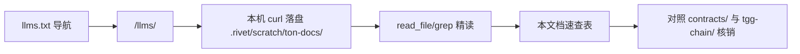

# TON 官方文档学习纪要（docs.ton.org）

> 来源：https://docs.ton.org/start-here 及其下属章节（官方文档站）。
> 学习日：2026-09-29。目的：把官方文档里**与本项目直接相关**的事实与易错点固化下来，避免后续开发凭记忆踩坑。
> 本文是速查+对照纪要，不是文档翻译；权威口径以官方文档原文为准（每节给出原文路径）。

## 0. 怎么抓官方文档（给后续会话）

- 文档站是 Next.js SPA，但提供 **LLM 友好出口**：
  - 导航清单：`https://docs.ton.org/llms.txt`
  - 单页正文：`https://docs.ton.org/llms/<路径>/content.md`（如 `.../llms/tvm/exit-codes/content.md`）
- `web_fetch` 会因本机 DNS 把 docs.ton.org 解析到保留段（198.18.x）而拒访（工具策略，不是网络不通）；**本机 `curl` 可直接穿过代理拿到正文**，落盘后用 read_file/grep 精读即可。
- 例外：Acton 工具链文档不在 docs.ton.org 的 llms 体系里（`/llms/contract-dev/acton/content.md` 返回的是 HTML 壳），实际在独立站 `https://ton-blockchain.github.io/acton/docs/...`（该站亦无 llms.txt）；**markdown 源在 GitHub `ton-blockchain/acton` 的 `master` 分支 `docs/content/docs/*.mdx`**（注意是 master 不是 main），可从 raw.githubusercontent.com 直取。



## 1. 执行模型（Start here，必须刻在脑子里的）

| 事实 | 出处 | 对本项目的意义 |
|---|---|---|
| TON 是**异步**消息模型：多合约交互不在同一区块完成，两条并发消息级联可能交错 | start-here `#asynchronous-execution` | 任何"检查过某条件"都不能假设到第三步仍成立（竞态，见 §2） |
| 消息只是 intent，被处理后才打包成 transaction；**compute phase 失败（exit≠0/1）→ 跳过 action phase → 可能 bounce** | start-here `#transactions`；exit-codes | 状态转移必须与出账编排一起设计失败路径 |
| get method **不能被合约调用**，只供链下服务读取；每次调用独立 TVM 实例、改动不落链 | start-here `#get-methods` | 链上合约间"取数"只能靠消息交换，不能 get |
| 账户四态：nonexist / uninit / active / frozen（欠 storage fee 冻结，欠满被删除） | start-here `#account-statuses` | 托管合约要留意 storage fee 长期挂账场景 |
| 内部消息必须带 Gram 付处理费；外部消息不能带 Gram，由收款合约**自付**处理费 | start-here `#messages` | 外部消息入口要防"白嫖 gas"（见 §2 accept） |
| 一切数据是 cell 树（1023 bits + 4 refs），序列化为 BoC；TL-B 描述二进制布局 | start-here `#data-storage-model` | 存储布局以 TL-B 为准；单 cell 1023 bit 是硬上限（本项目 EscrowExtra 拆引用即为此） |
| 钱包是把外部消息转成内部消息的代理合约；V5R1 是最新官方通用钱包 | start-here `#wallets` | 用户侧资金入口是钱包合约发来的内部消息 |
| mainnet/testnet 是两套网络，**配置、可用性、吞吐可能不同**，更新先上 testnet | start-here `#mainnet-and-testnet` | 网络标志贯穿一切地址/接口派生（见 §5） |

## 2. 安全反模式 ↔ 本项目对照（contracts/techniques/security，官方逐条给出漏洞样例）

| 官方反模式 | 官方要点 | 本项目现状 |
|---|---|---|
| `throw 0` / `throw 1` | 0/1 是**成功**退出码，无法区分成败；自定义码用 **100–65535** | ✅ `types.tolk` Errors 全在 `0x1002–0x100b` + `0xFFFF`，无 0/1 |
| 无条件 `acceptExternalMessage()` | ACCEPT 后 gas 由合约自付，攻击者可反复发消息烧光余额；须先验签/验状态再 accept | ⚠️ 当前合约只收内部消息（`else` 分支空体放行、带体报错），无外部消息入口——**若将来加外部消息入口（如联邦多签直发）必须先验后 accept** |
| 重放保护 | 外部消息需 seqno/validUntil/contractId 绑定；"有状态"不等于"已认证" | ⚠️ 同上，暂无外部消息入口；将来加时按官方 `SignedRequest` 模式做 |
| 签名必须绑定目标地址 | 否则 mempool 里签名可被抢跑者换 `to` 重用（front-running） | ⚠️ 同上（S5 链下多签方案 A 目前签的是裁决意图，落地时**签名域必须含合约地址+outcome+有效期**） |
| 消息级联竞态 | 一条消息流跑着时攻击者可并行再发一条；开头检查的前提到第三步可能已变 | ✅ `EscrowContract.tolk` 显式"先落状态、再出账"（注释即此理由）；状态机单向转移 + `onBouncedMessage` 回退 |
| 账户销毁（mode 128+32）不可逆 | 无法证明没有在途消息；销毁前须终结所有挂起操作 | ✅ 未用销毁模式 |
| 不安全随机数 | 链上随机可被爆破 logical time；关键场景用 commit-and-disclose | ✅ 未用随机数 |
| 敏感数据上链 | 一切状态/消息/计算可被读取与仿真；低熵秘密哈希不保密 | ✅ 争议理由链下留痕、不进 storage |
| out of gas 不可捕获 | 只比对 value 与 gas 不够：storage/forward/action fee、余额留存都要算 | ✅ 有 gas-baseline.json；jetton 路径强制附带 `≥0.05 TON` 出账转发费（`InsufficientFeeTon`） |
| excesses 不退会淤积 | 用 `0xd53276db` Excesses 退回剩余 Gram | ✅ JettonTransfer `responseDestination` 指定买方收 excesses |
| 不能 pull 别的合约的数据 | 跨合约只能异步消息 | ✅ 与 jetton 钱包交互全走标准消息 |

## 3. TEP-74 Jetton 消息速查（contracts/standard/tokens/jettons/how-it-works）

四个标准 op（TL-B 以 TEP-74 为准）：

| 消息 | op | 方向 | 本项目用法 |
|---|---|---|---|
| `transfer` | `0x0f8a7ea5` | 发给**自己的** jetton 钱包，报文指定真正收款方 | `types.tolk` `JettonTransfer`（tag `0xf8a7ea5`，同值）；Confirm/Refund/Resolve 出账用 |
| `internal_transfer` | `0x178d4519` | A 钱包 → B 钱包 | 不直接构造（钱包间自动流转） |
| `transfer_notification` | `0x7362d09c` | B 钱包 → B 的普通钱包/合约 | `JettonTransferNotification` 入金入口；**可信发送者 = 本合约自己的 jetton 钱包，报文 `sender` = 上一持有人（买方），两个地址都要验** ✅ 已验（`NotTrustedWallet`/`NotBuyer`） |
| `excesses` | `0xd53276db` | 退剩余 Gram 给 `response_destination` | `forwardTonAmount: 0` + `responseDestination: 买方` |

细节易错点（官方原文强调）：

- `forward_ton_amount` **必须 > 0** 对端才会发 `transfer_notification`，且必须小于本消息附带的 Gram——本项目**不需要回执，故意置 0**，别"顺手补个非 0"。
- `query_id` 链接 transfer/notification/excesses 三类消息，官方口径 "**always use a unique query ID**"。本项目恒 `queryId: 0`（每个托管实例一次终态出账、无并发关联需求，风险低）——**若将来同一钱包需要关联多笔出账，必须改成唯一 queryId**。
- `forward_payload` 是 `(Either Cell ^Cell)`，即便为空也要写全字段——钱包侧整条 `loadMessage`，缺字段解析失败、**转账静默不生效**（`types.tolk` 注释已记，别删）。
- jetton `amount` 量纲与 TON 的 amount **不同**，不可直接比较。

```mermaid
flowchart LR
  subgraph 入金（jetton 路径）
    BW[买方钱包] -->|transfer 0x0f8a7ea5| BJW[买方 jetton 钱包]
    BJW -->|internal_transfer 0x178d4519| EJW[本合约 jetton 钱包]
    EJW -->|transfer_notification 0x7362d09c| EC[EscrowContract]
  end
  subgraph 出金（以放款卖方为例）
    EC2[EscrowContract] -->|transfer 0x0f8a7ea5 固定发给 ownJettonWallet| EJW2[本合约 jetton 钱包]
    EJW2 -->|internal_transfer| SJW[卖方 jetton 钱包]
    EJW2 -.->|excesses 0xd53276db → responseDestination=买方| BW2[买方钱包]
  end
```

## 4. 发送模式与退出码速查

发送模式（foundations/messages/modes，8-bit 掩码）：

| 值 | Tolk 常量 | 语义 |
|---|---|---|
| +1 | `SEND_MODE_PAY_FEES_SEPARATELY` | 转发费从账户余额付，不从消息 value 里扣 |
| +2 | `SEND_MODE_IGNORE_ERRORS` | 发送失败不回滚、不 bounce，跳过该动作 |
| +16 | `SEND_MODE_BOUNCE_ON_ACTION_FAIL` | action phase 出错 → **整笔交易回滚** + 向入站方 bounce |
| +32 | `SEND_MODE_DESTROY` | 配合 128 才生效；清零即销毁账户（勿用，见 §2） |
| +64 / +128 | `CARRY_ALL_REMAINING_MESSAGE_VALUE` / `CARRY_ALL_BALANCE` | TVM 10 起**只影响 Gram**，不再捎带 extra currencies |

默认（mode 0）：发送失败 → **交易回滚且不 bounce**。本项目统一 `1 | 16`：
- 出账动作失败 → 整笔回滚（含 compute 阶段的 `state=4/5` 赋值一并撤销），入站方（买/卖方）收到 bounce——"先落状态再出账"是安全的，失败不会留下假状态；
- 出账动作成功但**资金在途中被退回** → `onBouncedMessage` 把 4→2 / 5→1 回退状态，等待重试。
  两层失败路径互补，改出账逻辑时**两层都要过**。

标准退出码（tvm/exit-codes）：`0/1` 成功；`2` 栈下溢；`3` 栈溢出；`4` 整数溢出（含除零）；`5` 越界；`6` 非法指令；`7` 类型错；`8/9` cell 溢出/下溢；`10` 字典错；`11` unknown（**发畸形消息/调不存在的 getter 也归它**）；`12` 致命；`13`（-14）out of gas；`14` 虚拟化。action phase 结果码 `32–38`（34=动作列表错/模式冲突，35=出站 src 地址不合法等）。测试断言时分清 compute `exitCode` 与 action `resultCode`。

## 5. 地址 / 网络 / 费用 / Tolk / TON Connect

- **地址三形态**：raw `0:<256bit hex>`、bounceable `EQ...`、non-bounceable `UQ...`；workchain id 在地址里，**跨网络/跨库转换必须显式带 testnet 标志**——本项目已在 `9c49405` 修复 ownJettonWallet 网络 tag 跟随 testnet 标志的缺陷（ton4j `toString` 三参无 testnet 语义，恒出 mainnet EQ）。新增地址派生/序列化代码一律走 `TonAddresses`，不散落手写。
- **费用**：storage fee 按 `bits/cells × 价格 × 时间` 计；**相同子树在多个引用下只存一份、不重复计费**（利于共享结构）；compute 有 `flat_gas_limit` 保底收费；gas 价格由网络配置决定，用户不可改。
- **Tolk/Acton**：Tolk 是官方推荐语言（`contract` 声明驱动 ABI/TS wrapper/调试）；官方为 agent 提供 `$tolk` skill（Acton development skillset，`ton-blockchain.github.io/acton/docs/agent-skills/overview`）——**给 agent 写合约时可直接挂上**。Acton CLI 工作流（new/build/test/wallet/run）另有跨会话记忆可查。
- **TON Connect**：dApp 侧 SDK 在 `ton-connect/sdk` monorepo（`@tonconnect/ui-react` / `ui` / `sdk` / `protocol`）；钱包侧无官方 SDK，按协议自行实现；排障先看 Troubleshooting（manifest 404 / CORS）；TON Connect 只管连接与交易签名，链上深度集成要自己写。

## 6. 遗留留意项（不是缺陷，是"别踩"清单）

1. `queryId` 恒 0：官方建议唯一 query_id；当前单实例单出账可接受，**出账并发化时必须改**。
2. 将来若引入外部消息入口（联邦直发/免 gas 触发），必须先验后 accept + 重放保护 + 签名绑定目标地址（§2 三条一起做，缺一即漏洞）。
3. 争议裁决链下多签（方案 A）的签名域设计时，按官方 front-running 防御把**合约地址、outcome、有效期**都签进去。
4. `onBouncedMessage` 的 body 可得性取决于发送时的 `BounceMode`（见 §7.1）：本合约出站全用 `RichBounce`（全文可得），但 handler 只按状态回退、不读 body 的做法要保持——出账目标是 jetton 钱包/卖方钱包，body 内容不承载回退所需信息。
5. 本纪要快照自 2026-09-29 的文档站；Tolk/Acton 迭代快，引用前用 §0 方法重抓核对。

## 7. 深入补读增补（2026-09-29 第二轮）

### 7.1 BounceMode 四态与新旧 bounce 格式（tolk/features/message-handling + foundations/messages/internal）

`createMessage` 的 `bounce` 字段是四值枚举，**决定 onBouncedMessage 能拿到什么**：

| BounceMode | bouncedBody 内容 | gas |
|---|---|---|
| `NoBounce` | （不 bounce） | — |
| `Only256BitsOfBody` | `0xFFFFFFFF` 前缀 + 原 body 前 256 bits | 最低 |
| `RichBounceOnlyRootCell` | 新 bounce 格式：原 body 根 cell（去 refs） | 高 |
| `RichBounce` | 新 bounce 格式：完整原 body + `gasUsed`/`exitCode` 等失败信息 | 最高 |

- 默认旧格式 body 太小（连一个内部地址都放不下）；新格式由 **`extra_flags` 位**开启：`&1` = 新格式（body 根 cell 去 refs），`&2` 同时置 = 完整 body 不去 refs。新格式 body 结构 `new_bounce_body#fffffffe ... original_info:^... bounced_by_phase:uint8 ...`。
- 旧格式前缀是 `0xFFFFFFFF`，解析前先 `in.bouncedBody.skipBouncedPrefix()`（Acton 官方教程 `bounces-as-feedback` 的标准模式：跳前缀 → `Vote.fromSlice` 正常解析）。
- **bounce = 异步回调**（官方教程原话 "The bounce mechanism acts as an asynchronous callback"）：对方 throw 时回弹给发送方做撤销/补偿——本合约 `onBouncedMessage` 4→2/5→1 就是此模式，与官方一致。
- 触发条件（msg-internal `#bounces`）：消息 bounceable 且（compute 失败、或 action phase 失败且 `+16`）；bounce 回执 `bounced=true`、`bounce=false`（防无限弹）。
- 256-bit 规则经验：若撤销只需识别消息类型/关键字段，让报文 ≤256 bits 并用 `Only256BitsOfBody` 最省 gas；本合约用 `RichBounce`（7 处全同）拿全文，稍贵但简单，**两者都对，改用 256-bit 方案前先确认消息首 256 bits 足以判别**。

### 7.2 地址 flag 表（foundations/addresses/formats）——A0-7 类缺陷的官方底图

user-friendly 地址 36 字节 = tag(1) + workchain(1) + hash(32) + CRC16-CCITT(2)，base64 与 base64url **都合法，应用必须两种都支持**。前缀由 tag 首 8 位决定（TEP-0002）：

| 前缀 | tag 二进制 | bounceable | testnet-only |
|---|---|---|---|
| `E...` | `00010001` | 是 | 否 |
| `U...` | `01010001` | 否 | 否 |
| `k...` | `10010001` | 是 | **是** |
| `0...` | `11010001` | 否 | **是** |

- **testnet 位就在 tag 里**——`9c49405` 修复的 ownJettonWallet 网络 tag 缺陷正是此位：ton4j `toString` 不带 testnet 语义时恒出 `E...`（mainnet），testnet 部署会把钱引向 mainnet 形态地址。验收口诀：**testnet 环境看到 `E/U` 开头的展示地址 = 又错了**（实测参照：Acton testnet 部署输出 `kQCC94...`）。
- 官方选型建议：合约类收款方用 **bounceable**（无效合约时资金弹回）；钱包类用 **non-bounceable**（保证入账）；发前验证收款方是否已初始化。
- 本项目地址转换收敛在 `TonAddresses.java`（grep 实测无手写 flag 字节，走 ton4j 库）——新增地址代码继续收敛，不散落。

### 7.3 Tolk 补读要点（tolk/features/message-handling + lazy-loading）

- 现代入口是 `onInternalMessage(in: InMessage)`：`in.valueCoins`/`in.senderAddress`/`in.body` 直接可用，比 legacy 四参签名省 gas；`myBalance` 的现代等价是 `contract.getOriginalBalance()`（合约态，不是消息属性）。
- `onExternalMessage` 收到时**只有有限 gas**，验完才 `acceptExternalMessage()` 提额——§2 的"先验后 accept"在 API 层面就是这个结构。
- `lazy` 匹配按前缀分派：**`else` 分支只在 lazy 匹配下合法**（非 lazy 的 union match 不允许 else）。本合约 `lazy ...fromSlice` + else 兜底空体放行的写法正是官方语义。
- 引用字段须 `.load()` 显式解包（`Cell<T>` 不能直接 `.x`），fromCell 不深读引用——`EscrowExtra` 的读法与官方一致。

### 7.4 Acton 工具链（源在 GitHub `ton-blockchain/acton` **master** 分支 `docs/content/docs/*.mdx`；github.io 站无 llms.txt）

- 部署/网络命令：`acton wallet new --local --airdrop --version v5r1`（测试网一步铸币）、`acton script scripts/deploy.tolk --net testnet`、`acton rpc info <addr> --net testnet`。
- `acton verify <Contract> --address <addr>`：用同源码+同编译配置复现 code hash，**不匹配在付费前中止**——上线前核对 code hash 的现成工具。
- gas/费用标准库函数（tolk_standard_library/gas-payments）：`calculateGasFee` / `calculateStorageFee` / `calculateForwardFee` / `contract.getStorageDuePayment` 等，合约内可做费用预算（官方 security 页 `calculateGasFee(BASECHAIN, ...)` 例子即出自此库）。
- 测试侧能力：`acton test --coverage`、`acton wrapper`、gas 快照对比（testing/gas-profiling-with-snapshots）、fuzz/mutation testing、trace 回放——`gas-baseline.json` 的回归可考虑接 gas 快照对比。
- 教程含 `bounces-as-feedback`、`close-and-owner`（安全关合约）、`splitting-contracts` 等模式课，写新状态机前值得翻。

### 7.5 TON Connect 核心机制（applications/ton-connect/core-concepts）

- 两通道：**HTTP bridge**（钱包方运营，`GET /events` SSE + `POST /message`，不可信——除 ConnectRequest 明文外全部 `nacl.box` 会话密钥加密）与 **JS bridge**（钱包 webview 注入 `window.<key>.tonconnect`，同设备可信走明文）；SDK 优先 JS bridge。
- 会话持久化数据（session keys、`client_id`、`nextRpcRequestId` 等）**按 secret 对待**：`client_id` 泄露者可拉取密文/删队列消息。浏览器默认 `localStorage`，服务端自传 `IStorage`。
- 钱包注册表 `wallets-v2.json`（config.ton.org）运行时拉取、失败回落内置副本；dApp 以 `ConnectEvent` 的 `features` 数组决定可调用的 RPC（显式 feature 协商）。
- 通用规则：TON Connect 只做连接与交易签名，**深度链上集成自写**（§5 原文），web/ 前端对账仍要走自己的 indexer/查询层。

### 7.6 以太坊开发者对照（from-ethereum）——术语校准

单条消息处理 = TON 的 "Transaction"；一次合约调用引发的跨账户全链 = "trace"。trace 长度无 1024 深度限制（实测有 1.5M tx 的 trace）。调试工具：TxTracer（含 Message Emulator 可离线仿真整条消息树）、TON Explorer。
