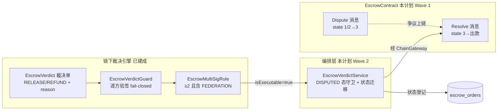

> **Model: mimo-v2.6-pro (strong)**

> **Status: EXECUTED** — 2026-09-29T05:05:00Z（三波全部交付 `e6f3195`/`4b552c6`/`512365d`；最终验证 mvn 966 用例+4 IT 0 failure、acton test 35 passed。偏差：Dispute 理由链下留痕；签名集不入库留痕日志；resolveDispute 恒「未执行」待部署后实现。注：plan close 任务块解析四次失败（No matching task blocks），闭环以本行与文末清单落盘为准。）

# S5 争议裁决接线（合约 Dispute/Resolve + 链下多签裁决编排）

## 需求提炼

**用户原话**：「继续任务」（承接上轮结尾：「S5 合约的争议裁决（`Dispute`/`Resolve`）是下一个开发大头」）。
目标：把「争议 → 裁决 → 按裁决出款」这条链在合约与 Java 两侧闭合——合约补 `Dispute`/`Resolve` 与 DISPUTED 态（EscrowContract.tolk:24-25 明示的缺口①），Java 编排层把已建成的链下裁决件（`EscrowVerdict`/`EscrowMultiSigRule`/`EscrowVerdictGuard`）接进订单生命周期。

**非目标（项目既定，不推翻）**：不做主网部署、不动真金（testnet 演练口径）；不引入调度器；不新增数据库表；不做业务参数决策（费率/阈值属部署者）；存储费池额度（合约缺口②，A0-3 未定案）不在本计划内。

**已定决策（不重开）**：C1 多签语义 = 2/3 必含联邦、买卖双方组合无效（UNDECIDABLE-DECISIONS.md:296-318；`EscrowMultiSigRule.java:89-94` 已实现此语义）。

## 现状锚点（实测回读）

| 事实 | 锚点 |
|---|---|
| 合约无 Dispute/Resolve/state3 | `contracts/EscrowContract.tolk:24-25`（自述「尚未实现」）、`:42-156`（仅 0/1/2 + 回弹 4/5） |
| Java 状态迁移只登记不动钱 | `EscrowTradeService.java:160-168`（release）、`:172-182`（refund）、`:185-194`（dispute） |
| 裁决选项只有两种 | `EscrowVerdict.java:58-63`（RELEASE 放款卖方 / REFUND 退款买方） |
| 多签规则 | `EscrowMultiSigRule.java:65-72`（Party 三方）、`:89-94`（≥2 且含 FEDERATION） |
| 验签 fail-closed | `EscrowVerdictGuard.java:74-109`（验失败不入集合、异常降级不通过） |
| C1 默认：联邦实质一人裁决 | `UNDECIDABLE-DECISIONS.md:296-318` |

## 架构与事实流

## 方案取舍（待你拍板的一个分叉）

**裁决的链上授权模型**（合约 `Resolve` 凭什么执行）：

- **方案 A（推荐）：链下多签裁决 + 链上联邦单方执行**。`EscrowVerdictGuard` 全套链下件已完成，天然就是裁决引擎；合约 `Resolve` 只守卫 `sender == federation`（存入 storage 的裁决授权地址），多签签名集作为链下审计留痕（存库）。理由：① 与 C1 实质一致（C1 自认「联邦选边即定胜负」）；② 不在 TVM 里做 ed25519 多签验签与 canonicalBytes 的 cell 编码（复杂度高、审计面大）；③ 已建成的链下件零浪费。
- **方案 B：合约内验 2/3 多签**（Resolve 消息携带签名集，合约 `check_signature` 逐方验）。信任根更强（不依赖联邦单方诚实），但要把 `EscrowVerdict.canonicalBytes` 的编码搬上链、两侧逐字节对齐（漂移即验签全灭），工作量约 A 的 2-3 倍。

## Wave 1 — 合约侧（Tolk + acton test）

1. `EscrowStorage` 加 `state=3`（DISPUTED）语义与 `federation` 裁决授权地址字段（部署参数）；`AllowedMessage` 加 `DisputeMessage`/`ResolveMessage`。
2. `Dispute`：buyer/seller 任一方、`state ∈ {1,2}` → 3；理由字段入 storage（留痕）。
3. `Resolve`：`sender == federation` 且 `state == 3`；按 outcome 出款——RELEASE 转 `storage.amount` 给 seller、REFUND 给 buyer（TON 路径 `asset==0` 复用现有回弹安全网；jetton 路径 `asset==1` 复用 trustedWallet 出账报文），余数回 buyer；state 3 → 4/5 终态与现有对齐。
4. fail-closed 逐条：非当事人 Dispute → `NotParty`；非 1/2 态 → `InvalidState`；非联邦 Resolve → `NotFederation`；非 3 态 Resolve → `InvalidState`；outcome 非法 → `InvalidMessage`。
5. `tests/EscrowContract.test.tolk` 扩用例：两路资金（TON/jetton）× 两 outcome = 4 主路径 + 5 条失败分支 + 回弹路径。

**验证命令**：`~/.acton/bin/acton test`（26 → 预计 ≥35 用例全绿）。

## Wave 2 — Java 编排层（TDD）

1. `EscrowVerdictService.execute(order, verdict, signatures)`：守卫（订单须 `DISPUTED`、裁决单 orderId 匹配、`EscrowVerdictGuard.isExecutable` 通过）→ `markReleased/markRefunded` 落库；签名集与裁决单**存档留痕**（新建表撞非目标 → 存 `dispute_reason` 同侧的既有文本列？——**待验证**：`escrow_orders` 现有列能否承载签名集摘要，不能则签名档只进日志+回执，如实标注）。
2. 拒绝路径文案逐字钉测试：非 DISPUTED 态、签名不足、买卖双方组合（无联邦）、验签失败混入。
3. `DisputeFlow` 增加「裁决入口」守卫（与 `requireCanInitiate` 同风格，规则单一定义处）。

**验证命令**：`TELEGRAM_BOT_TOKEN=123456:dummy-for-it mvn -B verify`（954 → 预计 +12~16 用例，0 failure）。

## Wave 3 — 接线（入口 + 链上通道）

1. 裁决入口（**待你拍板**）：admin API（`/admin/verdict`，复用 TGG_ADMIN_* 鉴权）或 Bot 命令（不推荐——裁决是联邦职责不是群操作）。默认走 admin API。
2. `ChainGateway` 增 `resolve(orderId, outcome)` 抽象方法（部署前 = 只登记 + 明示「链上未执行」，与现有 `CHAIN_CAVEAT` 纪律一致）。
3. `BotWiring` 装配 + 消费方核对。

**验证命令**：全量 `mvn -B verify` 不回退 + `~/.acton/bin/acton test` 不回退。

## 反证/复现（瑶光）

- **关键断言已回读**：上表全部 file:line 于本计划期实测核对（EscrowContract.tolk:24-25 缺口自述、EscrowMultiSigRule.java:89-94 规则实现、EscrowTradeService.java:160-194 只登记语义）。
- **行为断言的复现通道**：Wave 2 的拒绝路径测试即 RED 探针（先写测试钉「签名不足被拒」等 4 条，实现前跑红）；合约行为由 acton test 穷举（先写用例后实现，acton test 跑红即复现缺口）。
- **待验证假设（不当结论）**：① `escrow_orders` 是否有列可承载签名集摘要（Wave 2 第 1 步开工先查表结构）；② jetton 出账的 Resolve 路径能否复用现有 `trustedWallet` 报文而不改 TEP-74 序列化（Wave 1 第 3 步读 `EscrowExtra` 后定）；③ 裁决入口形态（admin API vs 其他）待你拍板。
- **不复现即降级**：若 jetton Resolve 路径在 acton 模拟网无法验证（jetton 通知流复杂），先交 TON 路径 + jetton 路径标「未验证」，不假装闭合。

## 任务清单（执行闭环用）

- [x] Wave 1：合约 Dispute/Resolve + DISPUTED 态 + acton test 26→35（`e6f3195`）
- [x] Wave 2：EscrowVerdictService 裁决编排 + DisputeFlow.requireCanVerdict + 8 用例（`4b552c6`）
- [x] Wave 3：/admin/verdict 入口 + ChainGateway.resolveDispute 抽象点 + BotWiring 装配 + 4 用例（`512365d`）
- [x] 全量验证：mvn 966 用例 + 4 IT 0 failure；acton test 35 passed
