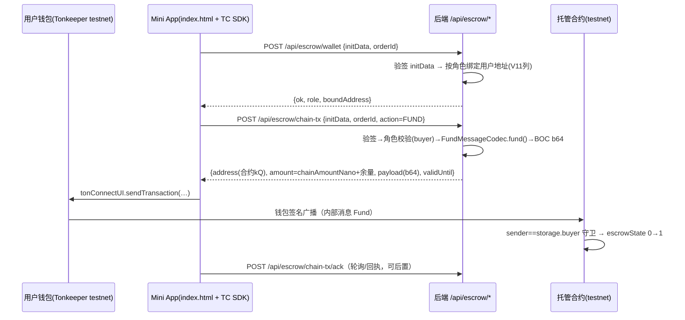

---

**执行状态：** 已闭环。Task 1-5 均已完成；验证通过；交付门检查：GREEN。
rivet-options: [{"label":"本次按推荐方案落地 (Recommended)","description":"TON Connect 在既有 static/miniapp 线上扩展（V11 地址/金额落库 + /api/escrow/* 构造 + 页面接入）；费率=链下口径确认+链上 gas/存储参数化（推荐——不动资金流向）"},{"label":"费率要链上扣费","description":"费率从链下 FeePolicy 改为合约出账时扣平台费——资金模型变更，需另起计划（本次仅做 TON Connect 部分）"},{"label":"费率暂缓","description":"只做 TON Connect 最小闭环，费率计划整体后置"}]
---


> **Model: deepseek-flash (cheap)**

> **Status: APPROVED** — 2026-10-02T12:06:06.960Z

> **Status: EXECUTED** — 2026-10-02T12:23:17.898Z

# TON Connect 集成 + 费率定案

## 需求提炼

**用户原话**：「TON Connect 集成（把资金链真正交到用户手上）、费率定案」——承接上一轮"资金路径链上腿前置=用户钱包"的结论。

**目标**：
1. **TON Connect 集成（一期打穿 Fund 入金闭环）**：让**用户自己的钱包**发送资金路径消息——链接钱包（TON Connect）→ 后端构造交易参数（复用现有 codec）→ 用户签名广播 → 链上 `Fund` 落地 `escrowState=1`。材料链已全绿：消息 codec（Fund 0x7d5a1001 已核销）、合约守卫（sender==buyer）、Mini App 现实路径（initData 验签器 + web_app 按钮 + 单文件静态页）都在，缺的是"连接 + 构造 + 上报"三段。
2. **费率定案**：合约出账的"随附 TON"现状是 jetton 路径固定 `grams("0.05")`（gas 预算占位）、TON 路径**全额**给收款方、**无任何存储费池/扣费逻辑**（源码级核验）——把"未定案"落成**有依据的明示约定 + 必要的参数化命名**，而不是留悬空占位。

**非目标（明确不做）**：
- 不建 Vue 工程——扩展既有的 `tgg-app/src/main/resources/static/miniapp/index.html`（无构建链是现状的刻意选择；`web/` 目录只是空壳 README）；
- **不做链上平台费扣费**——费率当前走链下 `FeePolicy` 口径；链上扣费是资金模型变更，需单独决策（本计划把此二义留作审批时的第一确认项，默认按"链下口径确认"落地）；
- 不做主网、不做 `items[]` 结构化交易路径（用 raw `messages[]`）。

## 现状证据（侦察留档，全部 file:line）

- **Mini App 现实路径**：`tgg-app/src/main/resources/static/miniapp/index.html`（单文件；L8 引 Telegram SDK；L142 `tg.initData` 原串，显式不用 initDataUnsafe）；`tgg-app/src/test/java/com/tg/escrow/webapp/MiniAppPageTest.java:44` 断言存在；`tgg-app/src/main/java/com/tg/escrow/SecurityConfig.java:50` 放行 `/miniapp`
- **initData 验签器**：`WebAppInitDataVerifier.java`（L82 算法常量、L129 verify、L214 authDateFresh）；消费方 `TradeApiController.java:115`（verifyUserId）、`TradeInviteController`（start_param 接单令牌）
- **web_app 按钮**：`BotReplyPort.java:61` → `TelegramBotReplyAdapter.java:99-105` → `TelegramBotHandler.java:320`（URL=配置 `tgg.webapp.url`，`application.yml:128`）
- **资金命令现状**：`TradeCommandHandler.advance():852-889`；`CHAIN_CAVEAT` 三处（L145-146/L888/L1233-1235）；服务层 `EscrowTradeService.java:162-216` 纯 markXxx（无 Chain*）
- **用户地址零存储**：迁移仅 V10 `chain_contract_address`（V10:15）；部署三角色地址唯一来源是 admin 请求体（`AdminChainController.java:130-132`）且不落库（`EscrowChainDeploymentService.java:107-108` 只进 storage cell；L117 只落合约地址）
- **合约出账**：TON 路径 `value: storage.amount` 全额（L111/142/193）；jetton 路径 `grams("0.05")` 发 ownJettonWallet（L96/127/178）；**无存储费池、无扣费**（L85-193 全区源码级核验）
- **TON Connect 官方形态**（docs.ton.org `/develop/dapps/ton-connect/transactions`，2026-10-02 抓取）：`sendTransaction({validUntil, network:'-3', messages:[{address(TEP-2 friendly 非 raw), amount(nanoton 字符串), payload(BOC base64)}]})`；manifest 由 `TonConnectUI({manifestUrl})` 拉取（url/name/iconUrl）
- **既有链上件可复用**：`FundMessageCodec.fund()`（已真机核销）、`EscrowOrder.getChainContractAddress()`、角色字段 `getBuyerUserId()/getSellerUserId()`

## 设计



**组成**：
1. **V11 迁移 + 实体**：`escrow_orders` 加 `chain_amount_nano`（VARCHAR(32)，nanoton 十进制串——Java BigDecimal 不配大整数）、`buyer_ton_address`/`seller_ton_address`（VARCHAR(80)）；`EscrowOrder` 加三字段与 mutator（`attachChainAmount/attachUserTonAddress(role, addr)`，防改绑同 `attachChainContractAddress` 模式）
2. **部署编排增强**：`AdminChainController.DeployRequest` 三地址与金额改**可选**——缺省从订单 V11 列读（票在库、旧流程不破）；`EscrowChainDeploymentService` 同源改造 + 金额落库
3. **后端交易构造**：`webapp/EscrowChainTxController`（学 `TradeApiController` 的 initData 验签+401 模式）：
   - `POST /api/escrow/wallet`：验签→找订单→按 `buyer_user_id/seller_user_id` 匹配角色→绑 V11 列
   - `POST /api/escrow/chain-tx`：验签→订单+角色校验（**角色矩阵**：FUND/CONFIRM=buyer、DELIVER=seller、REFUND=任一当事方、DISPUTE=当事方）→ 用现有 codec 产出 payload（**响应字段**：合约地址 kQ 形态、amount、payload b64、validUntil=now+600、network '-3' 由前端常量）
   - 金额语义：`FUND` = `chainAmountNano` + `FUND_GAS_MARGIN(0.05 TON)`；其余消息 = `MSG_GAS_MARGIN(0.05 TON)`
4. **前端**：`index.html` 加 TON Connect 区块（@tonconnect/ui CDN + manifestUrl）、连接按钮、订单操作按钮（FUND/DELIVER/CONFIRM/DISPUTE，按角色显示）；新增静态 `tonconnect-manifest.json`
5. **费率定案（文档+注释，不改资金流向）**：jetton gas `0.05` 依据（jetton 转账与通知的系统成本上界）、**Fund 超额部分 = 合约存储/操作预算保留（不退）**的明示、合约"无扣费逻辑"的明示；常量命名参数化（可选）
6. **文档回写**：CODE-VS-SPEC（ET-10/ET-11 相应行）、ONLINE-VERIFICATION（**新增 E1：TON Connect Fund 闭环，用户参与真机**）、HANDOFF

## 反证/复现

- **payload 一致性**（核心反证）：`/api/escrow/chain-tx` 响应 payload 解码后必须与 `FundMessageCodec.fund()` 逐字节一致（单测直接比对 BOC）；amount 必须等于 `chainAmountNano + margin`（断言，防"钱包扣错钱"）
- **角色矩阵负例**：seller 请求 FUND → 403；无订单/未部署（`chainContractAddress==null`）→ 400；坏 initData → 401（学 `TradeInviteControllerTest` 自算 hash 造数 + tampered 反证用例）
- **地址形态反证**：响应必须 kQ/TEP-2 friendly——raw 形态会被钱包拒（单测断言形态；reverse 用例：断言不是 raw）
- **真机（用户参与，不可自动化）**：Tonkeeper testnet 连接 → FUND 落地状态 `escrowState=1`（B12 运行器同款读法可复核链上）——**此步未验前不得称"资金链已交到用户"**
- **费率事实复现**：合约 L85-193 无扣费逻辑（已由 code_scout 源码级核验；计划期复核命令：`grep -n "grams(\|storage.amount" contracts/EscrowContract.tolk`）

## 风险与取舍

- **TON Connect 弹窗依赖用户钱包 App**（Tonkeeper testnet）——离线把一切备至"一触即发"，真机核销是人工步骤（清单化）；
- **V11 对既有订单**：金额列 NULL → 部署端点"请求体缺省读库、库缺省要求请求体"的兼容序不破坏旧流程；
- **前端单文件继续膨胀**（现 ~230 行）——超 ~500 行再评估拆分（无构建链是刻意选择）；
- **web/ 空壳目录与实现的落差**：本计划顺带在 `web/README.md` 标注"实现线在 static/miniapp"消除双线误解（文档小改）。

## 待用户审批时确认的二义（默认按推荐项落地）

1. **费率定案的范围**：推荐=链下口径确认 + 链上 gas/存储参数化（本计划）；备选=链上扣平台费（另起计划）。
2. **二期顺序**：Fund 打穿后，DELIVER/CONFIRM/REFUND/DISPUTE 是否紧接着做（本计划已把它们的构造接口一并设计，实现成本≈零）。

## Wave 分波（每波可独立验证）

### Wave 1 数据面：V11 + 实体 + 部署编排增强
- [x] V11 迁移（chain_amount_nano/buyer_ton_address/seller_ton_address）+ `EscrowOrder` 字段与 mutator
- [x] `EscrowChainDeploymentService`/`AdminChainController`：地址与金额可选、缺省读库；部署时金额落库
- 验证：`mvn -B -pl tgg-escrow,tgg-app -am test`（含 EscrowPersistenceIT 的真库迁移用例）

### Wave 2 构造面：/api/escrow/* 两接口 + 单测
- [x] `EscrowChainTxController`（wallet 绑定 + chain-tx 构造；initData 验签、角色矩阵、金额语义）
- [x] 单测：payload 对拍/角色负例/形态反证/未部署 400
- 验证：`mvn -B -pl tgg-app -am test -Dtest='EscrowChainTx*'`

### Wave 3 交互面：Mini App + manifest + 页面测试
- [x] `index.html` TON Connect 区块（连接/操作按钮/角色显示）
- [x] `tonconnect-manifest.json` 静态资源 + `SecurityConfig` 放行
- [x] `MiniAppPageTest` 扩展（新元素存在性）；`web/README.md` 落差标注
- 验证：`mvn -B -pl tgg-app -am test -Dtest='MiniAppPageTest'`

### Wave 4 定案面：费率文档 + 全文档回写
- [x] 合约注释（gas 0.05 依据/存储预算保留/无扣费明示）+ 常量命名（如需）
- [x] CODE-VS-SPEC（ET-10/ET-11）、ONLINE-VERIFICATION（E1）、HANDOFF
- 验证：`grep -n "grams(" contracts/EscrowContract.tolk` 复核 + 文档 diff 自查

### Wave 5 全量 + 真机准备
- [x] `TELEGRAM_BOT_TOKEN=… TGG_DB_NAME=… mvn -B clean verify`
- [x] 真机核销清单：本地起服务（配 TGG_WEBAPP_URL/HTTPS 隧道）→ Tonkeeper testnet 连接 → FUND → `escrowState=1` 复核
- 验证：全量绿 + 清单交付（真机为用户参与步骤）

## 7. Execution closure

已闭环：Task 1-5 均已完成并通过验证。

最终验证记录：

```bash
TELEGRAM_BOT_TOKEN=123456:dummy-for-it TGG_DB_NAME=tgg_escrow_verify mvn -B clean verify（surefire 1254 + IT 6/6，BUILD SUCCESS）
mvn -B -pl tgg-chain,tgg-app -am test -Dtest='DeliverConfirmRefundCodecVectorsTest,EscrowChainTxControllerTest'（3/3 + 7/7）
mvn -B -pl tgg-app -am test -Dtest='MiniAppPageTest'（6/6）
~/.acton/bin/acton test（54 passed；code hash 766CE1EC… 不变）
```

交付门检查：GREEN。

备注：5 波全完：W1 数据面（V11+实体+部署缺省读库，bc23b2f）→ W2 构造面（3 codec+控制器，5896112）→ W3 交互面（Mini App+manifest，a4e8961）→ W4 定案面（c59ed50）。真机核销（B13）为用户参与步骤，未验前不称「资金链已交到用户」。
