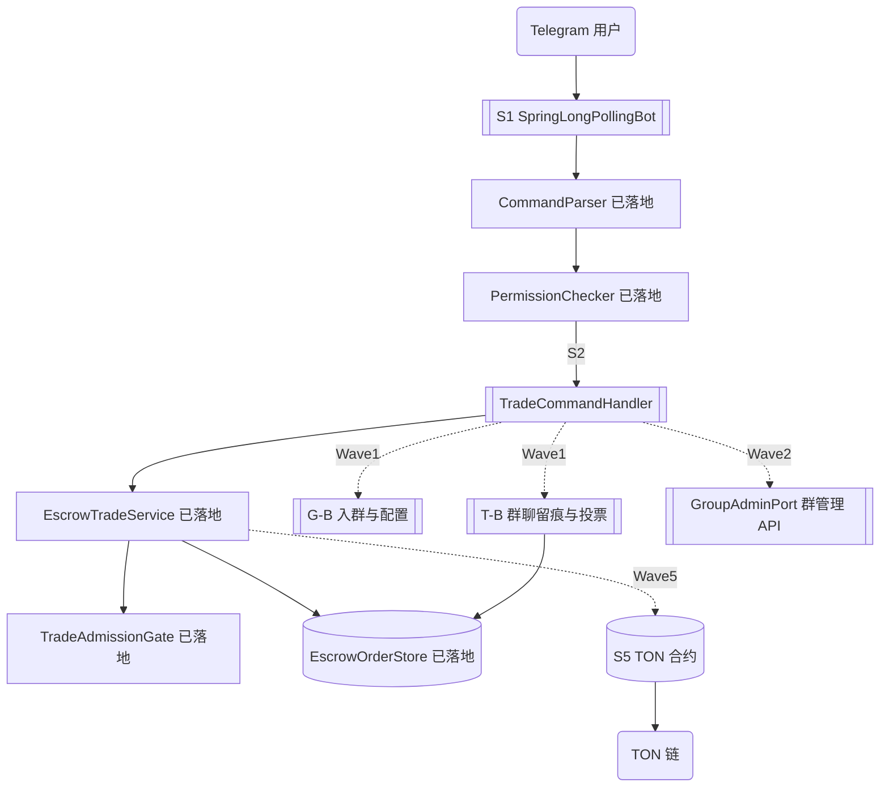

> **Model: deepseek-flash (cheap)**

> **Status: APPROVED** — 2026-09-24T00:40:04.713Z

# V2.0 剩余功能续跑实施计划

> 基线：`HEAD=84bbada`（与 origin 同步），`mvn test` 实测 **260 项全绿**（core 107 / federation 13 / escrow 128 / chain 12）。
> 输入文档：《Telegram 群管理 + 担保交易系统 最终版开发文档 V2.0》（约 92 项）。

## 执行进度（2026-09-24）

- ✅ **Wave 1a 完成**：G-B 六类（提交 `c4d6ca0`，tgg-core 107→152）+ S2 `TradeCommandHandler`（提交 `eacc780`，tgg-app 0→8）。全量 `mvn test` **313 全绿**。
- ⏸️ **Wave 1b（T-B）/ 1c（V2.0 新增纯逻辑）及 Waves 2–7 已暂停** —— 用户指令「暂时不要开工，先整理文档」，且后续还有文档待提交。
- 📄 需求文档库已建立：`docs/requirements/`（`01-V2.0-开发文档.md`、`02-TON-Connect.md`、`README.md` 索引含后续纳入约定），提交 `f458f1e`。

## 需求提炼

**用户原话里的目标**：V2.0 文档自述「群管理35项+担保交易57项，共约92项功能……资金安全变态级，开发者只提供代码、文档、许可证、免责声明，运营者自行申请牌照、合规运营……工期约9周」。相比此前版本，V2.0 新增 10 项细节（第 5.7 节 T59–T68）。

**本计划的目标**：把 V2.0 中**尚未实现**的功能，编排成可逐波执行、每波可独立验证的路线；把**零外部依赖的 Wave 1** 细化到类签名与关键逻辑，其余波次给出触发条件与依赖。

**非目标**（沿用文档既定边界，本计划不做）：
- 不参与运营、不持有密钥、不接触生产环境；不做真实链上资金（需先定 C1 多签语义）。
- 不决定商业参数（B1 费率 / B2 首单 / B3 信用分 / B4 KYC）——依赖用户拍板，本计划只标注阻塞。
- 不做 Vue Web 前端与 Telegram 真实接入（缺 A2 的 Bot Token，`SpringLongPollingBot` 无法端到端验证）。
- 不重写已落地能力（G5/G7/G9/G10/G22/G23/G24/G26/G28/G29 与 T1/T2/T12–T16/T18/T23–T28/T38）。

## 当前状态与差距（实测对照）

已落地 **25 个编号**：G5 G7 G9 G10 G22 G23 G24 G26 G28 G29（10 项，tgg-core）；T1(部分) T2 T12 T13 T14 T15 T16 T18 T23 T24 T25 T26 T27 T28 T38（15 项，tgg-escrow）。

剩余按模块分组（详见 `docs/FEATURE-ROADMAP.md` 第 1–3 节的逐项规格）：

| 组 | 剩余编号 | 数量 | 可开工性 |
|---|---|---|---|
| 结构性缺口 | S1 S2 S3 S4 S5 | 5 | S2 可立即；S1/S3 需 A2 token；S4/S5 需 C1 |
| 群管理 G-B | G11 G12 G13 G14 G15 G19 G27 | 7 | **零依赖，可立即** |
| 群管理 G-C | G1 G2 G3 G4 G6 G8 G16 G17 G18 G20 G21 G25 G30 | 13 | 需 Telegram API 端口 / Redis / 调度器 / 待决 B4 |
| 群管理 V2.0 新增 | G31 G32 G33 G34 G35 | 5 | 与 T60/T61/T63/T57/T58 重叠（见下） |
| 交易 T-B | T31 T32 T33 T34 T35 T36 + VoteStake | 7 | **零依赖，可立即** |
| 交易 T-C | T20 T21 T37 T39 T40 T41 T42 T43 | 8 | 多数需 S5 合约 / Redis |
| 交易 T-D | T44 T45–T58（含 T50–T58） | 15 | 部分可立即；T47/T53 需 B3 |
| 交易入门 S2/S3 | T3 T4 T5 T6 T17 T19 | 6 | T4/T5/T6 需 S1 |
| Web 平台 T-E | T7–T11 T22 T29 T30 | 8 | 全部需 S5 + A2 + B 决策 |
| V2.0 新增 T59–T68 | T59 T62 T64 T65 T66（T60/T61/T63/T67/T68 与 G 组重叠） | 5 | 多为纯逻辑，可立即 |

## 文档问题（须先统一口径）

**编号重叠 5 组**——V2.0 在「群管理」和「担保交易」两处各列了一遍，实为同一功能，须**合并实现、单一归属**：

| 群管理编号 | 交易编号 | 功能 | 建议归属 |
|---|---|---|---|
| G31 | T60 | 频道订阅前置验证 | tgg-core（入群验证的一部分） |
| G32 | T61 | 频道傀儡攻击防御 | tgg-core |
| G33 | T63 | Bot 防拉群机制 | tgg-core |
| G34 / T57 | T67 | 账号异常检测 | tgg-core（复用风险评分） |
| G35 / T58 | T68 | 定期防钓鱼推送 | tgg-core（复用推送端口） |

另：V2.0 的 G26「滑动窗口检测」与本项目已实现的 `SlidingWindowCounter`（G26 落地类）语义一致——**检测逻辑 = 计数器 + 阈值策略**，无需新建。
G12 文档写「Mini App 问答」，本计划先落**状态机 + 守卫**（`JoinVerificationFlow`），Mini App 交互层依赖 S1，单独标注。

## 架构与数据流



## 分波实施

> 每波一个闭环：TDD（RED→GREEN）→ `mvn test` 该模块全绿 → 提交 → 可 push。
> 顺序原则：先做**零外部依赖**的纯逻辑（Wave 1），再按依赖解开的顺序推进。

### Wave 1 — 零依赖纯逻辑（可立即开工，不需等任何外部条件）

**S2 命令层接线**（`tgg-app`，`TradeCommandHandler`）——补上"服务已就绪但无人调用"的缺口：
```java
public final class TradeCommandHandler {
    private final EscrowTradeService service;
    public String handle(BotCommand cmd, CommandActor actor) {
        // /escrow create <sellerId> <amount> <currency>
        // 解析失败 → "用法：/escrow create <卖方ID> <金额> <币种>"
        // 被拒   → "被拒：<reason>，可重试：<retryAfter 或 '暂无法预估'>"
        // 成功   → "已创建订单 #<id>"
    }
}
```
测试用**真实** `EscrowTradeService` + 真实 `TradeAdmissionGate` + 内存 `EscrowOrderStore`（不 mock 中间层），覆盖：成功创建、并发超限被拒、冷却期被拒、参数缺失、非命令。

**G-B 群管理（tgg-core，7 个类）**：`WelcomeTemplate`(G11 变量替换，缺失变量保守不泄漏原文)、`JoinVerificationFlow`(G12/G13 四态 + 超时守卫)、`FeatureToggle`(G14 未登记默认关闭 fail-closed)、`AdminRegistry`(G15 添加/移除 + 权限继承)、`SilenceWindow`(G19 跨午夜时段判定)、`ProtectionMode`(G27 开/关 + 原因)。

**T-B 群聊留痕与投票（tgg-escrow，7 个类）**：`TradeGroupLifecycle`(T31/T32 五态)、`MemberVote`(T33 计票 + 门槛)、`VoterRecusal`(T34 回避窗口)、`EvidenceChannel`(T35 双通道各自上报)、`VoteRewardAllocator`(T36 总额守恒，分出 > 收入抛异常)、`VoteStake`(质押锁/没收/退还守卫)。

**V2.0 新增纯逻辑**：`AmountTierPolicy`(T62 ≤100/100-1000/≥1000 分层)、`EvidenceDeadline`(T64 24h 时效)、`CounterpartyDiversityScorer`(T66 同一对手 >60% 标可疑)、`NewcomerBadge`(T59 前 3 笔"新手"标识)。

*验证*：`mvn test -pl tgg-core -am test` 与 `-pl tgg-escrow -am test` 分别全绿；`mvn test` 全量绿。预期测试数从 260 增至约 320–340。

### Wave 2 — 需 Telegram API 端口（阻塞：A2 token）

新建 `GroupAdminPort`（接口）+ 处理 G1 踢/封/解封、G2 禁言、G4 群主自主封禁、G8 消息自动删除、G16 日志频道、G17 群信息同步、G32 频道傀儡、G33 防拉群。接口先定，Telegram 实现等 token；纯逻辑（决策要知道"该不该做"）可在 Wave 1 之后先写。
*验证*：以 fake `GroupAdminPort` 驱动策略层单测；真实接入标"未验证——缺 token"。

### Wave 3 — 需持久化扩展（V2 迁移）

G3 警告累计（`warnings` 表）、T35 证据落库、T31 交易群关联表。新增 `V2__*.sql`（可移植 DDL，遵守 HANDOFF 坑位：索引用独立 `CREATE INDEX`、不写 `ENGINE/CHARSET`）。
*验证*：`EscrowPersistenceIT` 风格的真实 H2 迁移测试 + 回滚。

### Wave 4 — 需 Redis（阻塞：基础设施）

G6 反刷屏、T37 重放保护（seqno/nonce）。先定义 `ReplayGuard` / `SlidingWindowStore` 接口 + 内存实现（可测），Redis 实现后置。

### Wave 5 — 链上（阻塞：C1 多签语义 + S5 合约）

S4 `HttpChainSource`（对接 TON HTTP API，**实现前须核实 TON 确认数语义**——待决 D）、S5 `EscrowContract`（Tolk：fund/release/refund/dispute/resolve，守卫含 `impure`、减法前验余额、commit-reveal、校验 jetton 发送者地址）、T39 Fake Jetton 白名单、T40/T41/T43/T20/T21。
*阻塞*：C1 决定"必含联邦"多签的真实语义（详见 `docs/UNDECIDABLE-DECISIONS.md` C1）。

### Wave 6 — Web 平台（阻塞：S5 + A2 + B 决策）

T7 Vue 界面、T8 Telegram OAuth、T9 TON 支付、T10 托管、T11 冻结/释放、T22 KYC（B4）、T29/T30 费用划转（B1）。最后做。

### Wave 7 — 人性化与反滥用剩余（部分阻塞：B2/B3）

T44 首单（B2）、T45 推送、T46 争议陈述、T47 信用可视化（B3）、T48 多维惩罚、T49 社区、T50 设备关联、T51 互刷检测、T52 新账号限制、T53 互刷不累加（B3）、T54 可疑关系、T55/T56 Comment 钓鱼、T57/T67 账号异常。

## 阻塞项矩阵（不解决则对应波次无法收口）

| 编号 | 阻塞 | 影响波次 | 解除方式 |
|---|---|---|---|
| A2 | 无 Bot Token | Wave 2 / 6 的用户级验收 | 环境变量 `TELEGRAM_BOT_TOKEN` |
| A1 | 子代理 provider 余额 | 并行加速（不影响主控内联） | 充值或 `/model` 切 provider |
| B1/B2/B3/B4 | 费率/首单/信用分/KYC 未定 | Wave 6 / 7 | 用户拍板 |
| C1 | 多签语义未定 | Wave 5 | 用户确认（必含联邦 = 联邦一人裁决） |
| C2 | 合约可升级性 | Wave 5 T43 | 默认关闭 |
| D | TON 确认数语义 | Wave 5 S4 | 读 TON 官方文档 |

## 验证清单

- **每波**：先写目标测试（RED：类不存在→编译失败）→ 实现（GREEN）→ 该模块 `mvn test` 全绿 → 提交信息写入新增测试数。
- **Wave 1 具体场景**：命令成功/被拒/参数缺失 3 条路径；`JoinVerificationFlow` 四态 + 超时；`FeatureToggle` 未登记默认关；`SilenceWindow` 跨午夜（22:00–02:00）；`VoteRewardAllocator` 总额守恒（分出 > 收入抛异常）；`EvidenceChannel` 一条通道失败不静默丢另一条。
- **用户级验收**（Wave 2+ 才能执行）：Telegram 发 `/escrow create …` 看到「已创建订单 #N」或「被拒：<原因>」。**在 S1 + token 落地前，此项无法执行，不得声称达成**。
- **回归**：每波结束跑全量 `mvn test`，计数不得低于 260。

## 瑶光反证

- **断言：当前 S1/S2/S4、G-B、T-B 均未实现** —— 证据：`grep -E "GroupAdminPort|JoinVerificationFlow|WelcomeTemplate|FeatureToggle|SilenceWindow|ProtectionMode|MemberVote|TradeGroupLifecycle|VoterRecusal|EvidenceChannel|VoteStake|HttpChainSource|TelegramBotHandler|TradeCommandHandler"` 全仓返回**未找到匹配**。
- **断言：已落地 25 个编号** —— 证据：`find */src/main/java -name "*.java"` 列出 57 个类，逐一对上 `docs/FEATURE-ROADMAP.md` 第 0 节已落地表。
- **断言：基线 260 绿** —— 证据：`mvn test` 实测 `BUILD SUCCESS`、`TOTAL_TESTS=260`（core 107 / federation 13 / escrow 128 / chain 12）。
- **待验证假设**：TON 确认数语义（S4 依赖）——未核实，Wave 5 开工前必读 TON 官方文档；不得凭训练记忆实现。
- **待验证假设**：V2.0 G12 的 Mini App 问答交互——本计划只落状态机，Mini App 层未规划（依赖 S1）。

## 回归清单（改动前存在、改动后必须仍存在）

| 锚点 | 验证方式 |
|---|---|
| `mvn test` 全量 ≥ 260 全绿 | 命令行 |
| `EscrowOrder` 8 态迁移守卫（含 LOCKED 不可取消） | `EscrowOrderTest` |
| `TradeAdmissionGate` T23/T24/T25 三规则 | `TradeAdmissionGateTest` |
| `EscrowTradeService.initiate` 被拒不落单 | `EscrowTradeServiceTest` |
| `FederationKeyPair` Ed25519 契约 | `FederationKeyPairTest` |
| `tgg-core` 现有 10 个已落地能力类 | `tgg-core` 各 `*Test` |
| `git status` 干净、与 origin 同步 | 命令行 |
