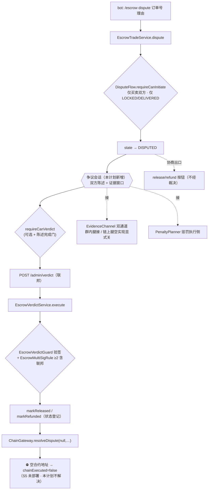

---

**执行状态：** 已闭环。Task 1-5 均已完成；验证通过；交付门检查：GREEN。
rivet-options: [{"label":"A：联邦裁决 + 争议体验闭环（推荐）","description":"维持 A0-2/C1（联邦链下多签+链上单签）；接线 ET-60 陈述 / ET-45 证据窗口 / ET-43 双通道（链上腿关）/ ET-61 惩罚；投票件簇维持不接。≈2–3 天"},{"label":"B：双层裁决（群投票首裁 + 联邦终裁）","description":"按 SPEC §4.9 全量复活投票机件簇（权重分层/回避/质押/资金分层/兜底），链上仍联邦单签执行。≈6–9 天，需新表 3–5 张"},{"label":"C：仅清偿文档（不写代码）","description":"9 孤儿 + 投票件簇按既有处置逐条登记进 CODE-VS-SPEC、修过期条目；接线留日后。< 0.5 天"}]
---


> **Model: deepseek-v4-flash (cheap)**

> **Status: APPROVED** — 2026-10-01T21:39:26.028Z

> **Status: EXECUTED** — 2026-10-01T21:55:20.032Z

# 争议/仲裁业务流程链定义与孤儿接线

> **Status: DRAFT**

## 需求提炼

**用户原话（本轮排队跟进）**：「账本里仍为 C、且已核验确实无 main 侧引用的争议/仲裁类孤儿（`DisputeStatementFlow`/`EvidenceChannel`/`EvidenceDeadline`/`PenaltyPlanner`/`SuspiciousRelationPolicy`/`StakeThresholdAdjuster`/`SecondaryVerificationFlow`/`MuteSchedule`/`NewAccountLimitPolicy`）——接线它们得先定『争议/仲裁流程』这条业务链（含链上投票与票权惩罚），不是顺手能接的。……`HANDOFF.md` 下一个波次提示：接线它们必须**先出计划**。」

**目标**：先把「争议/仲裁流程」这条业务链**定义清楚**（裁决语义层是唯一未定的枢纽），据此对 9 个点名孤儿 + 投票机件簇（`MemberVote`/`VoterRegistry`/`VoteStake`/`VoterRecusal`/`VoteRewardAllocator`/`FallbackSettle`）**逐条**给出「接线 / 阻塞（写明缺件）/ 维持不接」的处置与落点——**不留悬空**（沿用 `CODE-VS-SPEC.md §7.1` 的处置纪律）。可接的接成闭合用户面（TDD + 用户级验收 + clean verify）。

**非目标**（项目既定，不推翻）：不引入调度器；不做 S5 主网部署/不动真金；不改 `docs/requirements/01`–`14`（原始投稿）；不读敏感文件值（token/私钥只核键名）；不为「存档裁决签名集」新增表。

**唯一的待定枢纽**：裁决语义层。需求（`SPEC.md §4.9/§5/§6.1`）设计的是**群成员投票裁决**（权重分层 + 回避 + 质押），而项目已拍板 `A0-2/C1`：**链下多签判定 + 链上联邦单签执行**（`UNDECIDABLE-DECISIONS.md` A0-2、C1；`SPEC.md §6.4` 自认「实质是联邦一人裁决」）。`CODE-VS-SPEC.md §7.1` 正因此把投票机件簇判为「与定案冲突·不接」。用户这句「**含链上投票与票权惩罚**」正落在这里——本计划先把这一层定死，再谈接线。

## 现状地图（计划期亲读锚点）

| 事实 | 锚点（已亲读/已 grep 核） |
|---|---|
| 争议**唯一**入口 = bot `/escrow dispute` | `tgg-app/.../TradeCommandHandler.java:100`（`SUB_DISPUTE`）、`:126`（`ORDER_ID_SUBCOMMANDS` 含 dispute）；命令白名单 `:91-105` 无 statement/evidence/投票子命令 |
| 争议守卫（仅买卖双方、仅 LOCKED/DELIVERED） | `tgg-escrow/.../DisputeFlow.java`（`canInitiate`/`requireCanInitiate`） |
| 裁决入口 = admin `POST /admin/verdict`（**非 bot 命令**） | `tgg-app/.../AdminVerdictController.java`（`BASE_PATH="/admin/verdict"`、`execute`） |
| 裁决守卫链：DISPUTED → 单据匹配 → 15min 时效 → 逐方验签 → 多签规则 | `tgg-escrow/.../EscrowVerdictService.java`（`execute`，亲读全文） |
| 多签规则 = ≥2 方且**必含联邦**（买卖双方组合无效） | `EscrowMultiSigRule.satisfies`；`UNDECIDABLE-DECISIONS.md` C1、`SPEC.md §6.4` |
| 链路断点：出款传**空地址** → `chainExecuted` 恒 false | `AdminVerdictController.execute` 内 `chain.resolveDispute(null, …)` + `ChainGateway.resolveDispute` 空地址守卫（worker 定位 :121-122，本计划读码复核） |
| DISPUTED 另有**协商出口**：release/refund 按钮仍可触发 | `tgg-app/.../ActionButtons.java`（DISPUTED → release+refund，worker 定位 :73） |
| 订单表**无**争议会话/证据列；全库**无**投票/证据表 | `tgg-escrow/.../db/migration/V1__init_escrow.sql`（`escrow_orders` 仅 `reason` 列）；迁移仅 `V1`–`V6`（亲读） |
| 9 孤儿 + 投票机件簇**生产零引用**（仅自身 + 测试） | 全仓 grep（本轮，80 命中集中于各自身定义/测试）+ `CODE-VS-SPEC.md §7.1` + `HANDOFF.md` |
| 9 孤儿大多为**纯函数/小状态机**，无 DB 依赖 | 逐个 `read_file`（本轮）；`DisputeStatementFlow`/`EvidenceDeadline`/`PenaltyPlanner`/`SuspiciousRelationPolicy`/`StakeThresholdAdjuster`/`NewAccountLimitPolicy` 无状态；`SecondaryVerificationFlow`/`MuteSchedule` 有状态 |



## 核心决策：裁决语义层（三选一 —— 这是「先定业务链」的落点）

### 方案 A（推荐）——联邦裁决为唯一裁决方 + 把争议**体验面**接成闭合

- **裁决语义不动**：维持 `A0-2/C1`（联邦链下多签 + 链上单签执行，已上线）。理由：① 与既有拍板一致，无架构返工；② 需求自身的终局裁决人本就是联邦（`SPEC §6.1`「投票人数不足时移交联邦仲裁员」+ `§5` FallbackSettle），投票层只影响「够票时谁先裁」，不改终局；③ 合约 `Resolve` 只认联邦 sender，引入投票层要么改合约、要么加「联邦代执行投票结果」的间接层。
- **本轮接线**：`DisputeStatementFlow`（ET-60 双方陈述）、`EvidenceDeadline`（ET-45 证据窗口）、`EvidenceChannel`（ET-43 双通道，群内腿接、链上腿以空实现显式关闭）、`PenaltyPlanner`（ET-61，接三维，`VOTE_SUSPEND` 在无投票层下如实为空）。
- **维持不接 / 阻塞**：投票机件簇（ET-41/42/44/46/47）与 `StakeThresholdAdjuster`、`SuspiciousRelationPolicy` → **与定案冲突·维持不接**（若日后推翻方案 A 则复活）；`NewAccountLimitPolicy`（ET-66）→ **阻塞**（HANDOFF 已记「账号年龄不可得」前提缺件）；`MuteSchedule`（GM-02）/`SecondaryVerificationFlow`（GM-26）→ 维持不接（前已核证）。
- **成本** ≈ 2–3 天（含新表 1 张 + 测试）。

### 方案 B——双层裁决（群投票**首裁** + 联邦**兜底终裁**）

- 在联邦终裁之前插入群投票层（`SPEC §4.9` 全量）：`VoterRegistry`（权重分层）、`MemberVote`（含回避）、`VoterRecusal`、`VoteStake`+`StakeThresholdAdjuster`（质押与动态门槛）、`VoteRewardAllocator`（没收资金分层）、`FallbackSettle`（未达阈值兜底）、`SuspiciousRelationPolicy`（可疑降级）。链上**仍联邦单签执行**（不违反 A0-2/C1），投票结果作为联邦签名的输入。
- **成本** ≈ 6–9 天：新表 3–5 张（投票/质押/资金分层/会话）+ bot 投票 UI + 质押扣划与奖励分配 + 回避窗口 + 兜底链。**撞「不新增表」S5 非目标**，且需重新定义「票权惩罚」（质押没收）的链上/链下归属。
- 与方案 A 是**互斥的裁决语义选择**，需你先拍板。

### 方案 C——仅清偿文档（不写代码）

- 对 9 孤儿 + 投票机件簇按既有处置逐条登记进 `CODE-VS-SPEC.md`，修正过期条目，把接线留待日后。**成本 < 0.5 天**，但不闭合任何用户面。

> **推荐 A**。若你要的是需求原样的「群投票裁决」，选 B（本计划已含 Wave 5 覆盖）。

## Wave 计划（默认按方案 A；Wave 5 仅方案 B 执行）

### Wave 1 — 争议会话 + 双方陈述（ET-60）

1. 迁移 `V7__dispute_session.sql`：表 `escrow_disputes`（`order_id` PK/FK、`opened_at`、`buyer_statement`、`seller_statement`、`buyer_read_at`、`seller_read_at`、`evidence_deadline_at`）。**可移植 DDL**（同 V1 的 H2/MySQL 双跑纪律，禁 MySQL 方言）。
2. 端口 `DisputeSessionPort` + JPA 实现 + 内存实现（测试）；`@AfterEach` 清表（共享 H2，见跨会话记忆）。
3. `EscrowDisputeService`：`open(order, openedAt)`、`submitStatement(orderId, actorId, text)`、`markRead(orderId, readerId, authorId)`、`sessionOf(orderId)`。**陈述/已读互认的规则只在 `DisputeStatementFlow` 单一定义**，服务层不另写一套。
4. 争议发起接线：`EscrowTradeService.dispute` 迁移成功后建会话（写 `opened_at` + `evidence_deadline_at`）。
5. bot 入口 `/escrow statement <订单号> <文本>`（仅争议双方、仅 DISPUTED）+ 确认已读 inline 按钮（复用既有 `ActionCodec`/回调路由）。回执：谁已陈述、对方是否已读、`complete()` 状态。
6. 裁决前置门（**可配置，默认关**，不破坏既有 `/admin/verdict` 流程）：`tgg.dispute.require-statements`（默认 `false`）——开启时 `EscrowVerdictService` 多一道「陈述阶段 complete」守卫。登记 `application.yml` + `README.md`（坑 10）。

**波验证**：`TELEGRAM_BOT_TOKEN=123456:dummy-for-it mvn -B -pl tgg-escrow,tgg-app -am test -Dtest='DisputeStatementFlowTest,EscrowDisputeServiceTest,TradeCommandHandlerTest' -Dsurefire.failIfNoSpecifiedTests=false`

### Wave 2 — 证据窗口（ET-45）+ 证据双通道（ET-43）

1. `EvidenceDeadline` 接进 `EscrowDisputeService`：`canSubmitEvidence(orderId, now)` / `expired(orderId, now)`；窗口取配置 `tgg.dispute.evidence-window`（`Duration`，默认 `24h`）。**不可暂停**由类本身固化（无 pause API），不另加。
2. `EvidenceChannel` 接进：群内腿 = 既有交易群/回执留痕 sink；链上腿 = **空实现 `e -> {}` 显式关闭**（S5 未部署；类的契约明写「上链可选须用空实现显式声明」）。`record()` 的 `Report` 状态如实进回执（哪条腿成功）。
3. bot 入口 `/escrow evidence <订单号> <内容>`——先过 `EvidenceDeadline.canSubmit` 门，再经 `EvidenceChannel.record`；过期即拒并如实说明。
4. 裁决/回执披露：证据窗口是否已过、双通道状态，**不静默**（沿用「静默改数会让人对不上账」纪律）。

**波验证**：`… -Dtest='EvidenceDeadlineTest,EvidenceChannelTest,EscrowDisputeServiceTest' …`

### Wave 3 — 惩罚执行侧（ET-61）

1. **前置（本波含）**：补「争议败诉计数」落点——`PenaltyPlanner.plan` 的 `disputeLosses` 现无数据源。判定提议：**裁决 outcome 对其不利的一方即败诉方**（RELEASE→卖方胜、买方败；REFUND→买方胜、卖方败），按用户累计。⚠️ 这是业务规则，需你确认（见「待确认」）。
2. `PenaltyPlanner` 接进执行侧：数据源 = 警告数（`warnings` 表/`WarningOrchestrator`）+ 败诉计数（上一条）。三维落地：`TRADE_LIMIT`→`TradeAdmissionGate` 加严；`COOLDOWN_EXTEND`→冷却延长；`PUBLIC_NOTICE`→admin 公示（链上存证随 S5）。`VOTE_SUSPEND` 在方案 A 下**无对象**，如实登记为空操作。
3. 触发点：裁决落终态后计算一次计划并执行；结果进回执/日志。

**波验证**：`… -Dtest='PenaltyPlannerTest,PenaltyEnforcementTest,TradeAdmissionGateTest' …`

### Wave 4 — 文档清偿与逐条处置登记

1. `CODE-VS-SPEC.md`：更新 ET-43/45/60/61 状态（接线落点）；把投票机件簇（ET-41/42/44/46/47/68）登记为「与 A0-2/C1 定案冲突·维持不接·方案 B 可复活」；`NewAccountLimitPolicy`（ET-66）登记「阻塞：账号年龄前提缺件」；`MuteSchedule`/`SecondaryVerificationFlow` 维持不接并注明依据。
2. 修正 worker 发现的过期条目（如 `CODE-VS-SPEC.md` 关于 `EscrowGroupGuide`「未接线」与源码现状冲突）——**逐条以源码复核后改**。
3. `README.md` 补新配置键；`UNDECIDABLE-DECISIONS.md` 记本轮裁决语义决策；`HANDOFF.md` 更新快照。

**波验证**：文档锚点 grep 校正；全量 `mvn -B clean verify` 不回退。

### Wave 5 — 投票机件簇与仲裁员质押（ET-41/42/44/46/47/68）**【仅方案 B】**

1. 新表：投票（`order_id`+`voter_id`+权重+时刻）、质押（`voter_id`+金额+状态）、会话扩展。
2. bot 投票 UI（按钮/命令）+ `MemberVote`（含 `VoterRecusal` 回避、`VoterRegistry` 权重）+ `StakeThresholdAdjuster`（动态门槛）+ `VoteRewardAllocator`（没收资金分层）+ `FallbackSettle`（未达阈值托底→联邦）。
3. `SuspiciousRelationPolicy` 接进投票资格计算（标记→观察员）。
4. 与链上执行对接：投票结果作为联邦签名输入，经 `/admin/verdict` 落地。

**波验证**：`… -Dtest='MemberVoteTest,VoterRecusalTest,VoterRegistryTest,VoteStakeTest,VoteRewardAllocatorTest,FallbackSettleTest' …`

### 全量收口（所有方案共有）

`TELEGRAM_BOT_TOKEN=123456:dummy-for-it TGG_DB_NAME=tgg_escrow_verify mvn -B clean verify` —— 不回退当前基线 **1148 surefire + 4 IT**；按坑 23 取控制台 per-module 汇总行计数。

## 反证 / 复现（瑶光）

- **争议链现状已亲读复核**（非转述）：`AdminVerdictController`、`EscrowVerdictService`、`DisputeFlow`、`V1__init_escrow.sql`、`TradeCommandHandler` 子命令表、迁移目录——全部本轮 `read_file`/`grep`。
- **「生产零引用」已独立 grep 复核**：9 孤儿 + 投票机件簇的全仓命中集中于各自身定义与 `*Test.java`（本轮 grep 80 命中 / 15 文件，无 tgg-app 生产命中）。与 `CODE-VS-SPEC §7.1`、`HANDOFF` 的既有判定一致。
- **「无投票/证据表」已复核**：`db/migration` 仅 `CREATE TABLE` 出 `escrow_orders`/`warnings`/`banned_words`/`trade_message_map`/`user_prefs`/`trade_invites`/`trade_reviews`/`trade_groups`（本轮 grep 亲验）。
- **「裁决语义已定案」已亲读**：`UNDECIDABLE-DECISIONS.md` A0-2（建议链下裁决+链上单签）、C1（必含联邦=实质联邦一人裁决）、`SPEC.md §6.4`——三处一致。
- **待验证假设（不当结论）**：
  ① 争议败诉判定（outcome→败诉方）为业务规则，需确认；
  ② `ActionButtons.java:73`/`AdminVerdictController` 断点行号来自 worker（本计划读了 `AdminVerdictController` 源码确认 `resolveDispute(null,…)` 存在，但未逐行数字锚）；
  ③ `chain.resolveDispute(null,…)` 的「必然中断」为静态推断，未真机复现（S5 未部署，真机不可得）。
- **不复现即降级**：ET-43 链上腿在 S5 未部署下定为空实现并**显式登记未验证**，不假装闭合。

## 回归清单

- `/escrow dispute` 现状行为不回退（发起 + 冻结 + 维护期暂停）。
- `/admin/verdict` 既有验收（`AdminVerdictControllerTest` / `AdminVerdictEndpointAcceptanceTest`）不回退——**默认关的陈述前置门不得改变既有路径**。
- `DisputeFlow.requireCanVerdict` / `EscrowMultiSigRule` / `EscrowVerdictGuard` 行为零变化。
- DISPUTED 协商出口（release/refund 按钮）行为不变（是否收紧属独立议题，本计划不动）。
- 全量 surefire ≥ 1148（只增不减）+ 4 IT。

## 处置总表（9 点名孤儿 + 投票机件簇 —— 不留悬空）

| 类 | 方案 A 处置 | 前置缺件 / 备注 |
|---|---|---|
| `DisputeStatementFlow` (ET-60) | **接线**（Wave 1） | 需争议会话表 + bot 入口 |
| `EvidenceDeadline` (ET-45) | **接线**（Wave 2） | 需 `opened_at` 持久化 + 窗口配置 |
| `EvidenceChannel` (ET-43) | **接线·链上腿关**（Wave 2） | 链上存证腿需 S5 部署 |
| `PenaltyPlanner` (ET-61) | **接线**（Wave 3） | 需败诉计数落点；`VOTE_SUSPEND` 无对象 |
| `SuspiciousRelationPolicy` (ET-68) | **维持不接** | 投票资格降级——无投票层即无对象（方案 B 复活） |
| `StakeThresholdAdjuster` (ET-46) | **维持不接** | 仲裁员质押——同上（方案 B 复活） |
| `NewAccountLimitPolicy` (ET-66) | **阻塞** | 账号年龄不可得（`HANDOFF` 已记前提缺件） |
| `MuteSchedule` (GM-02) | **维持不接** | 到期由 Telegram 服务端保证；仅审计视图缺口 |
| `SecondaryVerificationFlow` (GM-26) | **维持不接** | 运营能力（人工回访），无自动化装配需求方 |
| `MemberVote`/`VoterRegistry`/`VoteStake`/`VoterRecusal`/`VoteRewardAllocator`/`FallbackSettle` (ET-41/42/44/47) | **维持不接**（方案 B 的 Wave 5 全量复活） | 与 `A0-2/C1` 定案冲突 |

## 待确认（至多一条业务规则）

**争议败诉判定**：本计划取「裁决 outcome 对其不利的一方即败诉方」（RELEASE→买方败 / REFUND→卖方败）驱动 ET-61。若你的口径不同（如「发起争议方败诉才算」），Wave 3 需按你的口径改——其余波次不受影响。

## 7. Execution closure

已闭环：Task 1-5 均已完成并通过验证。

最终验证记录：

```bash
TELEGRAM_BOT_TOKEN=123456:dummy-for-it TGG_DB_NAME=tgg_escrow_verify mvn -B clean verify
```

交付门检查：GREEN。

备注：四波全部落地：Wave1 争议会话+陈述（2be11aa）、Wave2 证据双通道+窗口（3f2fa7f）、Wave4 文档与逐条处置（655f9e7）、Wave3 惩罚执行侧（e032f3c）。全量 1170 surefire + 4 IT 绿（基线 1148，只增不减）。
