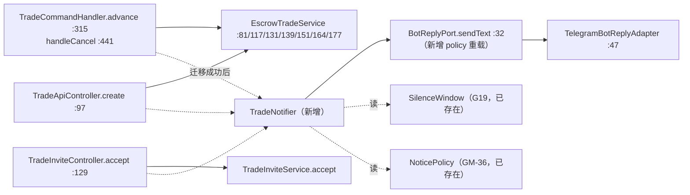

> **Model: deepseek-flash (cheap)**

**执行状态：** 已闭环。Task 1-3 均已完成；验证通过；交付门检查：GREEN。

> **Status: APPROVED** — 2026-09-26T04:50:24.697Z

> **Status: EXECUTED** — 2026-09-26T05:01:02.061Z

# 交易对手方通知（TradeNotifier）— 实施计划

> 上游设计：`docs/superpowers/specs/2026-09-25--counterparty-notification-design.md`（已获批）
> 基线：`HEAD=09b100b`，工作区干净，全量 766 绿

## 需求提炼

**目标**：让机器人能把交易状态变化主动告诉"没有发起该次操作的那一方"——补上担保流程里"对方不知道发生了什么"的缺口；同时让 `NoticePolicy`（GM-36）与 `SilenceWindow`（G19）两个零引用类获得真实生产消费者。

**唯一统一规则**：收件人 = 订单当事人中 **≠** 操作者的一方（建单亦然，服务返回后订单已存在）。

**非目标**（逐字沿用已获批 spec §2，本计划不做）：
- 不做调度器：不做定时/轮询推送（维护期到期、禁言到期等仍不自动通知）。
- 不做群内公告：只做私聊一对一通知。
- 不改资金语义：通知只描述"流程状态登记"，沿用既有 `CHAIN_CAVEAT` 的诚实边界。
- 不做重试/去重队列：一次迁移一次通知，失败即放弃并留痕。

## 靶点（file:line，提交前已 grep 实测）

| 锚点 | 位置 | 本计划对它做什么 |
|---|---|---|
| `BotReplyPort` 接口 | `tgg-app/src/main/java/com/tg/escrow/BotReplyPort.java:32` | 增 policy 重载（旧方法保留） |
| `TelegramBotReplyAdapter` | `tgg-app/src/main/java/com/tg/escrow/TelegramBotReplyAdapter.java:47` | 新方法映射 `policy.silent()` → `disableNotification` |
| `TradeCommandHandler.advance` | `tgg-app/src/main/java/com/tg/escrow/TradeCommandHandler.java:315` | 增 event 参数 + 迁移成功后调通知 |
| `TradeCommandHandler.handleCancel` | 同上 `:441` | 成功后调通知 |
| `TradeApiController.create` | `tgg-app/src/main/java/com/tg/escrow/webapp/TradeApiController.java:97` | 成功后调通知 + 响应加 `notified` |
| `TradeInviteController.accept` | `tgg-app/src/main/java/com/tg/escrow/webapp/TradeInviteController.java:129` | 同上 |
| `EscrowTradeService` 迁移方法 | `tgg-escrow/src/main/java/com/tg/escrow/escrow/EscrowTradeService.java:81/117/131/139/151/164/177` | **不改**（落点选在入口层，保持领域层纯净） |

## 数据流



## 分波实施

### Wave 1 — 出口与策略（无业务耦合，可独立验证）

- [x] T1（探针 + RED）先在 `TelegramBotReplyAdapterTest`（`:50`）里打 30 秒探针：写 `SendMessage.builder().disableNotification(true)` 确认装配形态；随后写 RED 用例——`sendText(chatId, text, NoticePolicy.progress())` 应产出 `disableNotification == true`，当前该方法不存在 → 编译失败即红。
- [x] T2（GREEN）`BotReplyPort:32` 增 `sendText(long, String, NoticePolicy)`；`TelegramBotReplyAdapter:47` 实现（`silent()` → `disableNotification`）；原 2 参方法保留并委托中性策略 → 现有调用点零改动。
- [x] T3 `BotWiring` 装配 `TradeNotifier`（含 `SilenceWindow`；配置缺省则不做静默判定）。

**Wave 1 验证**：`mvn -pl tgg-app -am test -Dsurefire.failIfNoSpecifiedTests=false`

### Wave 2 — 通知器与事件语义

- [x] T4（RED）`TradeNotifierTest`：8 事件逐条断言收件人 = 非操作者；发送抛 `TggException` 时返回 `RECIPIENT_UNREACHABLE` 且不冒泡；静默窗口内 `critical` 不静默、非 `critical` 静默。
- [x] T5（GREEN）新增 `TradeEvent`（8 值，各带 policy 与文案模板）与 `TradeNotifier`（收件人规则 + 静默判定 + fail-soft 返回值）。

**Wave 2 验证**：`mvn -pl tgg-app -am test -Dsurefire.failIfNoSpecifiedTests=false`

### Wave 3 — 接入三个入口

- [x] T6（RED）`TradeCommandHandlerTest`：通知失败时 `lock` 回执仍报成功、且追加"对方可能收不到"提示 → 当前无此文案即红。
- [x] T7（GREEN）`advance`（`:315`）与 `handleCancel`（`:441`）接入通知；`TradeApiController.create`（`:97`）与 `TradeInviteController.accept`（`:129`）接入并回 `notified` 字段。

**Wave 3 验证**：`mvn -pl tgg-app -am test -Dsurefire.failIfNoSpecifiedTests=false` → 全量 `mvn verify`（含 `EscrowPersistenceIT`）

## 瑶光反证

- **断言：当前不存在主动通知路径** —— 证据：`BotReplyPort`（`BotReplyPort.java:32`）三个方法全为回执语义；生产消费方仅 `TelegramBotHandler`。
- **断言：`disableNotification` 可用** —— 证据：`javap` `telegrambots-meta-10.3.0.jar` 显示 `SendMessage.disableNotification(Boolean)` 与 `setDisableNotification(Boolean)`。
- **断言：命令层无 `markConfirmed` 路径** —— 证据：`EscrowTradeService`（`:81`–`:177`）无 `confirm` 方法；`CONFIRMED` 仅经 `TradeInviteService.accept` 到达。
- **待验证假设（不得当结论）**："Telegram 机器人只能向曾与它会话的用户发起私聊"——两次抓 `core.telegram.org/bots/api` 均超时，未取得原文；本设计**不依赖其成立**（任何发送失败都走同一 fail-soft 路径）。
- **不可复现项（交付时须标"未验证"）**：真实 Telegram 发送端到端——无 bot token，只能用 fake `BotReplyPort` 驱动断言，不得声称"已真机验证"。

## 回归清单

| 锚点 | 验证方式 |
|---|---|
| 全量 766 绿不降 | `mvn verify` |
| 原 `sendText(chatId, text)` 行为不变 | `TelegramBotHandlerTest` |
| 命令回执文案不变（未触发通知失败时） | `TradeCommandHandlerTest` |
| Web 响应向后兼容（新增字段不破坏既有断言） | `TradeApiControllerTest` / `TradeInviteControllerTest` |

## 7. Execution closure

已闭环：Task 1-3 均已完成并通过验证。

最终验证记录：

```bash
mvn -pl tgg-app -am test（各波：768 / 776 / 779 / 781 绿）
TGG_DB_NAME=tgg_verify TELEGRAM_BOT_TOKEN=<假值> mvn verify -Dit.test=EscrowPersistenceIT（Running 行 + 4 passed）
TGG_DB_NAME=tgg_verify TELEGRAM_BOT_TOKEN=<假值> mvn verify（全量：surefire 781 + IT 4，BUILD SUCCESS）
```

交付门检查：GREEN。

备注：全部 Wave 完成：Wave1 端口策略（5a873fc）/ Wave2 TradeNotifier+装配（53bb9e9）/ Wave3a 命令路径（a155e4e）/ Wave3b Web 入口（9f72988）；ONLINE-VERIFICATION 增 A9 真机项（未验）。偏离记录：T3 装配从 Wave1 移到 Wave2 之后（依赖颠倒）；Wave2 提前跑 IT 验装配；Wave3 拆为 3a/3b 两提交。修正 spec §5 自相矛盾（静默窗口原先无作用对象）。
