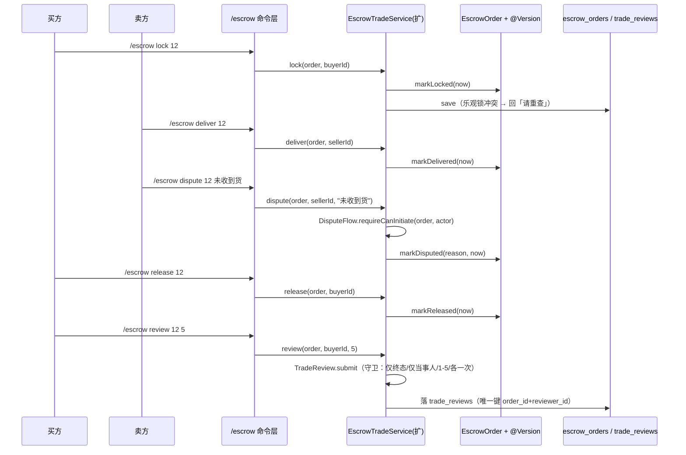

---

**执行状态：** 已闭环。Task 1-4 均已完成；验证通过；交付门检查：GREEN。
rivet-options: [{"label":"A. 一次做完 lock/deliver/release/refund/dispute/review + 维护期（推荐）","description":"服务方法 + 命令 + 接线三个孤儿类；资金类回执强制带「链上未接入」标注（测试钉住）。评价落 trade_reviews（V5）；维护期超时只算不自动执行（无调度器，诚实标注）。"},{"label":"B. 先做状态命令，评价/维护期延后","description":"先只接 lock/deliver/release/refund/dispute（零新表、零迁移），评价与维护期放下一波。更快拿到可用闭环，但 TradeReview 仍是孤儿。"}]
---


> **Model: deepseek-flash (cheap)**

> **Status: APPROVED** — 2026-09-24T14:12:21.819Z

> **Status: EXECUTED** — 2026-09-24T14:41:18.185Z

# 交易生命周期接线：让订单能走完流程，并接线三个孤儿类

## 需求提炼

**用户原话（本会话选项 1，逐字）**：
> 交易生命周期接线（推荐）：给 lock/deliver/release/dispute/review 加服务方法+命令，把 DisputeFlow/TradeReview/MaintenanceWindow 三个孤儿类接上线——让订单能走完流程。诚实的边界：真实转账腿仍要等 S5 合约，此波只落「状态+裁决记录」

**目标**：把担保订单从「创建/接单后停在 CONFIRMED」推进到可走完全程——买方托管登记 → 卖方交付 → 买方验收放款（或退款）→ 争议发起 → 交易评价；并把 `DisputeFlow` / `TradeReview` / `MaintenanceWindow` 三个已实现但零消费者的类真正接上线。

**非目标（本波不做，逐条给理由）**：
- **不做真实链上转账**（等 S5 合约 + C1 多签语义）——故本波所有资金类状态迁移必须显式标注「链上未接入」（见下方硬约束）。
- **不做联邦多签裁决**（`EscrowVerdict`/`EscrowVerdictGuard`/`EscrowMultiSigRule` 那条线）——本波只到「争议已发起 + 证据窗口」，裁决器接线属独立波次。
- **不做调度器**：无后台定时任务，故维护期超时**只判定、不自动执行**；自动放款/退款留待引入调度器后。
- **不改 `EscrowOrder` 状态机与 V1–V4 迁移**（8 态与守卫已在位，本波只调用既有 `markX`）。
- **不做按单选择维护期时长**（需要新列），本波用配置的默认时长。

## 现状与承重约束（file:line 均本会话实测）

1. 状态机迁移方法**全部就位**，但生产代码**零调用方**：`EscrowOrder.markConfirmed:161` / `markLocked:173` / `markDelivered:180` / `markDisputed:187` / `markReleased:195` / `markRefunded:202` / `markCancelled:216`。grep 全仓 `markLocked|markDelivered|markReleased|markRefunded|markDisputed` 只命中 javadoc 注释，**无一处业务调用**。
2. 服务层只有两个方法：`EscrowTradeService.initiate:70` 与 `cancel:106`（依赖 gate/historyPort/orderStore/clock，:38-41）。**没有任何 lock/deliver/release/refund/dispute/review 入口**。
3. 命令层只认 5 个子命令：`SUB_INVITE/SUB_CREATE/SUB_CONFIRM/SUB_STATUS/SUB_CANCEL`（`tgg-app/src/main/java/com/tg/escrow/TradeCommandHandler.java:68-72`）。
4. 三个孤儿类已实现且有单测，但**生产消费者为零**，`tgg-app/src/main/java/com/tg/escrow/BotWiring.java` 对其**零装配**（实测 grep 空）：`DisputeFlow.canInitiate:58` / `requireCanInitiate:74`；`TradeReview.submit:77` / `hasReviewed:88`（评分 1–5，:47/:49）；`MaintenanceWindow.durationAt:87` / `deadline:96` / `isExpired:104`（5 选项，:45）。
5. `TradeTimeoutPolicy.check:120` 同样无装配——它是维护期超时的判定器。
6. 订单乐观锁 `@Version` 已就位，并发写冲突已有 `ConcurrentOrderUpdateException` 通道。
7. **`TradeReview` 有状态**（内部 `Set<Long> reviewed` 记录已评价方），生命周期与订单结算阶段一致——**不持久化则重启即丢「已评价」事实，可被重复评价**。故接线它必须带持久化。
8. `TradeStatusView.of:48` 的 `nextStep` 文案目前指向「卖方确认接单/买方托管资金/卖方交付/买方确认收货」等——接线后需与真实可用命令对齐，否则文案在指挥用户发一条不存在的命令。

## 方案设计

### 数据流



### 硬约束（诚实性，由测试钉住）

每个**资金类**状态迁移（lock/release/refund）的用户可见回执**必须**带一句显式标注：链上托管未接入、当前不涉及真实转账。理由：本波只改状态、钱没动；对用户说「资金已托管」而实际没有，是会导致真实损失的谎报。该标注**由测试断言钉住**（缺失即红）。

### 权限矩阵（服务层守卫，不依赖命令层）

| 动作 | 允许方 | 前置状态 | 迁移 |
|---|---|---|---|
| lock | 买方 | OPEN/CONFIRMED | → LOCKED |
| deliver | 卖方 | LOCKED | → DELIVERED |
| release | 买方 | LOCKED/DELIVERED/DISPUTED | → RELEASED |
| refund | 买方或卖方（协商） | LOCKED/DELIVERED/DISPUTED | → REFUNDED |
| dispute | 买方或卖方 | LOCKED/DELIVERED | → DISPUTED（经 `DisputeFlow.requireCanInitiate`） |
| review | 买方或卖方 | RELEASED/REFUNDED | 不迁移（落评价记录） |

非当事人一律拒；状态不符由 `EscrowOrder.markX` 的既有守卫抛出——不重复实现第二套判定。

### 持久化（新增 V5）

`trade_reviews` 表：`id / order_id / reviewer_id / score / created_at`，**唯一索引 (order_id, reviewer_id)** —— 让「各评一次」在数据库层也成立，不只靠内存 Set。可移植 DDL（独立 `CREATE INDEX`、不写 ENGINE/CHARSET），遵循 `tgg-escrow/src/main/resources/db/migration/V1__init_escrow.sql` 文末约束。

## 反证/复现

- **边界断裂的物理证明（本波 RED 基线）**：写一条端到端集成测试——**真实** `EscrowTradeService` + 真实 `EscrowOrder` + 真实 `TradeCommandHandler` + 内存订单存储，跑 `/escrow lock 1` → `deliver` → `release`。**今天必红**：命令层不认 `lock`，回 USAGE，且状态停在 CONFIRMED 不动。该 RED 即「用户走不通流程」的可执行证据。
- **权限反证**：卖方发 `lock`、买方发 `deliver` → 必拒且**状态不变**（断言状态仍是原值，不只断言文案）。
- **争议守卫反证**：在 `OPEN`（未托管）发 `dispute` → 必拒（`DisputeFlow` 要求 LOCKED/DELIVERED）；第三者发 `dispute` → 必拒。
- **评价反证**：未到终态评价 → 拒；同一方评价两次 → 拒；**且持久化后仍拒**（从库重建已评价方，证明不是只靠内存）。
- **谎报反证**：lock/release/refund 回执**不含**「链上未接入」标注时测试必红——防止把状态登记说成真实资金动作。
- **并发反证**：保存触发乐观锁冲突 → 回「请重查」，**绝不谎报成功**。

## 分波执行

### Wave 1 — 生命周期服务方法（tgg-escrow）
- [x] 写 `EscrowLifecycleTest`（RED：先证明边界断裂——`EscrowTradeService` 无 lock/deliver/release/refund/dispute，编译失败）
- [x] `EscrowTradeService` 增 `lock/deliver/release/refund/dispute`（各含权限守卫 + 调既有 `markX` + `orderStore.save`）；`dispute` 内接 `DisputeFlow.requireCanInitiate`
- [x] 单测覆盖：每步成功迁移、每步非当事人被拒且状态不变、状态不符被拒、乐观锁冲突上抛
- [x] 更新该类 javadoc（现写「交易创建服务…唯一入口」，已不准确）

**验证**：`mvn -q -pl tgg-escrow -am test` 全绿。

### Wave 2 — 命令接线 + 文案对齐（tgg-app）
- [x] `TradeCommandHandlerTest` 增例（RED：`/escrow lock|deliver|release|refund|dispute <订单号>` 不被识别 → 回 USAGE）
- [x] `TradeCommandHandler` 增 5 个子命令分支（复用 `EscrowOrderLookupPort` 查单）+ 更新 `USAGE`
- [x] `TradeStatusView.nextStep` 文案改为指向**真实可用**的命令；补测断言
- [x] 更新 `BotDispatcher` 帮助文案
- [x] 资金类回执带「链上未接入」标注（含断言）

**验证**：`mvn -q -pl tgg-app -am test` 全绿。

### Wave 3 — 评价接线 + 持久化（tgg-escrow + tgg-app）
- [x] V5 迁移 `trade_reviews` + 实体/仓储/`TradeReviewStore` 端口 + `JpaTradeReviewStore`
- [x] `TradeReviewStoreTest`（RED→GREEN，H2 真库）：往返、**唯一索引拒同方二次评价**
- [x] `TradeReview` 增「带既有评价方」的构造器（从库重建，内存守卫语义不变）
- [x] `EscrowTradeService.review(order, actorId, score)`：读已评价方 → `TradeReview.submit` → 落库
- [x] 服务测试：未终态拒、非当事人拒、评分越界拒、**重复评价拒（跨重建仍拒）**

**验证**：`mvn -q -pl tgg-escrow -am test` 全绿。

### Wave 4 — 维护期/超时接线 + 收口
- [x] `MaintenanceWindow` 装配为 Bean（5 选项 + 默认项走配置 `tgg.maintenance.*`）；`TradeTimeoutPolicy` 装配（DELIVERED → 默认维护期 → AUTO_CONFIRM）
- [x] 状态视图暴露「维护期剩余 / 已过期（可验收放款）」；**标注无调度器故不自动执行**
- [x] 接线集成测试 `TradeLifecycleWiringTest`：**真实依赖非 mock**，跑完整链路 lock→deliver→release→review 与 lock→dispute
- [x] 全量回归 `mvn test`；`git diff --stat` 确认 `EscrowOrder.java` 与 V1–V4 零改动；HANDOFF 记录边界

**验证**：`mvn -q test` 全量绿；`git diff --stat c56a7ba..HEAD -- tgg-escrow/src/main/java/com/tg/escrow/escrow/EscrowOrder.java tgg-escrow/src/main/resources/db/migration/V1__init_escrow.sql` 为空。

## 部署前置与遗留
- 部署前置：新增 V5 迁移（Flyway 自动执行）；`tgg.maintenance.*` 配置项可选。
- 遗留（明确标注，不假装完成）：① 真实资金腿待 S5 合约；② 争议裁决器（联邦多签）未接线；③ 维护期超时**不会自动**放款（需调度器）；④ 按单自定义维护期时长需新列，未做。

## 7. Execution closure

已闭环：Task 1-4 均已完成并通过验证。

最终验证记录：

```bash
mvn test（全量，704 绿，BUILD SUCCESS，exit 0）
mvn -pl tgg-escrow -am test（342 绿）
mvn -pl tgg-app -am test（103 绿）
git diff --stat（EscrowOrder.java 与 V1/V2/V3 迁移为空 = 未打扰）
```

交付门检查：GREEN。

备注：Wave 1–4 全部落地：服务方法、命令接线、评价持久化（V5）、维护期装配。全量 mvn test 704 绿（起点 653，+51）。EscrowOrder.java 与 V1–V3 迁移零改动（已实测 git diff --stat 为空）。
