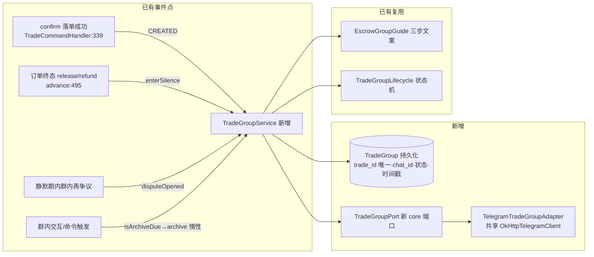

> **Model: mimo-v2.6-pro (strong)**

**执行状态：** 已闭环。Task 1-3 均已完成；验证通过；交付门检查：GREEN。

> **Status: APPROVED** — 2026-09-29T08:31:10.505Z

> **Status: EXECUTED** — 2026-09-29T09:42:22.134Z

# 交易群流程接线——ET-05/06/39/40 四个 P0 的共同上游（每笔交易新建群）

## 需求提炼

用户原话：「继续开发吧」。承接前序单元（S5 裁决验签修复已交付 `4fedad5`/`07638ea`），按 `docs/CODE-VS-SPEC.md:225` 的结论「真正的解锁条件是上游流程成立：交易群流程（ET-05/06/39/40）」推进下一开发波次。

**目标**（产品语义已定案，`docs/requirements/SPEC.md:327`：「交易群与交易 ID 绑定；每笔新交易新建群，不复用」）：
- 交易落单成功后自动创建专属 Telegram 群（建群 → 邀请买卖双方 → 绑定交易 ID）；
- ET-05 交易群创建引导（复用已有 `EscrowGroupGuide` 三步文案流）；
- ET-06 交易群机器人公告（建群后发规则公告并置顶）；
- ET-40 交易群静默期（订单终态后进入静默，静默期内再起争议回到留痕）；
- ET-39 交易群生命周期 7 天归档（静默期满惰性归档）。

**非目标**：
- **不引入调度器**（项目既定非目标）——归档/静默推进走惰性判定（群内下一次交互或命令触发时结算）；
- 不动 S5 链上执行（`ChainGateway.resolveDispute` 抽象点保持恒「未执行」）；
- 不复用群（每笔新交易新建）；
- 真机建群/邀请/置顶行为**不在本波核销**（需 bot 权限与部署环境），留 `ONLINE-VERIFICATION` 新条目；
- 不做群内反查订单命令（chatId→tradeId 的用户面功能）——但**绑定数据本波落**（后续可加）。

## 现状与缺口（侦察已核验，锚点经本会话 grep 复核）

已备件（全部零生产引用，有件未接线）：
- `TradeGroupLifecycle`（`tgg-escrow/.../TradeGroupLifecycle.java:49-141`）：5 态状态机 PENDING→LINKED→RECORDING→SILENT→ARCHIVED，构造绑定 tradeId(long)，`link/startRecording/enterSilence/disputeOpened/archive/isArchiveDue`；
- `EscrowGroupGuide`（`tgg-escrow/.../EscrowGroupGuide.java:39-72`）：三步文案 CREATE_GROUP→INVITE→START，`next` 末步返空；
- `TradeStage`（`tgg-escrow/.../TradeStage.java:52-79`）：7 阶段映射订单 8 态，未接用户视图（`TradeStatusView.java:44` 直接 switch 原始状态）。

缺口（实测）：
1. **建群能力全库为零**：`createChatSupergroup|inviteChatMember|pinChatMessage|leaveChat` 在 `tgg-*/src/main` 零命中（本会话 grep 核验）；`GroupAdminPort`（`tgg-core/.../GroupAdminPort.java:35`）仅 kick/ban/mute/deleteMessage；
2. **群↔订单绑定缺件**：`EscrowOrder` 无 chatId/群字段（本会话 grep 核验）；`TradeMessageMapPort`（`tgg-escrow/.../moderation/TradeMessageMapPort.java:36-38`）只存 tradeId→chatId→messageId，**无生命周期状态、无反查**；
3. **生命周期无持久化**：`TradeGroupLifecycle` 是内存有状态对象，重启即丢；
4. **语义张力（已核验）**：`TradeGroupLifecycle.disputeOpened` 只接受 SILENT（`:118-119`，「静默期内再争议」），而 `EscrowOrder.markDisputed` 只接受 LOCKED/DELIVERED（`EscrowOrder.java:187-188`）——**两者是不同事件，禁止直连**；
5. tradeId 由 `EscrowOrderStore.save` 回填（`EscrowOrder.java:89`，Long 可空）——构造 lifecycle 前须判空，防自动拆箱 NPE。

## 架构设计



关键设计决策：
1. **新增 core 端口 `TradeGroupPort`**（tgg-core）：`createGroup(tradeId, title)` / `invite(chatId, userId)` / `announce(chatId, text)` / `archive(chatId)`，tgg-app 侧 `TelegramTradeGroupAdapter` 用共享 `OkHttpTelegramClient`（`BotWiring.java:386`）实现，`BotWiring` 装配；
2. **新增持久化 `TradeGroup`**（JPA 实体 + `TradeGroupStore` 端口）：trade_id 唯一、chat_id、生命周期状态、silence 起点/归档时刻——`TradeGroupService` 每次从存储恢复 lifecycle 再推进（解决重启丢状态）。表结构入 Flyway 迁移；
3. **事件映射（语义边界防误接）**：落单成功→`link`；建群+邀请完成→`startRecording`；订单终态（RELEASED/REFUNDED/CANCELLED）→`enterSilence`；**静默期内群内再起争议→`disputeOpened`（≠ 订单 markDisputed）**；`isArchiveDue` 为真且有触发→`archive`；
4. **fail-safe 降级**：建群/邀请/置顶失败**不回滚交易**（群是辅助载体），回执如实「群未建：<原因>」——绝不假装已建（同 `TradeNotifier` 通知失败不回滚迁移的既有语义）；
5. **三态配置沿用 `:#{null}` 惯例**（`BotWiring.java:486`）：`tgg.trade-group.silence-days`（缺省 7）；建群能力未配置/无权限时优雅降级而非启动失败；
6. **诚实边界**：所有群回执不涉资金语言（状态登记 ≠ 出款，链上未接入）。

### Wave 1 · 域层：持久化 + 事件映射（不碰 Telegram API）

1. `TradeGroup` JPA 实体 + Flyway 迁移 + `TradeGroupStore` 端口（tgg-escrow）；
2. `TradeGroupService`（tgg-escrow）：从存储恢复/推进 lifecycle 的编排——`onTradeCreated`/`onTradeSettled`/`onDisputeInSilence`/`onArchiveDue` 四个入口；**disputeOpened 语义边界**用例钉死（订单 DISPUTED 不得触发它）；
3. tradeId 判空防护用例（save 回填失败即拒，不 NPE）。

> **验证**：`TGG_DB_NAME=tgg_verify TELEGRAM_BOT_TOKEN=0000000000:TEST_TOKEN mvn verify` 全量不回退（当前基线 914 surefire + 4 IT）；新用例先 RED 后 GREEN。

### Wave 2 · 能力层：建群端口 + Telegram 适配器

4. `TradeGroupPort` 接口（tgg-core）；
5. `TelegramTradeGroupAdapter`（tgg-app）：createChatSupergroup / inviteChatMember / pinChatMessage / leaveChat 封装，逐方法 try-catch 转 `TradeGroupException`（含 Telegram 错误码透传）；
6. `BotWiring` 装配（`:#{null}` 三态 + 失败降级开关）；
7. **开工前探针**：`javap`/IDE 确认 telegrambots-meta 10.3.0 的方法类名（`CreateChatSupergroup` 等）——假设待验证，若缺类则改为 BotApiMethod 原生调用。

> **验证**：适配器单测（mock TelegramClient 断言方法构造与错误转换）+ 全量 `mvn verify` 不回退。

### Wave 3 · 编排层：用户可见流程 + 惰性归档

8. 落单成功 → 建群 + 邀请买卖双方 + `EscrowGroupGuide` 三步文案（ET-05）+ 规则公告置顶（ET-06）；回执带群链接或如实降级说明；
9. 订单终态 → `enterSilence` + 群公告「静默期 N 天，期内可争议」（ET-40）；
10. 惰性归档结算入口：群内任意消息/`/escrow status` 触发 `isArchiveDue` 判定 → `archive` + `leaveChat`（ET-39）；
11. `TradeStage.label()` 接入 `TradeStatusView`（顺手收口零引用第三件）；
12. `ONLINE-VERIFICATION.md` 增补真机核销条目（建群/邀请/置顶/归档，A 级待部署）。

> **验证**：全量 `mvn verify` 不回退；BotDispatcher 级用例（命令→回执）；真机面明确标「未核销」。

## 反证 / 复现

本计划的关键断言已逐条核验（本会话 grep/read 实测，非采信 scout 转述）：

| 断言 | 复现命令 | 实测结果 |
|---|---|---|
| disputeOpened 与 markDisputed 语义互斥 | `grep -n 'require(State.SILENT' TradeGroupLifecycle.java` / `grep -n 'requireState(State.LOCKED' EscrowOrder.java` | `:119` 仅 SILENT；`EscrowOrder.java:188` 仅 LOCKED/DELIVERED——直连必抛非法迁移 |
| 建群能力全库为零 | `grep -rn 'createChatSupergroup\|inviteChatMember\|pinChatMessage\|leaveChat' tgg-*/src/main` | 0 命中 |
| EscrowOrder 无群字段 | `grep -n 'chatId\|groupId' EscrowOrder.java` | 0 命中 |
| 三者零生产引用 | `grep -rn 'TradeGroupLifecycle\|EscrowGroupGuide\|TradeStage' tgg-*/src/main --include='*.java' -l \| grep -v '定义文件'` | 仅定义文件自身 |
| 产品语义已定案 | `docs/requirements/SPEC.md:327` | 「交易群与交易 ID 绑定；每笔新交易新建群，不复用」 |

**待验证假设**（不当结论，Wave 2 开工前探针结算）：
- telegrambots-meta 10.3.0 提供 `CreateChatSupergroup`/`InviteChatMember`/`PinChatMessage` 方法类（依赖 `tgg-app/pom.xml:45-57` 确认为 10.3.0，但方法类存在性未 javap 实证）；
- Bot 以 createChatSupergroup 建群后自动成为群主（Telegram 行为）——真机核销项。

## 验收与遗留

- **用户级验收**（每波后可测）：① 落单成功 → 回执含「交易群」与群链接/降级说明；② 订单放款/退款 → 群公告含静默期；③ 静默期满后群内交互 → 群归档（bot 退群）；④ 静默期内发争议 → 群回到留痕态。
- **不核销项**（如实标注）：真机建群行为（需 bot 权限+部署）；链上资金面（S5 未部署，回执恒 `chainExecuted=false`）。
- **风险**：建群 API 需要 bot 是超级群创建者（BotFather 权限面）——降级路径保证交易主流程不依赖群。

## 7. Execution closure

已闭环：Task 1-3 均已完成并通过验证。

最终验证记录：

```bash
TGG_DB_NAME=tgg_verify TELEGRAM_BOT_TOKEN=0000000000:TEST_TOKEN mvn verify → BUILD SUCCESS（947 surefire + 4 IT 全绿）
mvn -pl tgg-app -am test -Dtest='TelegramTradeGroupAdapterTest' → 4/4
mvn -pl tgg-escrow -am test -Dtest='TradeGroupServiceTest,TradeGroupPersistenceTest' → 32/32
EscrowPersistenceIT（Bean 图）→ 4/4
```

交付门检查：GREEN。

备注：全部完成。设计偏差：telegrambots 10.3.0 无 bot 建群/拉人 API（javap 实证），改为「用户建群→群内落单绑定」；偏差记录在 TradeGroupPort javadoc 与 ONLINE-VERIFICATION A16。执行侧偏差：plan_task 后台仅 T1/T2 完成，T3/T4 由主会话内联接手。真机面（A16/A17）未核销，待部署。
