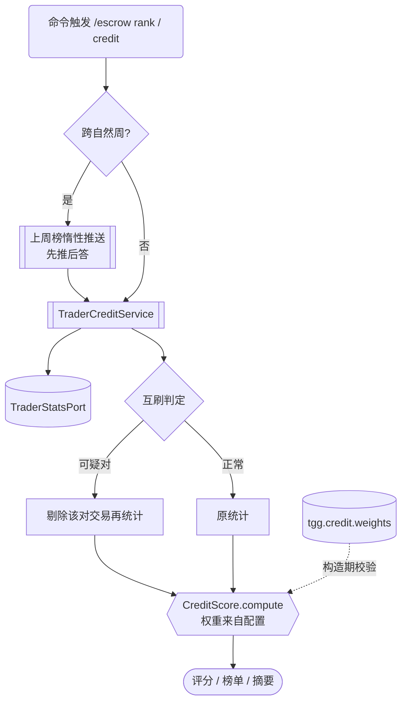

> **Model: glm-5.3-flash (cheap)**

> **Status: APPROVED** — 2026-10-01T09:41:43.565Z

# ④ 信用分一次到位（B3 剩余差距：权重配置化 + 轻量衰减 + 互刷不累加 + 周榜惰性推送）

> **Status: EXECUTED** — 2026-10-01（三波全部交付，见文末「闭环摘要」）

## 需求提炼

**用户原话**：「开始遗留处理」→ 指 HANDOFF 排期下一项「**④ 信用分一次到位**（拍板边界已定，~3-4 天）」。
**排名范围已由用户本轮拍板**：「保持全局榜——实现简单，不加数据结构」（第 5 子项由此闭案，只记决策不加代码）。

**目标**（拍板边界 = UNDECIDABLE-DECISIONS.md §④ 差距清单 1+3+4 落地 + 2 轻量形态 + 5 已拍板）：
1. **权重配置化**（差距 1）：`CreditScore.WEIGHTS` 从硬编码改为 `tgg.credit.weights` 配置，构造期 fail-fast。
2. **互刷不累加**（差距 3，ET-38/T53）：被互刷判定的交易不计入信用分；前 3 笔豁免（`NewcomerBadge` 同源阈值）。
3. **周榜惰性推送**（差距 4，ET-77）：命令触发时若跨了自然周，主动把上周榜发给触发者（不引入调度器）。
4. **轻量时间衰减**（差距 2 轻量形态）：活跃维度按「最近活跃距今」衰减——现有数据（`firstAt/lastAt`）即可。

**非目标**：
- **真时间衰减**（每笔交易按时间戳加权）——需扩大统计存储，拍板文档明言后置。
- **排名按群**——用户本轮拍板保持全局；在 UNDECIDABLE-DECISIONS §④ 记决策即可。
- 不改五维的语义口径（哪五个维度、反向方向）与 `TraderTier` 等级门槛。
- 不引入调度器/定时任务（项目既定非目标）。

## 现状（计划期亲读源码核实，非转述）

| 事实 | 锚点 |
|---|---|
| 五维权重**硬编码** `0.30/0.25/0.20/0.15/0.10`，无配置入口 | `tgg-escrow/src/main/java/com/tg/escrow/escrow/CreditScore.java:34-37` |
| `CreditScore` 是**纯静态工具类**（私有构造、无状态）——配置化必须改成实例或传参 | `CreditScore.java:31`（`private CreditScore()`） |
| 五维拆解与评分**同源**：`breakdownOf` 产出 → `scoreOf` 直接喂 `compute` | `TraderCreditService.java:93-95 / 100-103`（亲读） |
| 榜单先排后截 + 同分按 userId 定序 | `TraderCreditService.rank:131-143`（亲读） |
| 互刷检测**只进评估链**（`FraudLinkageService.assess`），评分/榜单链未消费 | `tgg-app/.../FraudLinkageService.java:94`；grep 全仓无评分链引用 |
| 新手豁免已有同源阈值（completed < 3） | `NewcomerBadge.java:40`（NEWCOMER_THRESHOLD=3） |
| 互刷阈值已有配置键 `tgg.fraud.concentration-threshold:0.6` | `tgg-app/.../BotWiring.java:274` |
| 活跃天数 = 首末自然日跨度含两端 | `TraderCreditService.activeDaysOf:63-70` |
| 榜单命令链：`handleRank:453` → `credit.rank(statsPort.allWithActivity(), topN)` | `tgg-app/.../TradeCommandHandler.java:453,469` |
| 文档债：CODE-VS-SPEC 把已接线的互刷/新手豁免仍记「零引用」（与 ET-04 行自相矛盾）、行号漂移 ~114 行 | `docs/CODE-VS-SPEC.md:141/203/255 vs :107`（worker 发现，本轮以 grep 源码反证） |

## 方案

### Wave 1 · 权重配置化（差距 1）

1. `CreditScore` 改为**实例类**：构造器收 `BigDecimal[] weights`（5 项、每项 ∈ [0,1]、**总和 = 1**——不等于 1 是最常见的配置事故，构造期 fail-fast）；静态默认实例 `CreditScore.defaults()` 保持现口径（现有测试大多零改动）。`compute` 改实例方法。
2. 配置键 `tgg.credit.weights`（逗号分隔 5 值，如 `0.30,0.25,0.20,0.15,0.10`）；`BotWiring` 解析 + 失败即启动失败（同 `FeePolicy` 模式）。**按坑 10 登记 application.yml + README**。
3. `TraderCreditService` 从静态调用改为注入 `CreditScore` 实例（构造器加参；BotWiring 同步）。全量消费方 grep：`CreditScore.compute` 调用点只有 `TraderCreditService.scoreOf`（本轮已核）。

**波验证**：`mvn -B -pl tgg-escrow,tgg-app -am test -Dtest='CreditScoreTest,TraderCreditServiceTest' -Dsurefire.failIfNoSpecifiedTests=false` + 全量 clean verify（坑 1）。

### Wave 2 · 互刷不累加（差距 3）

1. `TraderCreditService` 增加互刷感知的统计路径：对 `TraderStats.counterpartyCounts` 中占比超阈值的**可疑对手对**，把与该对手的交易对从「有效笔数」中剔除后再拆解（**不修改 TraderStats 本身**——评估链与评分链共享同一份原始数据）。
2. 阈值**同源** `tgg.fraud.concentration-threshold`（不新增第二个阈值键——两处阈值漂移会比没有阈值更糟）；判定复用 `MutualBrushDetector.shareOf` 口径（占比 = 与该对手笔数 / 全部对手笔数和，坑 9）。
3. 新手豁免：`NewcomerBadge.isMutualBrushExempt(completed)` 同源调用——前 3 笔不启用剔除（豁免的是"检测生效时点"）。
4. `handleRank`/`handleCredit`/`summarize` 全部走新路径；被剔除的笔数在**五维拆解文案**中如实披露（如「剔除互刷嫌疑 2 笔」）——静默改数会让人对不上账。

**波验证**：`mvn -B -pl tgg-escrow,tgg-app -am test -Dtest='TraderCreditServiceTest,RankingTest,CreditSummaryViewTest' …` + 全量。

### Wave 3 · 周榜惰性推送（差距 4）+ 轻量衰减（差距 2）

1. **周榜**：`/escrow rank` 触发时比对「上次推送的周」与「当前周」（ISO 周，状态存哪：**user_prefs 表已有先例**，或进程内——由实现时按最小改动定，计划不预设）；跨周则在回答本次请求**之前**先推上周榜（文本，脱敏同现口径）。
2. **轻量衰减**：活跃维度分数乘以「最近活跃距今」的衰减因子（如 30 天内满额、每超 30 天打 9 折、下限 0.3——具体参数进配置键 `tgg.credit.decay`，同样 fail-fast）；文档口径与渲染层同步。
3. **决策记录**：UNDECIDABLE-DECISIONS §④ 补记「排名范围 = 全局榜（2026-10-01 用户拍板）」；顺手修 CODE-VS-SPEC 的 ET-38/ET-65/67/72 过期判定与行号漂移（worker 已定位，逐条以源码复核后改）。

**波验证**：`mvn -B -pl tgg-escrow,tgg-app -am test -Dtest='TraderCreditServiceTest,CreditSummaryViewTest' …`；最终 `TELEGRAM_BOT_TOKEN=123456:dummy-for-it TGG_DB_NAME=tgg_escrow_verify mvn -B clean verify`（基线 1126 surefire + 4 IT 不回退）。

## 瑶光反证 / 复现

- **权重硬编码**：亲读 `CreditScore.java:34-37`（本计划期 read_file 全文）✓
- **评分与拆解同源**：亲读 `TraderCreditService.java:93-103` ✓
- **互刷只进评估链**：grep 全仓 `MutualBrushDetector` 生产引用仅 `FraudLinkageService`（worker 发现 + 我 grep `fraudLinkage` 接线佐证）；**待验证假设**：worker 称评分链零引用，本轮以全仓 grep 复核为据，未逐文件读——Wave 2 动手前先跑相关测试拿基线。
- **`rank` 先排后截**：亲读 `TraderCreditService.java:131-143` ✓
- **`CreditScore.compute` 消费方唯一**：本轮 grep 只见 `TraderCreditService.scoreOf`；Wave 1 动手前再以编译器（`mvn test-compile`）全量确认，不靠 grep 下负结论。
- **文档债**：worker 报告 ET-38 与 ET-04 自相矛盾——已在计划列为待修项，改前逐条按源码复核（教训：文档描述写下时状态）。

## 回归清单

- `/escrow credit` 回执形态（评分 + 等级 + 笔数 + 五维拆解）不回退；零历史 40 分行为不变（权重默认值不动时）。
- `/escrow rank` 先排后截 + 同分按 ID 定序 + 强制脱敏。
- `FraudLinkageService`（评估链）行为零变化——本计划只让评分链**也**消费判定，不动评估链。
- `TradeAdmissionGate` 准入三规则不受影响。
- 全量 surefire ≥ 1126（只增不减）+ 4 IT。
