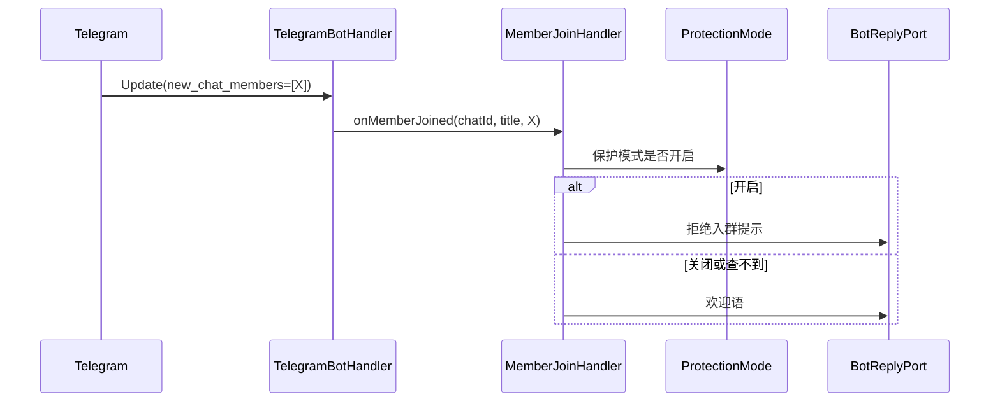

---

**执行状态：** 已闭环。Task 1-3 均已完成；验证通过；交付门检查：GREEN。
rivet-options: [{"label":"A. 入群治理接线（推荐）","description":"Wave1 修私聊误处置 + 聊天类型进载体；Wave2 接新成员入群（欢迎语 + 保护模式）。"},{"label":"B. 只修私聊缺陷","description":"先只修私聊误处置（已确认缺陷），不引入入群事件路径。"},{"label":"C. 先定 C1 解锁 S5","description":"先出 C1 多签语义决策简报，解锁 S5 合约。"}]
---


> **Model: deepseek-flash (cheap)**

> **Status: APPROVED** — 2026-09-24T15:51:07.948Z

> **Status: EXECUTED** — 2026-09-24T16:04:23.179Z

# 入群治理接线：新成员欢迎 + 保护模式，并修掉私聊被误处置

## 需求提炼

用户指令：继续开发。目标：① 修掉已确认缺陷——私聊消息也会被内容安全处置；② 把零引用孤儿 `WelcomeTemplate`（欢迎语）与 `ProtectionMode`（保护模式）接进新成员入群路径。

非目标：不改既有编排语义（只加聊天类型前置门槛）；不做 `JoinVerificationFlow` 完整问答（超时需调度器）；不做 `SilenceWindow`/`FeatureToggle`/`AdminRegistry`。

## 现状（实测）

`TelegramBotHandler` → `MessageGuardService.screen` → `deleteMessage` + `warn`。全仓 `getType|ChatType|isGroup` 零命中 → 私聊发带链接消息会触发删消息 + 记警告（两分支都错）。`isProcessable` 看不到 `new_chat_members` → 入群事件根本进不来。孤儿（main 引用 0）：`WelcomeTemplate`、`ProtectionMode`。

## 方案



关键决策：① `IncomingMessage` 加 `ChatKind`，编排层对非群聊直接放行（不是漏判，是该规则不适用私聊）；`UNKNOWN` 行为定死并断言。② 保护模式查不到时取「默认关闭、放行且欢迎」——拒绝全体入群的破坏性远大于放行一个；该取舍写进注释与测试。

## 瑶光反证

私聊带可疑链接：今天会被删+记警告（RED）。群聊同内容仍须被处置（不误伤）。入群事件：今天 `isProcessable` 判 false，欢迎语永不发出（RED）。保护模式开启时不得发欢迎语。未打扰：命令路径/违禁词优先/群聊内容安全不变；`ModerationOrchestrator`/`GroupAdminPort`/`WarningOrchestrator`/`EscrowOrder`/迁移零改动。

## 分波执行

### Wave 1 — 聊天类型进载体 + 修私聊误处置
- [x] `MessageGuardOrchestratorTest` 增例（RED：私聊带可疑链接现状被拦，期望放行）
- [x] `IncomingMessage` 加 `ChatKind`，工厂补齐
- [x] `MessageGuardOrchestrator.inspect`：非群聊放行
- [x] `TelegramBotHandler.toIncoming` 映射 `Chat.type`
- [x] 测试：私聊放行、群聊照拦、`UNKNOWN` 定死断言

**验证**：`mvn -q -pl tgg-core -am test`、`mvn -q -pl tgg-app -am test` 全绿。

### Wave 2 — 新成员入群：欢迎 + 保护模式
- [x] `MemberJoinHandlerTest`（RED：类不存在→编译失败）
- [x] 新增 `MemberJoined` + `MemberJoinHandler`（保护模式判定 → 欢迎或拦截）
- [x] `isProcessable` 纳入 `new_chat_members` 并路由
- [x] `BotWiring` 装配 `WelcomeTemplate`/`ProtectionMode`（配置驱动）
- [x] 测试：变量替换、保护模式拦截、查不到时放行且回报

**验证**：`mvn -q -pl tgg-app -am test` 全绿。

### Wave 3 — 收口
- [x] 全量回归 `mvn test`（基线 754 绿）
- [x] `git diff --stat` 确认编排层/订单/迁移零改动
- [x] HANDOFF 记录私聊已修、入群已接、真机未验证

**验证**：`mvn -q test` 全绿；diff 为空。

## 部署前置与遗留

无新迁移；新增可选配置（欢迎语模板、保护模式默认值）。遗留：真机未验证；`JoinVerificationFlow` 问答交互未接；`SilenceWindow`/`FeatureToggle`/`AdminRegistry`/`NoticePolicy`/`MuteSchedule`/`ChannelSubscriptionCheck`/`ReplayGuard` 仍零引用。

## 7. Execution closure

已闭环：Task 1-3 均已完成并通过验证。

最终验证记录：

```bash
mvn test（全量，766 绿，BUILD SUCCESS，exit 0）
mvn -pl tgg-core -am test（251 绿）
mvn -pl tgg-app -am test（148 绿）
git diff --stat（ModerationOrchestrator/GroupAdminPort/WarningOrchestrator/EscrowOrder/迁移 为空 = 未打扰）
```

交付门检查：GREEN。

备注：Wave 1 修掉私聊被误处置（ChatKind + 编排层前置门槛）；Wave 2 接新成员入群（MemberJoined/MemberJoinHandler + 事件路由 + 装配）。全量 mvn test 766 绿（起点 754，+12）。ModerationOrchestrator/GroupAdminPort/WarningOrchestrator/EscrowOrder/迁移 零改动。两处偏离已记录：计划中的「保护模式查不到状态」分支不适用（该类为进程内对象），MemberJoinHandler 置于 tgg-app 而非 core。
