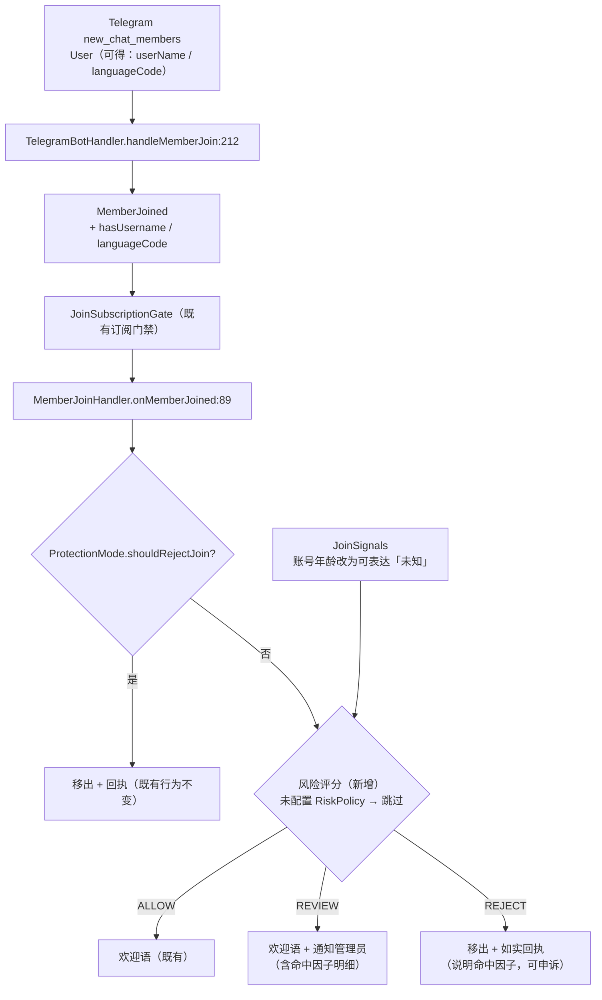

---

**执行状态：** 已闭环。Task 1-3 均已完成；验证通过；交付门检查：GREEN。
rivet-options: [{"label":"A：精确化信号语义 + 接入评分（推荐）","description":"让「未知」可表达（与语言那句同族）+ 只采可得信号 + 默认不启用；三档落点：放行/通知管理员/移出"},{"label":"B：不接线，只登记缺件","description":"保持代码不动，只在 CODE-VS-SPEC 写清「为何不接」（账号年龄信号不可得）——可以，但 GM-24/25 继续停在 C 级"},{"label":"C：硬编码默认值填满信号（不推荐）","description":"不动 JoinSignals，接线时把不可得信号填成「不可能命中」的默认值——会把未知伪装成已知（对攻击者有利），仅作反面记录"}]
---


> **Model: deepseek-flash (cheap)**

> **Status: APPROVED** — 2026-09-28T19:06:16.197Z

> **Status: EXECUTED** — 2026-09-28T19:12:25.175Z

# 入群风险评分接线（GM-24/25）——并解决「账号年龄不可得」这一前提缺件

## 需求提炼

**用户原话**：「继续本地开发」——延续既有路线：把"有实现类但零引用"的能力接上真实链路；范围限本地，不碰线上部署。

**目标**：让入群风险评分这条链真正作用于入群事件——`JoinSignals`（信号）→ `JoinRiskScorer`（评分与档位）→ `MemberJoinHandler`（落点）。三者齐全，但**没有任何生产调用点**，新成员入群时根本不评分。

**必须先解决的前提缺件（本波核心）**：`JoinSignals.accountAgeDays` 是**不得为负的 int**（`JoinSignals.java:40/43`），而 **Telegram 不暴露账号注册时间**（本波 `javap` 实测 telegrambots-meta 10.3.0 的 `User`：`createdAt`/`registeredAt`/`accountAge` 匹配数 **0**）。照现状接线只能把年龄填 0 → **每个新成员都命中 `NEW_ACCOUNT`** → 系统性误判。这正是 `JoinRiskScorer` 已为**语言**避免、却没为**账号年龄**避免的那类错误（其 javadoc：「把'拿不到'当作'可疑'会让评分在部分客户端上系统性偏高——那是数据问题，不是用户问题」）。

**为什么选它**：`docs/CODE-VS-SPEC.md` §2.2 的 **GM-24 / GM-25** 是 C 级里少见的"零件齐全、只差接线"一组（评分器 + 策略 + 三档结论 + 已有门禁先例），且与本会话前两波同域（群治理安全）。

**非目标**：
- **不启用头像检测**：`hasAvatar` 需每个新成员多一次 `getUserProfilePhotos` 往返（延迟 + 失败面），本波不做；部署者可用可得因子组合覆盖。明确登记为"不接"
- **不引入封禁/处罚链**：`REJECT` 只做"拒绝入群（移出）"
- **不改变默认行为**：`RiskPolicy` **未配置 = 不启用**该防御（同 `tgg.guard.*` 惯例）
- 不新增第三方依赖、不新增表、不做线上部署

## 现状（实测）

| 事实 | 证据 |
|---|---|
| 评分三件套生产零引用 | `grep -rn "\bJoinRiskScorer\b" --include=*.java tgg-*/src/main` 仅命中自身文件（**0** 外部引用） |
| 入群事件载体面很窄 | `MemberJoined.java`（record：chatId / chatTitle / userId / userName）——没有 username 有无、语言、头像、账号年龄 |
| 唯一生产构造点 | `TelegramBotHandler.java:212`（`handleMemberJoin` 内） |
| 入群门禁现状 | `MemberJoinHandler.onMemberJoined:89` → `protection.shouldRejectJoin():93` → 欢迎语；**无评分环节** |
| 装配点 | `BotWiring.java:523`（memberJoinHandler bean）、`:562/565`（JoinSubscriptionGate 链） |
| Telegram 侧可得信号 | `User.getUserName()` ✓、`User.getLanguageCode()` ✓；**账号年龄 ✗**（javap 实测 0 匹配）；头像需额外 API |
| 三档结论已定义 | `RiskAssessment.Verdict`：ALLOW / REVIEW / REJECT（互斥完备） |
| 策略全配置驱动 | `RiskPolicy`（权重表 / 阈值 / 语言白名单 / 新账号门槛）+ 构造期 fail-fast |

## 数据流



## 分波执行

### Wave 1 · core：信号语义 + 评分器（TDD）

- [x] **RED**：`JoinRiskScorerTest` 加用例——**账号年龄未知时不得命中 `NEW_ACCOUNT`**；若 `JoinSignalsTest` 不存在则新建（信号载体的构造期约束）→ 跑 `mvn -B -pl tgg-core -am test -Dtest='JoinRiskScorerTest,JoinSignalsTest'`，记录失败形态与退出码
- [x] `JoinSignals`：`accountAgeDays` 改为可表达"未知"（`OptionalInt`——让"未知"无法被误读为 0）
- [x] `JoinRiskScorer.assess`：账号年龄未知时**不计入** `NEW_ACCOUNT`（与"语言未知不判违规"写在同处、同理由）
- [x] `MemberJoined`：新增 `hasUsername` 与 `languageCode`；**账号年龄不加入载体**（不可得的字段一放进模型，就会被某处填一个看起来合理的假值）

**验证要点**：`mvn -B -pl tgg-core -am test` 全绿；`JoinRiskScorerTest` 用例数只增不减

### Wave 2 · app：采集 + 落点 + 装配（TDD）

- [x] **RED**：`MemberJoinHandlerTest` 加三档用例（ALLOW 欢迎 / REVIEW 欢迎+通知 / REJECT 移出且回执含命中因子）；`TelegramBotHandlerTest` 加信号采集用例
- [x] `TelegramBotHandler.handleMemberJoin`：从 `User` 采集可得信号填入 `MemberJoined`
- [x] `MemberJoinHandler`：接入 `JoinRiskScorer`（**可空依赖**——未配置即跳过），实现三档落点；`REJECT` 复用既有 `attemptKick` 并**如实回执**（移出失败不谎报）
- [x] 装配：`BotWiring` 由 `tgg.risk.*` 构造 `RiskPolicy`——**未配置（权重表为空）= 不建评分器**；配置键写进 `application.yml` 注释与 README

**验证要点**：`mvn -B -pl tgg-app -am test -Dtest='MemberJoinHandlerTest,TelegramBotHandlerTest,JoinSubscriptionGateTest'` 全绿

### Wave 3 · 文档收口 + 全量回归

- [x] `docs/CODE-VS-SPEC.md`：GM-24 / GM-25 判定更新（C→A）+ §2.3/§4 计数用区域限定 awk 从正文重算 + §2.5 零引用清单重跑
- [x] `docs/ONLINE-VERIFICATION.md`：新增真机核销项（配 `TGG_RISK_*` 后按档位处理；未配置时行为不变）
- [x] `README.md`：配置面补 `tgg.risk.*`；已实现清单补"入群风险评分"
- [x] 全量 `mvn -B verify`：**用例数 ≥916 + 4 IT**、0 failure

**验证要点**：全量绿 + 文档三处与实测一致（计数非手写）

## 反证 / 复现

| 断言 | 复现命令 | 期望 |
|---|---|---|
| 账号年龄**不可得**（本波的前提缺件） | `javap -cp <telegrambots-meta-10.3.0.jar> ...User \| grep -icE "createdAt\|registeredAt\|accountAge"` | **0** |
| 评分器**当前零引用** | `grep -rn "\bJoinRiskScorer\b" --include=*.java tgg-*/src/main \| grep -v JoinRiskScorer.java \| wc -l` | **0** |
| 未知账号年龄**不得**命中 NEW_ACCOUNT | `mvn -B -pl tgg-core -am test -Dtest=JoinRiskScorerTest` | 新用例绿；**回滚该判定则该用例红** |
| 未配置策略**不改变行为** | 不配 `TGG_RISK_*` 跑全量 | 现有入群用例全绿、用例数只增不减 |
| 三档落点可复现 | `mvn -B -pl tgg-app -am test -Dtest=MemberJoinHandlerTest` | ALLOW / REVIEW / REJECT 各有用例 |

## 风险与规避

- **误踢真人**（REJECT 是重动作）：① 默认不启用（未配策略即不评分）；② 只对 `REJECT` 移出，`REVIEW` 仅通知；③ 回执与日志带**命中因子明细**（可解释、可申诉）；④ 语言因子已在评分器内做过"未知不判违规"。
- **`MemberJoined` 签名变更**：3 处测试构造点 + 1 处生产构造点（`TelegramBotHandler:212`）→ 用 `mvn -B test-compile` 让编译器点名同步，不用"默认值重载"省事（那会让"忘传信号"静默退化成"无信号"）。
- **信号采集的诚实性**：不可得的字段不进模型（否则必被填假值）。
- **判定顺序**：风险评分排在保护模式**之后**（保护模式是"暂时关门"，优先级更高）、欢迎语**之前**。

**验收证据**（每波逐条核销）：TDD（RED→GREEN）→ 全量 `mvn -B verify` 用例数不回退（基线 916 + 4 IT）→ scoped 提交 → push（本地开发范围，不含线上部署）。

## 7. Execution closure

已闭环：Task 1-3 均已完成并通过验证。

最终验证记录：

```bash
TELEGRAM_BOT_TOKEN=123456:dummy-for-it mvn -B verify → BUILD SUCCESS，932 用例 + 4 IT，0 failure
mvn -B -pl tgg-core -am test → 293 用例全绿
mvn -B -pl tgg-app -am test -Dtest=MemberJoinHandlerTest,TelegramBotHandlerTest,JoinSubscriptionGateTest → 38/38 绿
回滚验证：把「账号年龄未知不计入」还原为 orElse(0) → JoinRiskScorerTest 两条用例红，失败详情 {NEW_ACCOUNT=30}
```

交付门检查：GREEN。

备注：三波完成并推送（提交 f089ac0）。计划外的两处发现/偏离：(1) 除账号年龄外，**头像同样不可得**（需每成员一次 getUserProfilePhotos），照直传 false 会让每个新成员命中 NO_AVATAR——已一并让"未采集"可表达，并把 hasAvatar 采集明确登记为不接；(2) 计划里的"REVIEW → 通知管理员"未实现——本项目没有群管理通知通道（GroupAdminPort 无列管理员接口），故 REVIEW 档只做日志留痕、不在群里公开标记（公开点名会伤到被误判的真人），并在代码与文档中明确"不假装已通知"。
