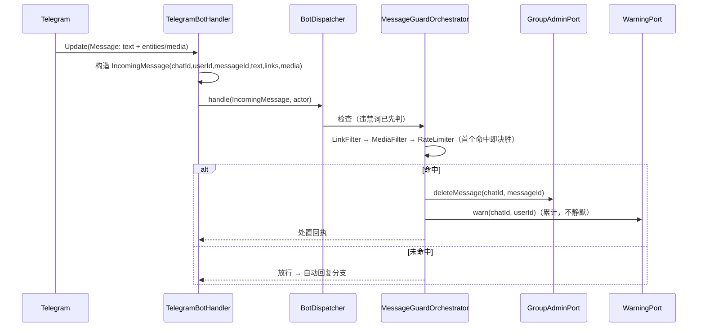

---

**执行状态：** 已闭环。Task 1-3 均已完成；验证通过；交付门检查：GREEN。
rivet-options: [{"label":"A. 内容安全接线（推荐）","description":"引入 IncomingMessage 载体 + 把链接/媒体/限流三个死掉的检测器接进消息管道，命中则删消息 + 累计警告（复用刚接好的 GroupAdminPort/WarningOrchestrator）。"},{"label":"B. 交易状态变更通知","description":"先做交易状态变更通知（T45）：交付/放款/争议后主动告知对方——交易侧体验闭环，不动群管理行为。"},{"label":"C. 先定 C1 解锁 S5","description":"先出 C1 多签语义决策简报：S5 合约（真实资金）是产品最大一块，不定它无法开工。"}]
---


> **Model: deepseek-flash (cheap)**

> **Status: APPROVED** — 2026-09-24T15:01:33.036Z

> **Status: EXECUTED** — 2026-09-24T15:33:43.990Z

# 内容安全接线：让链接过滤、媒体过滤与限流真正作用于消息

## 需求提炼

**用户指令（本会话，逐字）**：
> 继续开发

**目标**：把三个**实现完备、有测试、却零生产引用**的内容安全守卫接进消息管道——链接过滤 `LinkFilter`（GM-10）、媒体过滤 `MediaFilter`（GM-11）、三级限流 `RateLimiter`（GM-32）。命中即处置（删消息 + 累计警告），复用上一波刚接好的 `GroupAdminPort` 与 `WarningOrchestrator`。

**非目标**：
- 不改 `ModerationOrchestrator` / `GroupAdminPort` / `WarningOrchestrator` 的既有语义（前两波刚接线，冻结）。
- 不做入群验证/欢迎语/静默模式/保护模式的接线（`JoinVerificationFlow`/`WelcomeTemplate`/`SilenceWindow`/`ProtectionMode` 同样零引用，但属另一条线，本波不碰）。
- 不做 Redis 版跨进程限流（先用进程内实现）。
- 不做 `ReplayGuard`（重放保护需 seqno 语义，属独立设计）。

## 现状与承重约束（本会话实测）

1. **三个检测器全仓 main 源引用数为 0**（除自身文件）：`LinkFilter`、`MediaFilter`、`RateLimiter`。同期实测 `MessageRepeatDetector`=3、`SlidingWindowCounter`=2、`PermissionChecker`=1、`FeatureToggle`=1、`AnomalyDetector`=2——即它们被引用，故**不能**一概而论说"全部未接线"，必须逐类核实（本计划已逐类 grep）。
2. `BotDispatcher.handle(long chatId, String text, CommandActor actor)` 的非命令路径目前只有两步：**违禁词 → 自动回复 → 不响应**（`BotDispatcher.java:115` 起）。**没有任何链接/媒体/频率检查**。
3. 输入受限：`linkFilter` 需要消息里的链接、`mediaFilter` 需要媒体类型——而当前分发器只拿到 `String text`。`TelegramBotHandler` 手上的 `Update.getMessage()` 才有 entities/media，故需把消息元信息**载体化**并向下传递。
4. 上一波已就位：`GroupAdminPort.deleteMessage(guildId, messageId)`、`WarningOrchestrator`（入口已强制管理员）、`WarningPort`。但注意：**自动处置的执行者不能是普通成员**，而 `WarningOrchestrator` 现在要求 actor ≥ ADMIN——自动处置需要一个"系统执行者"概念（见方案设计）。

## 方案设计



### 关键设计决策：系统执行者

自动处置不是"某个管理员干的"，而是规则触发。两种做法：
- (a) 给 `WarningOrchestrator` 传一个合成的 ADMIN actor——**不诚实**：审计会显示一个不存在的管理员。
- (b) 本波**不让自动处置走 `WarningOrchestrator` 的判罚路径**，只落两件确定的事：**删消息**（`GroupAdminPort.deleteMessage`）+ **累计警告数**（`WarningPort.warn`，为后续阈值判罚积累）。阈值判罚仍由管理员 `/warn` 或独立调度触发。

选 (b)：诚实、不做假执行者，且不触碰刚冻结的编排层。

### 输入载体

新增 `IncomingMessage`（tgg-core）：`chatId / userId / messageId / text / linkUrls / mediaKind(NONE|PHOTO|DOCUMENT|VIDEO|OTHER)`。纯值对象，可测；`TelegramBotHandler` 负责从 `Message` 构造（entities 抽 URL、媒体类型映射）。

## 反证/复现

- **边界断裂的物理证明（本波 RED 基线）**：写一条端到端测试——普通成员在群里发一条含**未白名单链接**的消息。**今天必红**：`BotDispatcher` 只查违禁词与自动回复，链接被原样放行、消息不被删。该红灯即"过滤规则形同虚设"的可执行证据。
- **越界反证**：白名单域名链接**不得**被删（否则正常用户被打扰）；`MediaFilter` 的白名单类型不得被删。
- **限流反证**：阈值内不处置、超阈值才处置；**且"恰好等于阈值"的边界语义要与 `RateLimiter` 既有实现一致**（不另立标准）。
- **不静默反证**：删消息失败（Telegram API 抛错）时**不得**吞掉——处置失败必须让上层知道（与 `TelegramGroupAdminPort` 同取向）。
- **未打扰反证**：命令路径（`/escrow`、`/kick` 等）行为不变；违禁词优先级不变；上一波全部用例仍绿；`ModerationOrchestrator`/`GroupAdminPort`/`WarningOrchestrator`/`EscrowOrder` 与迁移零改动。

## 分波执行

### Wave 1 — 消息载体 + 检测器接线骨架（tgg-core）
- [x] 写 `MessageGuardOrchestratorTest`（RED：类不存在 → 编译失败）
- [x] 新增 `IncomingMessage` 值对象（含构造期校验：chatId/messageId 合法、text 可空）
- [x] 新增 `MessageGuardOrchestrator`：串联 `LinkFilter` → `MediaFilter` → `RateLimiter`，**首个命中即决胜**，返回 `Decision(boolean blocked, String reason)`
- [x] 单测：命中/未命中/白名单放行/阈值边界/依赖缺失 fail-fast

**验证**：`mvn -q -pl tgg-core -am test` 全绿。

### Wave 2 — 胶水层传递消息元信息（tgg-app）
- [x] `TelegramBotHandlerTest` 增例（RED：`Update` 带链接/媒体 → 目前构造不出 `IncomingMessage`）
- [x] `TelegramBotHandler` 从 `Message` 构造 `IncomingMessage`（entities→URL、媒体类型→枚举）
- [x] `BotDispatcher` 新增重载 `handle(IncomingMessage, CommandActor)`，命令路径委托旧签名（保持既有测试可通过）
- [x] 单测：entities 抽取、媒体映射、无媒体/无链接退化

**验证**：`mvn -q -pl tgg-app -am test` 全绿。

### Wave 3 — 处置接线 + 装配 + 收口
- [x] `BotDispatcher` 非命令路径插入 guard 检查（**违禁词优先不变**，guard 排在自动回复之前）
- [x] 命中 → `GroupAdminPort.deleteMessage` + `WarningPort.warn`，回执说明原因；失败不静默
- [x] `BotWiring` 装配 `LinkFilter` / `MediaFilter` / `RateLimiter` / `MessageGuardOrchestrator`（白名单与阈值走配置）
- [x] 集成测试（真实检测器 + 记录型 fake 端口，非 mock 中间层）：链接命中被删、白名单放行、超限流被处置
- [x] 全量回归 `mvn test`；`git diff --stat` 确认编排层/订单/迁移零改动；HANDOFF 记录真机未验证

**验证**：`mvn -q test` 全量绿（基线 735）。

## 部署前置与遗留
- 部署前置：新增配置项（链接白名单、媒体白名单、限流三阈值）。**无新迁移**（限流为进程内状态）。
- 遗留：① 真机未验证；② 限流为**进程内**状态，多实例部署下会各算一份（跨进程需 Redis）；③ `JoinVerificationFlow`/`WelcomeTemplate`/`SilenceWindow`/`ProtectionMode`/`ReplayGuard` 仍零引用，留待后续波次；④ 自动处置不触发阈值判罚（见方案设计决策 (b)）。

## 7. Execution closure

已闭环：Task 1-3 均已完成并通过验证。

最终验证记录：

```bash
mvn test（全量，752 绿，BUILD SUCCESS，exit 0）
mvn -pl tgg-core -am test（245 绿）
mvn -pl tgg-app -am test（140 绿）
git diff --stat（编排层/端口/订单/迁移 为空 = 未打扰）
```

交付门检查：GREEN。

备注：Wave 1–3 落地：IncomingMessage 载体 + MessageGuardOrchestrator（链接/媒体/限流串联）+ 处置服务 + 分发器单一入口接线 + 装配与配置。全量 mvn test 752 绿（起点 735，+17）。ModerationOrchestrator/GroupAdminPort/WarningOrchestrator/EscrowOrder/迁移 零改动。注意：本波改变了运行行为（bot 会真的删消息），上线前必须填链接白名单。
