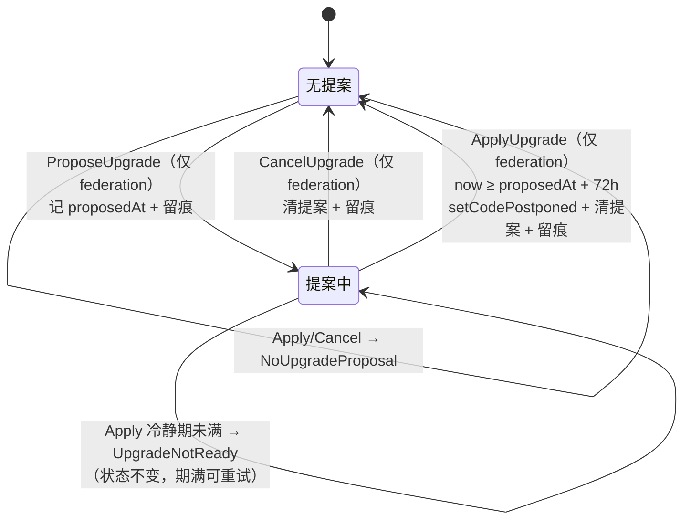
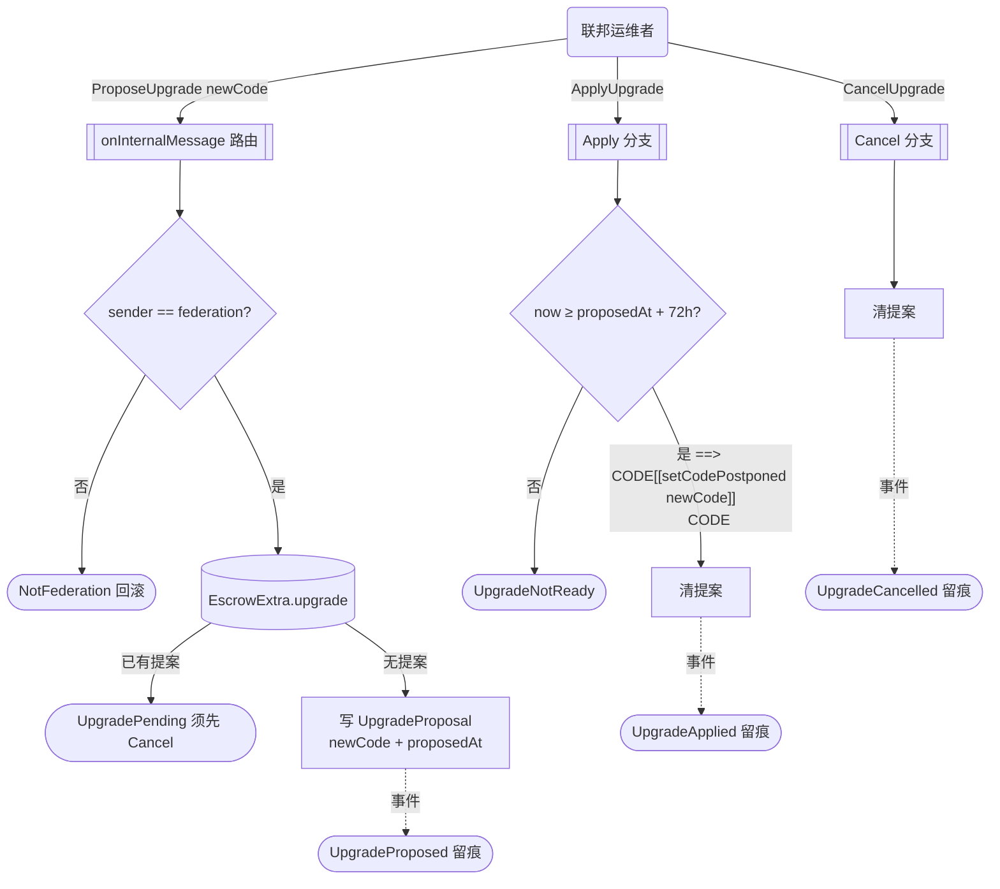

---

**执行状态：** 已闭环。Task 1-3 均已完成；验证通过；交付门检查：GREEN。
rivet-options: [{"label":"A. 合约面 + wrapper + 文档（推荐）","description":"合约三消息（Propose/Apply/Cancel）+ 合约内 72h 时间锁 + EscrowExtra 容错兼容 + acton wrapper 操作面 + 文档回写。Java 写链栈并入「resolveDispute 链上接通」独立事项，不重复投资。"},{"label":"B. 全量含 Java 写链栈","description":"在 A 之上另建 Java 写链栈（cell 构造 + 签名 + 广播 + 升级编排类）。成本 +3~5 天，且该栈与 resolveDispute 待建栈重合，升级本身用不到（操作者是联邦运维者）。"}]
---


> **Model: mimo-v2.6-pro (strong)**

> **Status: APPROVED** — 2026-09-30T03:31:36.823Z

> **Status: EXECUTED** — 2026-09-30T04:37:38.479Z

# ⑥ 合约升级入口（方案 a + c 兜底）——提案→冷静期→执行的时间锁升级

> 背景：拍板排期「①B1 → ③ET-04 → **⑥升级入口** → ⑤B2 → ④全量」（`docs/UNDECIDABLE-DECISIONS.md:603`），①③已提交（`a0e1536`/`dfb2584`、`5547e13`/`40be8a1`），本计划执行⑥。
>
> **执行方案：B（用户批准时选定「全量含 Java 写链栈」）**——下述 T1-T7 之外，增补 **Wave 3「Java 写链栈」**（T8-T11，见文末「执行增补」章节）。正文「方案取舍」表中「Java 写链栈=零改动」一行**以本增补为准作废**。

## 需求提炼

**用户拍板原文**（`docs/UNDECIDABLE-DECISIONS.md:595`、`:599-601`、`:603`）：

> ⑥=**方案 a + c 兜底**。`upgrade(newCode)` 消息：**联邦多签**（与 A0-2 方案 A 同源：链下裁决+联邦单签）触发 `setCodePostponed`；配**时间锁**（提案→冷静期→执行）+ 升级事件留痕。
> 两条硬约束：1. **升级权必须走联邦多签 + 时间锁**——单签升级=单点拿走全部托管资金；2. **存储兼容约定**：新代码必须能读旧 `EscrowExtra`（缺失字段给默认值），升级前跑「旧数据→新代码」兼容用例（`acton test`）。
> c = 不升级 + 迁移（升级=新部署+用户迁资金），**留作 a 的兜底**（升级失败时的退路）。

**目标**：
1. 合约内置升级入口：Propose → 冷静期 → Apply 的时间锁生命周期，**时间锁在合约内校验**。
2. 升级授权 = 链上 `sender == storage.federation`（与 Resolve 同信任根，`contracts/EscrowContract.tolk:151` 先例）；多签在链下（A0-2 已拍板：不做链上多签验签）。
3. 升级事件链上留痕（Proposed / Applied / Cancelled，带 newCode hash）。
4. 硬约束 2 落地：`EscrowExtra` 新增升级提案字段 + 缺字段给默认值的容错读取 + 「旧数据→新代码」兼容用例。
5. 方案 c 兜底成文（触发条件 + 操作步骤）。

**非目标**：
- 链上多签验签（A0-2 已拍板不做）。
- 存储 schema 迁移机制（hot upgrade / 迁移函数）——真需要改 schema 时再引入。
- 时间锁时长可配置化——合约常量即可。
- 合约部署与真机验证（合约至今未部署，本计划不改变该状态）。

## 问题与根因

**表面问题**：合约「无升级路径」（`contracts/EscrowContract.tolk:12` 头注释自述 ET-56 默认关闭），代码缺陷只能重新部署 + 迁移资金。

**根因分析**（两层）：
1. **升级权的天然单点**：TON 里换 code 必须由合约自己执行（消息驱动），而链上信任根是**单个 federation 地址**（`contracts/EscrowContract.tolk:151`）。若升级 = 「federation 发一条消息立即生效」，则联邦 key 被盗 = 一条消息拿走全部托管资金（替换 code 为自己写的提款器）。**这不是加个权限校验能解决的**——校验通过的正是被攻破的 key。真正的防御是**时间维度**：即使 key 被破，72h 冷静期内用户/审计方可察觉并 Cancel。所以时间锁**必须放合约 storage 由链上校验**（放链下编排 = 校验方还是同一个单点，防不住）。
2. **存储兼容是升级的隐性前提**：TON 升级只换 code 不动 data（官方 upgrades 页语义）。新代码上任第一件事就是读旧存储——严格解析遇到缺位/多位直接抛错，资金路径全崩。当前 `EscrowExtra` 只有 2 字段且**没有版本/缺省语义**（`contracts/types.tolk:41-49`），9 个消费点全走严格 `extra.load()`（`contracts/EscrowContract.tolk:50,83,87,114,118,165,169,193,195`）——任何字段新增若不配容错读取，都会让「旧数据 + 新代码」这个必然组合当场崩溃。

## 现状（实测锚点，本会话 read_file/grep 直读核验）

| 事实 | 锚点 |
|---|---|
| 合约无任何升级代码，头注释自述「无升级代理（ET-56 默认关闭，待决 C2）」 | `contracts/EscrowContract.tolk:12` |
| 消息路由 = `lazy AllowedMessage.fromSlice` + `match`，现有 7 类 opcode（0x7d5a1001–0x7d5a1006、0x7362d09c） | `contracts/EscrowContract.tolk:43-45`、`contracts/types.tolk:76-81,87,93` |
| 存储：`EscrowStorage`（buyer/seller/federation/amount/state + `extra: Cell<EscrowExtra>`）；扩容约定「继续往 EscrowExtra 加，不得动基础结构体」 | `contracts/types.tolk:51-58,63-65` |
| `EscrowExtra` 现有 2 字段（ownJettonWallet/asset ≈ 275 bit、0 ref），距 1023 bit/4 ref 上限有余量 | `contracts/types.tolk:41-49` |
| `extra.load()` 严格解析消费点共 **9 处**（容错改造的全部调用面） | `contracts/EscrowContract.tolk:50,83,87,114,118,165,169,193,195` |
| 链上信任根 = 单 federation 地址等值比较（A0-2：多签在链下） | `contracts/EscrowContract.tolk:151` |
| 测试 = `tests/EscrowContract.test.tolk` 单文件 35 个 `get fun` 用例（`acton test`） | `tests/EscrowContract.test.tolk:48-650` |
| 测试构造 `EscrowExtra` 两处（字段新增需同步） | `tests/EscrowContract.test.tolk:26,168` |
| wrapper 是 `acton wrapper` **自动生成**（勿手改，再生成即得新 send 方法） | `wrappers/EscrowContract.gen.tolk:1-4` |
| Java 侧**无任何写链能力**（无 cell 构造/签名/广播/部署类；唯一预留点 `ChainGateway.resolveDispute` 恒抛 stub） | `tgg-chain/src/main/java/com/tg/escrow/chain/ChainGateway.java:81-92` |
| 文档口径欠账（本计划顺手同步）：ET-56 行、合约头注释 Dispute/Resolve「尚未实现」与实现冲突 | `docs/CODE-VS-SPEC.md:159`、`contracts/EscrowContract.tolk:24-25`（vs `:137,:147` 已实现） |

**外部语义**（docs.ton.org 官方 upgrades 页实抓核验，2026-09-30，来源 https://docs.ton.org/llms/contracts/techniques/upgrades/content.md）：
- `setCodePostponed(code)`：action phase 调度、当前交易完成后生效；**不动 data**——升级后新代码读旧存储是硬要求（与硬约束 2 直接对应）。
- 官方 delayed 升级模式 = 本设计直接模板：storage 存 `CurrentRequest{newCode, timestamp}` + timeout，Approve 用 `assert(currentRequest.timestamp + timeout < blockchain.now())` **合约内**校验冷静期；Reject 随时可撤。
- 升级交易失败（如 Gram 不足）整笔回滚，提案保留、可重试。

## 设计

### 1. 存储兼容（硬约束 2 的落点）

`EscrowExtra` 新增第 3 字段：`upgrade: Cell<UpgradeProposal>?`（Maybe ^Cell，1 bit 标志 + 0/1 ref）。

```tolk
// contracts/types.tolk —— 新增
struct UpgradeProposal {
    newCode: Cell<cell>      // 待执行的新代码
    proposedAt: uint32       // 提案时刻（秒）
}
struct EscrowExtra {
    ownJettonWallet: address
    asset: uint8
    upgrade: Cell<UpgradeProposal>?    // 新增：无提案 = null
}
```

**容错读取是核心机关**：旧数据的 extra cell 是 275 bit / 0 ref，**没有** Maybe 标志位——严格 `fromCell` 因缺位抛错，资金路径全崩。新增容错加载器，按「剩余 bits/refs」判定字段在不在、缺则默认 `upgrade = null`：

```tolk
// contracts/types.tolk —— 新增（伪码，实施时按 Tolk slice API 定稿）
fun loadExtraCompat(c: Cell<EscrowExtra>): EscrowExtra {
    val s = c.beginParse();
    val own = s.loadAddress();
    val asset = s.loadUint(8);
    // 旧格式到此为止（275 bit / 0 ref）；新格式尾部有 1 bit Maybe 标志（+ 可选 ref）
    val upgrade = if (s.hasRemainingBits()) s.loadMaybeRef().map(UpgradeProposal.fromCell) else null;
    return EscrowExtra { ownJettonWallet: own, asset: asset, upgrade: upgrade };
}
```

9 个消费点（`contracts/EscrowContract.tolk:50,83,87,114,118,165,169,193,195`）由 `storage.extra.load()` **一律切换**为 `loadExtraCompat(storage.extra)`——全量替换，漏一处即旧数据下资金路径崩溃。写回时按新格式重建 extra cell。

### 2. 升级消息与时间锁状态机

新 opcode（续现有段）：

```tolk
// contracts/types.tolk —— 新增
struct (0x7d5a1007) ProposeUpgradeMessage { newCode: Cell<cell> }
struct (0x7d5a1008) ApplyUpgradeMessage {}
struct (0x7d5a1009) CancelUpgradeMessage {}
// AllowedMessage 联合追加这三个变体
// Errors 追加：UpgradePending = 0x100c / NoUpgradeProposal = 0x100d / UpgradeNotReady = 0x100e
```





分支规则（三分支均**不检查 escrow state**——升级是合约生命周期管理，与交易状态机正交）：

```tolk
// contracts/EscrowContract.tolk —— match 新增三分支（伪码）
ProposeUpgradeMessage => {
    var storage = lazy EscrowStorage.load();
    assert (in.senderAddress == storage.federation) throw Errors.NotFederation;
    var extra = loadExtraCompat(storage.extra);
    assert (extra.upgrade == null) throw Errors.UpgradePending;   // 拒绝覆盖式提案，防计时器热替换
    extra.upgrade = UpgradeProposal { newCode: msg.newCode, proposedAt: blockchain.now() }.toCell();
    storage.extra = extra.toCell();
    storage.save();
    emitUpgradeEvent("proposed", msg.newCode.hash(), blockchain.now());
}
ApplyUpgradeMessage => {
    var storage = lazy EscrowStorage.load();
    assert (in.senderAddress == storage.federation) throw Errors.NotFederation;
    var extra = loadExtraCompat(storage.extra);
    assert (extra.upgrade != null) throw Errors.NoUpgradeProposal;
    val proposal = extra.upgrade!!.load();
    assert (blockchain.now() >= proposal.proposedAt + UPGRADE_COOL_DOWN_SECS) throw Errors.UpgradeNotReady;
    setCodePostponed(proposal.newCode);       // action phase 生效；失败整笔回滚、提案保留
    extra.upgrade = null;
    storage.extra = extra.toCell();
    storage.save();
    emitUpgradeEvent("applied", proposal.newCode.hash(), blockchain.now());
}
CancelUpgradeMessage => {
    var storage = lazy EscrowStorage.load();
    assert (in.senderAddress == storage.federation) throw Errors.NotFederation;
    var extra = loadExtraCompat(storage.extra);
    assert (extra.upgrade != null) throw Errors.NoUpgradeProposal;   // 显式报错不静默
    extra.upgrade = null;
    storage.extra = extra.toCell();
    storage.save();
    emitUpgradeEvent("cancelled", 0, blockchain.now());
}
```

**时间锁常量**：`UPGRADE_COOL_DOWN_SECS = 259200`（72h）。理由：审计窗口覆盖一个周末；升级罕见、托管交易生命周期以天计，成本可接受；紧急修复走方案 c 兜底。写死为合约常量（改动需走升级本身，递归自洽）。

### 3. 升级事件留痕

事件载荷记 **newCode 的 cell hash**（不进整码，事件轻量）：`UpgradeProposed{codeHash, proposedAt}` / `UpgradeApplied{codeHash}` / `UpgradeCancelled{codeHash}`。

留痕通道双路径（按优先级）：
1. **首选 `emit(...)`**（TVM 事件）——链上标准事件形态、gas 便宜；
2. **退化：`createMessage` 发事件 body 到 federation 地址**——与现有 `createMessage` 风格同构（`contracts/EscrowContract.tolk:57-63` 先例），不依赖新特性。
实施时探测 Acton 1.2.0 对 `emit` 的支持后定稿（项目内无先例，见「反证/复现」待验证假设）。

### 4. get 方法与操作面

```tolk
// contracts/EscrowContract.tolk —— 新增
get fun upgradeStatus(): (int, int) {
    val storage = lazy EscrowStorage.load();
    val upgrade = loadExtraCompat(storage.extra).upgrade;
    if (upgrade == null) { return (0, 0); }
    val p = upgrade!!.load();
    return (p.newCode.hash(), p.proposedAt);
}
```

- **wrapper 由 `acton wrapper` 再生成**（`wrappers/EscrowContract.gen.tolk:1-4` 明示自动生成、勿手改）——再生成后自动获得 `sendProposeUpgrade/sendApplyUpgrade/sendCancelUpgrade` + `upgradeStatus`。
- **Java 侧零改动**（范围偏差见「方案取舍」）：升级执行操作面 = acton wrapper/CLI（与部署同路径，`wrappers/EscrowContract.gen.tolk:38` 的 `net.send` 基建）。运维手册写明三步操作（propose → 等 72h → apply，随时 cancel）。

### 5. 方案 c 兜底（成文，非代码）

写入 `docs/UNDECIDABLE-DECISIONS.md` ⑥ 落地情况段：**触发条件**（兼容用例不过 / Apply 反复失败 / 新代码行为异常）→ **步骤**（停止升级流程；新版本走全新部署；逐单迁移：旧合约按既有 Refund/Resolve 路径出清资金，新单走新合约；对外公告）。

### 6. 文档回写（口径同步）

- `docs/UNDECIDABLE-DECISIONS.md` ⑥ 节补「落地情况」段（同 A0-1 的落地实录格式）。
- `docs/CODE-VS-SPEC.md:159` ET-56 行：D「未做（默认关闭，待决 C2）」→ 按实际落地度更新。
- `contracts/EscrowContract.tolk:12` 头注释「无升级代理」→ 升级入口已开（时间锁）；**同注释块**顺手修正 Dispute/Resolve「尚未实现」自述漂移（`:24-25` vs `:137,:147` 已实现）。
- `README.md` 升级/时间锁口径更正（`README.md:304` 附近的 `timelock.*` 计划键按落地形态更正或标注未实现）。

## 方案取舍

| 决策点 | 采纳 | 被弃方案 | 理由 |
|---|---|---|---|
| 时间锁位置 | **合约内**（storage + `blockchain.now()` 校验） | 链下编排管冷静期 | 硬约束 1 的必然推论：链下冷静期防不住联邦 key 单点被破后的立即换 code，校验方就是被攻破的单点 |
| 升级触发模型 | **A0-2 同源**：链下多签裁决 + 链上 federation 单签 | 链上多签验签 | A0-2 已拍板不做链上多签；与 Resolve 信任根同构（`contracts/EscrowContract.tolk:151`） |
| 提案覆盖语义 | **拒绝覆盖**（有提案须先 Cancel） | 允许覆盖+重新计时 | 少一个状态转换、审计清晰，且天然防「计时器热替换」 |
| 新字段落点 | **`EscrowExtra` 第 3 字段** | `EscrowStorage` 加字段 | 拍板硬约束 2 点名 EscrowExtra；且 `contracts/types.tolk:63-65` 约定「不得动基础结构体」 |
| 兼容读取 | **容错加载器**（缺字段给默认） | 严格 struct 解析 + 部署时迁移 data | 严格解析在旧数据上必崩（缺 Maybe 标志位）；迁移 data 反而引入升级窗口 |
| Java 写链栈 | **零改动**（选项 A，推荐） | 建写链栈 + 升级编排类（选项 B） | 见下方偏差说明；B 成本 +3~5 天且与 resolveDispute 待建栈重合 |

**Java 编排范围偏差（对拍板文案「合约+测试+Java 编排」的裁剪）**：实测 Java 侧无任何写链栈（cell 构造/签名/广播三件全缺，`tgg-chain/src/main/java/com/tg/escrow/chain/ChainGateway.java:81-92` 恒抛 stub 是唯一预留点）。为升级单独建栈 ≈ 与「接通 resolveDispute」同一个待建栈，重复投资。升级操作者是联邦运维者（acton CLI 可执行），不是 bot 用户。**建议**：升级操作面落 wrapper/acton，Java 写链栈并入「resolveDispute 链上接通」独立事项。审批时可改选全量方案（提交选项 B）。

## 反证/复现

1. **worker 断言已独立核验**（external-source-verification）：三个侦察 worker 的关键锚点（消息路由、EscrowExtra 结构、9 个 `extra.load()` 消费点、`:151` federation 校验、wrapper 自动生成、Java 无写链栈）均由本会话 read_file/grep 直读**逐条复核一致**，无一处采信转述。上轮计划文件一度丢失（磁盘核实：草稿与提交件均不存在），本版以磁盘重新落盘为准。
2. **硬约束 2 的兼容用例本身就是复现机制**（测试用例 COMPAT-1）：手工构造**旧格式** extra cell（builder 直接 store 275 bit / 0 ref，不走新 struct 的 `toCell()`）→ 部署新代码 → 断言资金路径不崩、`upgradeStatus` 默认无提案、Propose 可写入。**该用例在容错加载器缺失时必然 RED**（严格 fromCell 抛错）——红因来自被测层，回滚容错加载器即回红，满足 RED→GREEN 纪律。
3. **升级生效的断言链**（用例 APPLY-3）：Apply 后断言 ①提案清空（`upgradeStatus` 返回 (0,0)）②留痕事件发出 ③升级后合约仍正常处理消息（状态机存活）。若模拟网支持读 code hash，追加断言 `codeHash == newCode.hash()`（待验证假设④）。
4. **待验证假设（实施时探测，不预设成立）**：
   - ① Tolk 时间 API：官方 delayed 示例用 `blockchain.now()`；Acton 1.2.0 不支持则用 `now()`；
   - ② `setCodePostponed` 的确切调用形态（全局函数 vs `contract.` 方法）；
   - ③ `emit` 是否可用（决定留痕通道 1 还是退化到通道 2）；
   - ④ acton 模拟网能否断言升级后 code hash（不能则用存活断言替代，如实记录）；
   - ⑤ Tolk 严格 `fromCell` 对新格式 extra cell 尾部多余位是否宽容（决定「新数据→旧代码」降级可行性）。
5. **验证纪律**：测试先行——兼容用例先于容错加载器、生命周期用例先于三分支实现（见 Wave 1 内的 TDD 序）；交付报告逐条核销验证命令，未跑/未跑完如实标注。

## 回归清单（改动前后必须仍成立的锚点）

| # | 回归断言（现有 35 用例覆盖） | 验证方式 |
|---|---|---|
| R1 | TON 资金主路径 Fund→Deliver→Confirm 出账金额与状态迁移不变 | 现有用例 `test fund locks when full amount arrives` / `test confirm pays seller exactly the escrowed amount` 等全绿 |
| R2 | Refund/Dispute/Resolve 状态守卫与权限矩阵不变 | 现有 `test refund …` / `test dispute …` / `test resolve …` 系列全绿 |
| R3 | Jetton 入金三重校验（trusted wallet / asset / sender）与出账走向不变 | 现有 `test forged jetton notification is rejected` 等 jetton 系列全绿 |
| R4 | 多付退回、回弹状态还原（4→2 / 5→1）不变 | 现有 `test fund returns the surplus` / `test bounced payout reverts` 全绿 |
| R5 | 未知消息拒收、空消息体容忍不变 | `test unknown message is rejected` 全绿 |
| R6 | `EscrowExtra` 现有 2 字段语义（ownJettonWallet/asset）不变 | R1-R4 全绿即覆盖；测试构造点 `tests/EscrowContract.test.tolk:26,168` 补 `upgrade: null` 后编译过 |

## 验证清单（测什么 / 看什么）

**新增用例（tests/EscrowContract.test.tolk，先落 RED 再实现）**：

| 用例 | 场景 | 期望可见结果 |
|---|---|---|
| PROP-1 | federation 发 ProposeUpgrade（带 newCode） | 交易成功；`upgradeStatus` = (newCode.hash(), 提案时刻)；留痕事件含 codeHash |
| PROP-2 | 非 federation 发 Propose/Apply/Cancel | 三连 `toHaveFailedTx` exitCode=NotFederation；状态不变 |
| PROP-3 | 已有提案再 Propose | UpgradePending；Cancel 后再 Propose 成功 |
| APPLY-1 | 冷静期未满 Apply | UpgradeNotReady；提案保留（`upgradeStatus` 不变） |
| APPLY-2 | 期满 Apply | 交易成功；提案清空 (0,0)；留痕 UpgradeApplied |
| APPLY-3 | Apply 后合约存活 | 升级后正常处理一条 Deliver/Fund 消息（状态机不僵死） |
| CANCEL-1 | Cancel 清提案；之后 Apply | Cancel 成功留痕；Apply→NoUpgradeProposal |
| CANCEL-2 | 无提案时 Apply/Cancel | NoUpgradeProposal（显式报错不静默） |
| STATE-1 | 各 escrow state（OPEN/LOCKED/DISPUTED/RELEASED）下三消息可用 | 升级生命周期与交易状态机正交，不受 state 制约 |
| COMPAT-1 | **旧格式 extra cell（275 bit/0 ref）→ 新代码** | Fund/Confirm 资金路径不崩；`upgradeStatus` 默认 (0,0)；Propose 可写入并转新格式 |
| COMPAT-2（尽力） | 新格式 cell → 严格旧式解析 | 记录 fromCell 对尾部多余位的实际行为（降级可行性证据） |

**人工检查点**：① 头注释更新后不再自述「无升级代理」与「Dispute/Resolve 未实现」；② `docs/CODE-VS-SPEC.md:159` 行与实际落地度一致；③ 运维手册三步操作可照抄执行；④ 全仓 `extra.load()` 严格解析调用清零（grep 复核）。

**每波验证命令**：`~/.acton/bin/acton build && ~/.acton/bin/acton test`（项目根，期望 35 存量用例 + 本轮新增全绿）；Java 侧零改动，`mvn verify` 不跑并在交付报告如实说明。

## 任务与波次

> TDD 序：T2 的兼容用例先落（RED：严格解析在旧格式 cell 上崩溃）→ 容错加载器实现转绿；T4 生命周期用例先落（RED）→ T5 三分支实现转绿。

### Wave 1 · 合约与类型 + 测试（验证：`~/.acton/bin/acton build && ~/.acton/bin/acton test` 全绿）

- [x] T1 `contracts/types.tolk`：`UpgradeProposal` struct；三消息 struct + opcode 0x7d5a1007-0x7d5a1009；`AllowedMessage` 扩展；错误码 UpgradePending/NoUpgradeProposal/UpgradeNotReady；事件 struct（不入联合）
- [x] T2 `contracts/types.tolk` + `contracts/EscrowContract.tolk`：`EscrowExtra` 增 `upgrade` 字段；先落 COMPAT-1 用例（RED）→ `loadExtraCompat` 容错加载器（GREEN）；9 个消费点（`contracts/EscrowContract.tolk:50,83,87,114,118,165,169,193,195`）全量切换；`tests/EscrowContract.test.tolk:26,168` 补 `upgrade: null`
- [x] T3 `tests/EscrowContract.test.tolk`：生命周期/权限/时间锁用例矩阵（PROP-1~3、APPLY-1~3、CANCEL-1~2、STATE-1，先落 RED）
- [x] T4 `contracts/EscrowContract.tolk`：Propose/Apply/Cancel 三分支（权限 + 时间锁 + `setCodePostponed` + 清提案 + 留痕，按 T3 转绿）；`get fun upgradeStatus`；头注释更新（ET-56 行 + Dispute/Resolve 自述漂移）
- [x] T5 `tests/EscrowContract.test.tolk`：COMPAT-2 尽力项（新数据→旧式解析行为记录）；全量用例回归（回归清单 R1-R6 逐项核销）

### Wave 2 · 操作面与文档（验证：`acton test` 复跑绿 + 文档逐行核对 + grep 复核）

- [x] T6 `acton wrapper` 再生成 `wrappers/EscrowContract.gen.tolk`（确认生成 sendProposeUpgrade/sendApplyUpgrade/sendCancelUpgrade + upgradeStatus），测试引用同步
- [x] T7 文档回写：`docs/UNDECIDABLE-DECISIONS.md` ⑥ 落地情况 + 方案 c 兜底手册；`docs/CODE-VS-SPEC.md:159` ET-56 行；`README.md` 时间锁/升级口径更正

## 风险

- **Acton/Tolk API 探测点**（待验证假设①-④）若全部不利：留痕退化到消息通道、生效断言退化到存活断言——功能不受损，证据形态降级并如实记录。
- **兼容用例是硬门**：若「旧数据→新代码」用例无法在 acton 测试层构造，按硬约束 2 **不得进入 Apply 路径交付**，改为只交付 Propose/Cancel + 显式记录阻塞原因。
- 合约仍未部署：本计划交付「升级能力 + 用例证据」，链上行为照旧未验证。

## 执行增补（方案 B · 2026-09-30 执行期探针定稿）

### 探针定稿（API 形态以此为准——全部来自本轮 `acton compile` 探针 + `.acton/tolk-stdlib/common.tolk` 一手源码，原「待验证假设「待验证假设①②③」已关闭）

| 原假设 | 定稿结论 | 证据 |
|---|---|---|
| ① 时间 API | **`blockchain.now(): int`**；测试侧 **`testing.setNow(uint32)`** 控时（冷静期用例可跳过 72h） | `.acton/tolk-stdlib/common.tolk:409`；`.acton/emulation/testing.tolk:240`（探针编译通过） |
| ② setCode 形态 | **`contract.setCodePostponed(newCode: cell): void`**（编译通过）；TVM 指令即 SETCODE(FB04)「本 run 成功结束后生效」 | `.acton/tolk-stdlib/common.tolk:392`；`acton doc tvm SETCODE` |
| ③ 事件留痕 | **`createExternalLogMessage({dest: ExtOutLogBucket { topic: N }, body: 事件struct}).send(SEND_MODE_REGULAR)`**（`emit` 不存在，编译器报 undefined——走通道 1'：外部日志消息）；测试断言 **`expect(txs).toEmitExternalMessage<事件>()`** | `.acton/tolk-stdlib/common.tolk:1772`、`.acton/types/out_actions.tolk`；`.acton/emulation/network.tolk:1610` |
| ④ 测试读 code hash | 未定——APPLY 断言先用「提案清空 + 事件 + 存活」三件套，能读 code hash 再追加 | 实现时探测 |
| ⑤ fromCell 宽容度 | 未定——COMPAT-2 用例实测记录 | 实现时探测 |
| 容错加载器剩余位 API | **`slice.remainingBitsCount()` / `slice.remainingRefsCount()`**（`remainingBits()` 不存在，编译器报 method not found） | `.acton/tolk-stdlib/common.tolk:1389-1394` |

事件 struct 用 opcode 前缀（如 `struct (0x7d5a1010) UpgradeProposedEvent { codeHash: uint256, proposedAt: uint32 }`），与 `findExternalOutMessage<T>()` 的按类型检索配套。升级三事件 topic 取 `ExtOutLogBucket { topic: 0x555047 }`（"UPG"）。

### Wave 3 · Java 写链栈（B 案增补）（验证：`mvn -q verify` 相关模块绿 + 离线测试不触网）

> 现状前提（已核验）：tgg-chain 建在 **ton4j 2.1.0** 上（`tgg-chain/src/main/java/com/tg/escrow/chain/AdnlJettonWalletQuery.java:20-26` import 块）；ton4j `AdnlLiteClient` 有 **`sendExternalMessage(Message)`/`sendMessage(Message)`**（adnl-2.1.0-sources 实测 L2123/L2143），smartcontract jar 自带 wallet v1-v5/multisig 签名件。写链栈三件（cell 构造/签名/广播）可全部建在既有依赖上。

- [x] T8 `tgg-chain` UpgradeMessageCodec（cell 构造）：ProposeUpgrade/ApplyUpgrade/CancelUpgrade 消息体 cell（opcode 0x7d5a1007-09，Propose 带 newCode ref），ton4j CellBuilder 实现；**位级对拍测试**：与 `contracts/types.tolk` 的 TL-B 布局逐位一致（同一消息两种构造（Tolk toCell vs Java codec）出同 hash 的向量测试）
- [x] T9 `tgg-chain` 写链发送路径：`ChainMessageSender` 接缝接口（可离线替身，照 `JettonWalletQuery` 模式）+ `AdnlChainSender`（ton4j 钱包签名（federation key）组 external message → `AdnlLiteClient.sendExternalMessage` 广播）；异常契约对齐 `ChainUnavailableException` 惯例（含 ton4j 裸 Error 兜底，照 `AdnlJettonWalletQuery:120-135` 惯例）；类注释如实标「未经真实节点验证不得称可用」
- [x] T10 升级编排类 `EscrowUpgradeService`（tgg-escrow）+ `ChainGateway` 三方法接线：提案→冷静期→执行工作流——链下多签守卫（复用 `EscrowMultiSigRule`/`EscrowVerdictGuard` 范式：≥2 方且必含联邦、签名载荷绑定 codeHash+action+时间）→ 提案跟踪（链上 `upgradeStatus` get 查询）→ 冷静期到期提示执行 / 随时 Cancel；`ChainGateway.proposeUpgrade/applyUpgrade/cancelUpgrade` 从恒抛 stub 改走 `ChainMessageSender`（与 `resolveDispute` 同一接缝）
- [x] T11 Wave 3 测试 + 文档：codec 位级对拍、sender 离线替身（Recording 模式照 `ChainGatewayTest`）、编排守卫链用例（伪造签名剔除/买卖双方组合无效同款）；`docs/CODE-VS-SPEC.md` ET-56 行按 B 案全量形态更新、运维手册补 Java 入口

## 7. Execution closure

已闭环：Task 1-3 均已完成并通过验证。

最终验证记录：

```bash
~/.acton/bin/acton test
TELEGRAM_BOT_TOKEN=123456:dummy-for-it mvn -B verify
```

交付门检查：GREEN。

备注：方案 B 全量执行完毕：Wave 1 合约（acton test 47 passed，COMPAT-1 硬门+mutation 反证）+ Wave 2 文档 + Wave 3 Java 写链栈（mvn verify 1055+4 IT BUILD SUCCESS）。偏离：team_orchestrate 两轮派发失败（scope 解析缺陷）改核心路径自做；BotWiring 未装配写链栈（遗留）。
