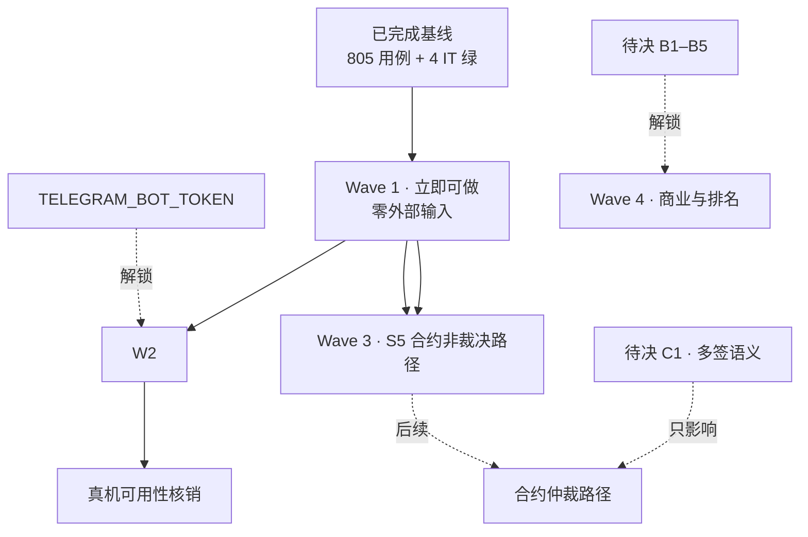

> **Model: deepseek-flash (cheap)**

> **Status: APPROVED** — 2026-09-26T11:47:35.720Z

# 开发计划（2026-09-25 · 实测重建版）

> **取代** `2026-09-24-full-dev-plan.md`（已完全消耗：其 Wave 1b–1d 的 17 个类实测全部已存在）。
> 规划基准是**实测**：HEAD `7f38d6b`、main 164 类 / test 107 类、`mvn verify` **805 用例 + 4 个 IT 全绿**、
> 落地判定见 `docs/CODE-VS-SPEC.md`（A30/B5/C60/D15/E4）。

## 需求提炼

**目标**：在"文档已重建、现状已实测"的基础上，把剩余工作排成**可开工、可验收**的顺序——优先推进
**不依赖任何人拍板、不依赖任何凭证**的项；把必须依赖外部输入的项显式挂上触发条件，不再让它们混在
"待办"里制造虚假进度感。

**非目标**：不接真实资金（S5 未部署前一切"资金"仅为状态登记）；不引入调度器（项目既定非目标，
改用**惰性判定**）；不改商业参数（B1–B5 待拍板）；不新增第三方依赖；不重写 14 份溯源材料。

**验收证据**：每波 TDD（RED→GREEN）→ 全量 `mvn verify` 测试数不回退 → scoped 提交 → push。

## 现状基线（实测）

| 结构项 | 状态 | 证据 |
|---|---|---|
| S1 Bot 接线 | ✅ | `BotWiring`/`BotDispatcher`/`TelegramBotHandler`，`/escrow …` 链通 |
| S2 命令层 | ✅ | `TradeCommandHandler`（含 ET-34 两步流 `PendingTradeRegistry`） |
| S3 Bot 内 6 项入口 | 🟡 | ET-01/02 已接线；ET-03/04/05/06 为 C 级 |
| S4 真实链上源 | ❌ | 无 `HttpChainSource` |
| S5 TON 合约 | ❌ 仅骨架 | `contracts/EscrowContract.tolk` 可编译，资金逻辑未写、未部署 |
| S6 Web/Admin | 🟡 | 两个 controller + `WebAppInitDataVerifier`；无前端页面 |
| 真机核销 | ⚠️ 0/3 | A9/A10/A11 全未验（缺 token） |

## 依赖与阻塞图

**读图要点**：C1 只决定**仲裁**语义，托管/交付/放款/退款**不依赖它** → S5 不必整体等 C1。

## Wave 1 · 立即可做（零外部输入）

1.1 **「缺调度器」逐项判定并收口**：拆为**可惰性化**（下次交互结算，如归档/静默期/到期确认）→ 直接接上；
**真需定时**（无人交互也要发生，如入群验证 60s 超时踢出、禁言定时解除）→ 单列，作为"接受降级 or 改非目标"的决策项。
1.2 **五个「已落地·未接线」项**（`AdminRegistry`/`ChannelPuppetGuard`/`FeatureToggle`/`JoinOnboarding`/`ReplayGuard`）
逐项补缺件或**明确不接并说明**，不留悬空（缺件已记录于 `.rivet/HANDOFF.md`）。
1.3 **`LogSanitizer` 加盐**（SPEC 6.2：无盐 + 仅 24bit → 可字典反推、碰撞）。零依赖。
1.4 ~~`BannedWordMatcher` 换 Trie~~ ✅ **2026-09-29 完成**（原标"可选，视词表规模"）：按折叠字符建树、
沿文本每个起点走；**每个终点只记最小词表索引**，以逐字保住「返回**词表顺序**最靠前的命中」这条
契约（换实现最容易丢的就是它）。新增 4 条用例（顺序正/反两例 + 重叠词 + 2000 词规模），
tgg-core 270→274、全量 877 绿。**Wave 1 至此四项全齐（1.1 判定收口 / 1.2 五项决策 / 1.3 已加盐 / 1.4 本项）。**

> **验证（每小项独立）**：先写 RED（目标类不存在→编译失败，或新断言失败）→ 实现 → `mvn verify`
> 全量不回退（基线 805 + 4）→ scoped 提交 → push。

## Wave 2 · 需 `TELEGRAM_BOT_TOKEN`（真机核销）

`ONLINE-VERIFICATION.md` 的 A9/A10/A11 逐条核销 + `CODE-VS-SPEC.md` 里 30 个 A 级项各走一遍"用户做什么→看到什么"。
**触发条件**：用户提供 token 或授权真机执行；未提供时整波标记 blocked，不得声称已验证。

> **验证**：`ONLINE-VERIFICATION.md` 逐项打勾并记录观察；失败项回写为缺陷。

## Wave 3 · S5 合约（非裁决路径先行，不等 C1）

只做 `fund / deliver / release / refund` 的链上实现与守卫（`impure` 修饰、减法前验余额、乱序消息不越级迁移）；
仲裁（`dispute / resolve`）留待 C1。依据：C1 只定义多签语义，非裁决路径的正确性不依赖它。

> **验证**：`acton build` exit 0 → `acton test` 全绿 → `acton simulator` 本地部署跑资金路径 →
> Gas 基线（`acton test --gas-profile`，对应 ONLINE-VERIFICATION B2）。

## Wave 4 · 需 B1–B5 拍板（商业与排名）

ET-29/30（费用划转，B1）、ET-35（首单保障，B2）、ET-22（KYC，B4）、ET-75–80（信用排名，B3 的 5 点澄清）。
逐项已列于 `UNDECIDABLE-DECISIONS.md`，拍板即可开工。

> **验证**：每项 TDD + 全量 `mvn verify`。

## 反证 / 复现

| 断言 | 复现命令 | 期望 |
|---|---|---|
| 805 用例 + 4 IT 全绿 | `TGG_DB_NAME=tgg_verify TELEGRAM_BOT_TOKEN=<合法格式假值> mvn verify` | `BUILD SUCCESS`；surefire 805 + `EscrowPersistenceIT` 4 |
| main 164 / test 107 类 | `find */src/main -name '*.java' \| wc -l`（test 同法） | 164 / 107 |
| 分级计数 A30/B5/C60/D15/E4 | `awk -F'\|' '/^\| (GM\|ET)-[0-9]+/{print $4}' docs/CODE-VS-SPEC.md \| sed 's/[* ]//g' \| sort \| uniq -c` | 30 A / 5 B / 60 C / 15 D / 4 E |
| 旧计划已被消耗 | `find . -name MemberVote.java -path "*/src/main/*"` 等 14 类 | 均存在 |
| S5 仅有骨架 | `grep -c '^//' contracts/EscrowContract.tolk` | 73（主体为注释） |

**已知不可复现项（不得当结论）**：真机行为（A9/A10/A11，无 token）；链上行为（合约未部署）。
**局限**：`CODE-VS-SPEC.md` 的分级以"类存在 + 读过的调用链"为证据，未逐类做行为级核实；E 级 4 项即"无证据"，不等于"没做"。

## 回归清单（不得回退）

`EscrowOrder`（8 态 + fail-closed）· `TradeAdmissionGate`（三规则）· `TradeTimeoutPolicy`（DISPUTED 永不超时）·
`TradeCommandHandler`（ET-34 两步流不可绕过）· `MemberJoinHandler`（保护模式真踢 + 踢人失败不谎报）·
`JoinSubscriptionGate`（查不清不踢也不放行）· `JoinBurstGuard`（惰性解除）· `TradeNotifier`（通知失败不回滚迁移）·
`FederationKeyPair`（Ed25519 契约）· `EscrowPersistenceIT`（**surefire 看不到 Bean 图，改 `BotWiring` 必跑它**）。
