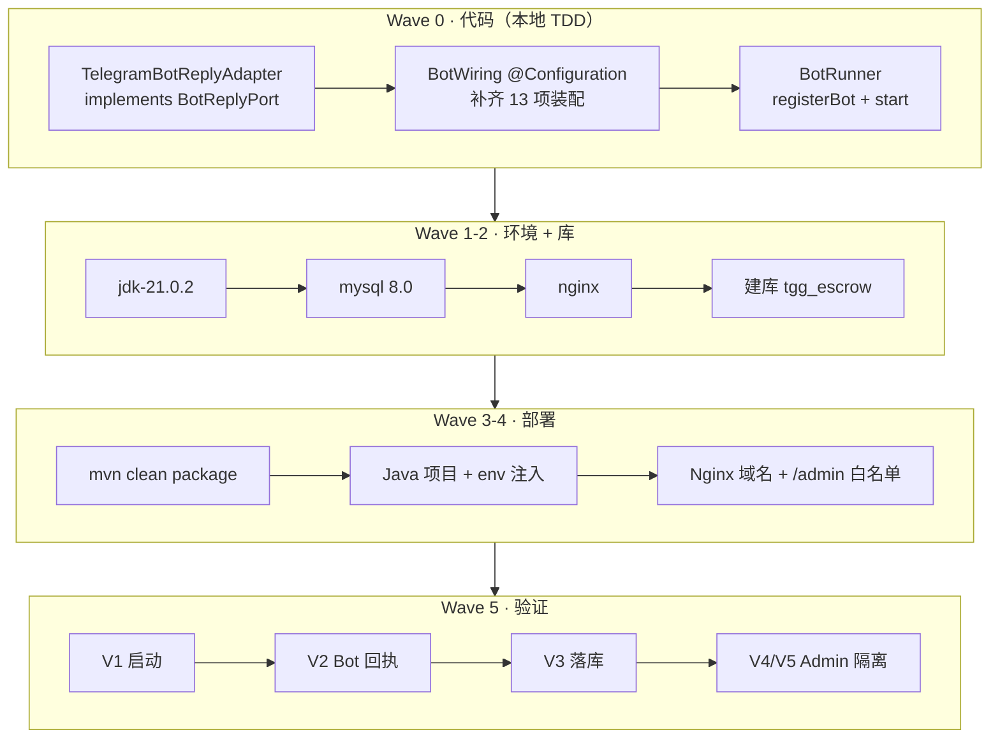

> **Model: deepseek-flash (cheap)**

> **Status: APPROVED** — 2026-09-24T09:37:05.569Z

# 服务器部署与功能验证 — 实施计划

> 设计依据：`docs/superpowers/specs/2026-09-24--server-deploy-and-verification-design.md`（已获用户批准）
> 日期：2026-09-24　目标机：141.164.50.75　域名：www.7kyuedu.xyz

## 需求提炼

**用户原话（提炼）**：
- 「域名时 www.7kyuedu.xyz 已经解析道该服务器」
- 「直接在服务器上部署环境进行各种功能验证」
- 「设计 OK，Admin API 用 (a) Nginx 限定白名单 IP——最快」

**目标**：把项目部署到 141.164.50.75（域名 www.7kyuedu.xyz），在真实环境跑通 Telegram Bot 与核心交易流程，逐条核销 `docs/ONLINE-VERIFICATION.md` 的 A 组（依赖 Telegram）与 C 组（依赖部署环境）。

**非目标（YAGNI）**：不引入 Redis（代码未接入）；不做 TON 合约（待决 C1）；不建 Vue 前端（待 npm）；不决定业务参数（B1–B5）；**不改 Application 层 Admin 鉴权代码**（本轮仅以 Nginx 限制来源 IP）。

## 现状锚点（开工前核对，工作区会变，以此为准）

| 事实 | 锚点 |
|---|---|
| handler 链已存在、无启动装配 | `tgg-app/src/main/java/com/tg/escrow/TelegramBotHandler.java:47,60` |
| 回复出口仅接口、无实现类 | `tgg-app/src/main/java/com/tg/escrow/BotReplyPort.java:32,35,47` |
| tgg-app 唯一 @Bean | `tgg-app/src/main/java/com/tg/escrow/BotBeans.java:40` |
| 全仓无 registerBot 调用点 | repo 级 grep = 0 命中 |
| token 入口（环境变量） | `BotTokenConfig.java:55` `from(Function<String,String>)` |
| 长轮询注册 API | `TelegramBotsLongPollingApplication#registerBot(String, LongPollingUpdateConsumer)`（本会话 javap 实测） |
| 服务器为空环境 | MCP 实测：站点 0、nginx/mysql/redis 全 not_installed、`jdk-21.0.2` 可选装 |
| bot 用户名 | `nq9831ops_bot`（用户提供的 BotFather 消息） |

## Wave 0 — 补 S1 代码（本地，TDD，可独立验证）

### 0.0 探针（必须先行；结论决定后续实现路径）
- [ ] 0.0a `mvn dependency:get -Dartifact=org.telegram:telegrambots-client:10.3.0` —— 确认该 artifact 可下载（本地 m2 目前**缺失**）。
  **若不通过** → ReplyPort 实现改走 `okhttp:4.12.0`（已在依赖树）手写 `POST https://api.telegram.org/bot<token>/sendMessage`，不加新依赖。
- [ ] 0.0b `javap -cp ~/.m2/repository/org/telegram/telegrambots-meta/10.3.0/telegrambots-meta-10.3.0.jar org.telegram.telegrambots.meta.api.methods.send.SendMessage org.telegram.telegrambots.meta.api.methods.AnswerCallbackQuery` —— 落定构造签名（**当前未验证**）。
- [ ] 0.0c `javap` 定死 `OkHttpTelegramClient` 的 FQN 与可用构造。

### 任务
- [ ] 0.1 **RED**：新增 `tgg-app/src/test/java/com/tg/escrow/TelegramBotReplyAdapterTest.java`（fake `TelegramClient`，断言 `sendText`→execute(SendMessage) 且 chatId/text 正确；`ackCallback`→execute(AnswerCallbackQuery)；TelegramApiException 包装为 TggException）。跑 `mvn -pl tgg-app -am test -Dtest=TelegramBotReplyAdapterTest -Dsurefire.failIfNoSpecifiedTests=false` → 期望编译失败（找不到符号）。
- [ ] 0.2 **GREEN**：新增 `tgg-app/src/main/java/com/tg/escrow/TelegramBotReplyAdapter.java` 实现 `BotReplyPort`。
- [ ] 0.3 若 0.0a 通过：`tgg-app/pom.xml` 加 `org.telegram:telegrambots-client:10.3.0`。
- [ ] 0.4 新增 `tgg-app/src/main/java/com/tg/escrow/BotWiring.java`（@Configuration），产出：`Clock`、`AmountTierPolicy`、`TradeAdmissionPolicy`、`TradeAdmissionGate`、`PendingTradeRegistry`、`EscrowTradeService`（注入 `JpaEscrowOrderStore`/`JpaTradeHistoryPort`）、`TradeCommandHandler`、`KeywordAutoReply`、`BotTokenConfig`（`from(System::getenv)`）、`BotDispatcher`、`TelegramBotHandler`、`BotReplyPort`。
- [ ] 0.5 新增 `tgg-app/src/main/java/com/tg/escrow/BotRunner.java`（`SmartLifecycle`）：`start()` 构造 `TelegramBotsLongPollingApplication` → `registerBot(token, handler)` → `start()`；`stop()` 调 `close()`。
- [ ] 0.6 `tgg-app/src/main/resources/application.yml` 增 `tgg.bot.username: ${TELEGRAM_BOT_USERNAME:nq9831ops_bot}`（token 仍只走环境变量，绝不入仓）。
- [ ] 0.7 修正 `tgg-app/src/main/java/com/tg/escrow/EscrowBotApplication.java:28-33` 的过时注释（称"尚无 Web/Bot 装配"）。
- [ ] 0.8 全量回归：`mvn test`（退出码落文件）。
- [ ] 0.9 `deliver_task` 提交（wave 0 一个逻辑单元）。

**Wave 0 验证命令**：`mvn test > /tmp/w0.log 2>&1; echo MVN_EXIT=$?`；判据：`BUILD SUCCESS` 且 `MVN_EXIT=0` 且总数 ≥ 553。

## Wave 1 — 装服务器环境（宝塔 MCP）

- [ ] 1.1 `JavaJdk action=install version=jdk-21.0.2`（装后用 `JavaJdk action=list` 轮询 `operation` 3→1）
- [ ] 1.2 `SoftwareInstall name=mysql version=8.0`（异步，用 `SoftwareList search=mysql` 轮询 setup）
- [ ] 1.3 `SoftwareInstall name=nginx`
- [ ] 1.4 核验 `ServiceStatus`（mysql/nginx running）

**Wave 1 验证命令**：`ServiceStatus` 返回 mysql/nginx `running:true`；`JavaJdk list` 中 `jdk-21.0.2` `operation=1`。

## Wave 2 — 建库

- [ ] 2.1 `DatabaseCreate name=tgg_escrow db_user=tgg_user address=127.0.0.1`（记录返回的生成密码，供 Wave 3 env 使用）
- [ ] 2.2 核验 `DatabaseList search=tgg_escrow`

**Wave 2 验证命令**：`DatabaseList` 含 `tgg_escrow`。

## Wave 3 — 构建 + 部署

- [ ] 3.1 本地 `mvn clean package -DskipTests`（**必须 clean**：根 pom 注释记录过陈旧 class 致"找不到符号"的坑）
- [ ] 3.2 上传 `tgg-app/target/tgg-app-0.1.0-SNAPSHOT.jar` 到服务器（宝塔 Upload 或 scp）
- [ ] 3.3 `JavaProjectCreate`：jar 路径 + JDK21 + port 8080 + `env_list` 注入 `TELEGRAM_BOT_TOKEN`、`TELEGRAM_BOT_USERNAME`、`TGG_DB_HOST/PORT/NAME/USER/PASSWORD`
- [ ] 3.4 核验 `JavaProjectInfo`（run/listen）；必要时读日志路径确认 Flyway V1/V2 干净应用

**Wave 3 验证命令**：`JavaProjectInfo` 返回 `run:true` 且监听 8080；应用日志无 Flyway/JPA validate 错误。

## Wave 4 — Nginx + 域名 + Admin 白名单

- [ ] 4.1 反代 `www.7kyuedu.xyz` → `127.0.0.1:8080`（`ProxyProjectCreate`，或 `JavaProjectModify add_domain`）
- [ ] 4.2 `ProxyWriteConfig` 在 `location /admin/` 加 `allow <用户出口 IP>; deny all;`（**实施本波时向用户索取出口 IP**，用户在当地 `curl ifconfig.me` 即得）
- [ ] 4.3 核验 `ProxyProjectInfo` 含域名与规则

**Wave 4 验证命令**：`ProxyProjectInfo` 域名正确；`curl -I http://www.7kyuedu.xyz/admin/words` 从非白名单来源返回 403。

## Wave 5 — 启动 + 验证 + 记录

- [ ] 5.1 `JavaProjectControl action=start`
- [ ] 5.2 **V1** 读应用日志：Flyway 迁移成功 + Web 容器起 + Bot 注册无异常
- [ ] 5.3 **V2（需用户在 Telegram 内操作）**：群里发 `/escrow create 2002 100 USDT` → 风险提示；再 `/escrow confirm 2002 100 USDT` → 「已创建订单 #N」
- [ ] 5.4 **V3** `MysqlQuery` 查订单表确认落库行
- [ ] 5.5 **V4/V5** Admin API 白名单可达 / 非白名单 403
- [ ] 5.6 更新 `docs/ONLINE-VERIFICATION.md`：勾 A1/A2/A3/C1/C5（逐条注日期与观察）

**Wave 5 验证命令**：`MysqlQuery` 返回订单行；`JavaProjectInfo` run=true；ONLINE-VERIFICATION 对应项已勾。

## 反证 / 复现（瑶光反证）

**计划期已复现（有工具证据）**：
- `registerBot(String, LongPollingUpdateConsumer)` 签名 —— 本会话 `javap` 实测。
- `TelegramClient` 是 meta 接口、实现类不在现有依赖 —— `javap` + jar 清单 + 依赖树实测。
- 无 registerBot 调用点 / 无 BotReplyPort 实现类 —— repo 级 grep 均 0 命中。
- 服务器为空环境（站点 0、三服务 not_installed、jdk-21.0.2 可装）—— MCP `ServiceStatus`/`SiteList`/`JavaJdk` 实测。

**计划期无法复现、列为待验证假设（由 Wave 0 探针证伪）**：
- `SendMessage(String,String)` 与 `AnswerCallbackQuery(String)` 的构造签名 —— **未验证**（计划模式禁 bash，scout 亦无 bash）。若不符，**首次编译即暴露**，修正成本低。
- `org.telegram:telegrambots-client:10.3.0` 可下载 —— **未验证**；本环境观测到 DNS 劫持，若下载失败则回落 okhttp 手写（0.0a 已给分支）。
- `OkHttpTelegramClient` 的 FQN/构造 —— **未验证**。
- Spring 默认扫描覆盖 tgg-escrow 实体与仓储 —— **静态推断**（未跑上下文）；Wave 3 启动日志会直接证伪。

**失败分流（避免把"装配未生效"误判为"token 无效"）**：Bot 无回执时，先 `curl https://api.telegram.org/bot<token>/getMe` 判 token；再查应用日志是否见 registerBot 成功。

## 风险与缓解

- **内存 3.3 GiB 偏紧**：JVM 限 `-Xmx768m`；MySQL 视情况调 `innodb_buffer_pool_size`；若 OOM 则减配或升配。
- **Bot Token 已在对话明文出现**：验证通过后到 BotFather `/revoke` 轮换，并在宝塔同步更新 env。
- **`botUsername` 此前无来源**：Wave 0.6 以配置项引入（默认 `nq9831ops_bot`）。
- **Admin 端点应用层仍无鉴权**：本轮仅 Nginx 缓解；若将来公网化必须补代码（记入遗留）。
