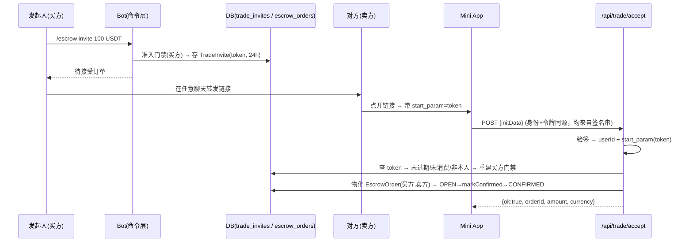

---

**执行状态：** 已闭环。Task 0-4 均已完成；验证通过；交付门检查：GREEN。
rivet-options: [{"label":"A. 独立 TradeInvite 聚合（推荐）","description":"待接受态存新表 trade_invites，接单时一次性物化出 EscrowOrder（双方齐全，直接 CONFIRMED）。EscrowOrder 及状态机、两处穷举 switch、准入门禁、迁移全部不动。"},{"label":"B. EscrowOrder 加 PENDING 态 + 卖方可空","description":"按字面「新增订单状态」实现：seller_user_id 改可空、State 加 PENDING。牵动 cancel:110 / DisputeFlow:66,83 / TradeReview:65 三处资金路径，且新状态会被 JpaTradeHistoryPort:33-36 自动计入「进行中」。"}]
---


> **Model: deepseek-flash (cheap)**

> **Status: APPROVED** — 2026-09-24T13:54:19.571Z

> **Status: EXECUTED** — 2026-09-24T14:06:16.060Z

# 深链邀请接单：发起人建邀请 → 对方点开链接自动绑定为卖方

## 需求提炼

**用户原话（本会话）**：
> deep link 邀请（Telegram 生态标准做法）：发起人不填对方 ID，先落一个「待接受」订单并生成深链（https://t.me/<bot>?startapp=<token> 或 ?start=<token>）；把链接发给对方，对方点开时由对方的 initData 暴露其真实身份并绑定为卖方。这才能自动、且不可伪造。代价是要新增订单状态（待接受）、深链令牌的生成/校验、以及「双方都点开时谁绑定为谁」的并发处理。

**补充需求（本轮排队指令，逐字）**：
> 所有交易只使用ton币和ton链上的usdt其他的一律不需要

**目标**：把「手填对方数字 ID」替换为「生成不可伪造的邀请深链 → 对方点开 → 用其本人验签身份绑定为卖方」；并把「交易币种」收敛为白名单 **TON / USDT（TON 链）**，服务端 fail-closed 拒绝其余币种。

**非目标**：
- 不实现链上锁仓 / TON Connect（本波不碰资金动作）。
- 不实现双方到账通知推送（bot 不能主动给未 /start 的用户发消息）——标注为遗留。
- 不删除现有手填路径 `/escrow create|confirm`（`tgg-app/src/main/java/com/tg/escrow/TradeCommandHandler.java:44`）与 `/api/trade/create`（`tgg-app/src/main/java/com/tg/escrow/webapp/TradeApiController.java:97`）——保留为兼容路径。
- 不做邀请过期后台清扫任务：采用惰性过期校验（accept 时判 expiresAt）。

## 现状与承重约束（file:line 均本会话已核实）

1. 订单账本 `EscrowOrder` 的「买卖双方恒在」是承重不变量：公有构造 `EscrowOrder(long buyerUserId, long sellerUserId, ...)`（`tgg-escrow/src/main/java/com/tg/escrow/escrow/EscrowOrder.java:149`），列 `seller_user_id BIGINT NOT NULL`（`tgg-escrow/src/main/resources/db/migration/V1__init_escrow.sql`）。
2. 三处资金路径依赖非空卖方：`EscrowTradeService.cancel`（`tgg-escrow/src/main/java/com/tg/escrow/escrow/EscrowTradeService.java:110`）、`DisputeFlow`（`tgg-escrow/src/main/java/com/tg/escrow/escrow/DisputeFlow.java:66` 与 `:83`）、`TradeReview`（`tgg-escrow/src/main/java/com/tg/escrow/escrow/TradeReview.java:65`）。若卖方改可空，这些点会引入拆箱 NPE 风险。
3. `EscrowOrder.State` 有两处穷举 switch：`TradeStage.of`（`tgg-escrow/src/main/java/com/tg/escrow/escrow/TradeStage.java:84`）、`TradeStatusView.of`（`tgg-escrow/src/main/java/com/tg/escrow/escrow/TradeStatusView.java:48`）。加状态会被编译器强制同步。
4. 准入门禁的「进行中」集合由枚举派生：`ACTIVE_STATE_NAMES = Arrays.stream(EscrowOrder.State.values()).filter(非终态)`（`tgg-escrow/src/main/java/com/tg/escrow/escrow/JpaTradeHistoryPort.java:33-36`）。**新增任何非终态会被自动计入「进行中」**，直接影响 T23。
5. initData 验签器目前只产出 userId：`WebAppInitDataVerifier.verifyUserId`（`tgg-app/src/main/java/com/tg/escrow/webapp/WebAppInitDataVerifier.java:115`）。
6. 前端契约测试把硬约束钉进构建：`tgg-app/src/test/java/com/tg/escrow/webapp/MiniAppPageTest.java`（禁 `initDataUnsafe`、禁 `userId` 字面量、须含 `tg.initData`）。
7. 承重外部事实（已用三处独立来源交叉核实）：直链 `https://t.me/<bot>?startapp=<token>` 的 startapp 参数会进入 Mini App 的 `start_param` 字段，而 initData 除 `hash` 外全部字段参与 HMAC 签名——故服务端可从**已验签**的 initData 里取出令牌，前端无需碰 `initDataUnsafe`。
8. **币种在服务端无任何白名单**：`EscrowOrder.currency` 是自由 `String`（`tgg-escrow/src/main/java/com/tg/escrow/escrow/EscrowOrder.java:129`），`TradeInitiationRequest` 只校验非空白，`/api/trade/create`（`tgg-app/src/main/java/com/tg/escrow/webapp/TradeApiController.java:112`）与命令层（`tgg-app/src/main/java/com/tg/escrow/TradeCommandHandler.java:130`）原样透传。全仓唯一枚举币种处是前端 `tgg-app/src/main/resources/static/miniapp/index.html:88-91`（TON/USDT）。现有 59 处测试币种字面量**全部为 `USDT`**（本会话 grep 核实）——加白名单不误伤既有测试。

## 方案设计

### 数据流



### 状态与不变量

- 新增独立聚合 `TradeInvite`（`trade_invites` 表）：`token`（唯一，SecureRandom 16B→hex）、`buyerUserId`、`amount`、`currency`（经 Wave 0 的 `TradeCurrency` 白名单校验）、`createdAt`、`expiresAt`、`acceptedOrderId`（NULL=未被接受）、`version`（乐观锁）。
- 接单成功 = 同一事务内「物化订单 + 标记邀请已消费」。并发抢接靠 `@Version`：后到者提交期版本冲突 → 转 `ConcurrentOrderUpdateException` → 回「已被他人接受」。
- `EscrowOrder` **零改动**：接单时用现有构造（`:149`）建单，再调现有 `markConfirmed`（`EscrowOrder.java:158`）迁到 CONFIRMED。两处穷举 switch、门禁集合、迁移 V1/V3 全不动。

### 新端点

- `POST /api/trade/invite`：体 `{initData, amount, currency}` → 验签 → 门禁 → 存邀请 → 返回 `{ok, orderId:null, inviteUrl, expiresAt, riskPrompt}`。
- `POST /api/trade/accept`：体 `{initData}` → 验签 → 取 `start_param` → 绑定 → 返回 `{ok, orderId, amount, currency}`。失败：401（验签）/409（已接受）/410（过期）/400（自邀自接）。
- 两者与现有 `TradeApiController` 同风格（HTTP 200 + body.status 承载语义，见 `TradeApiController.java:63-66` 的已知简化）。

## 反证/复现（可证伪的承重假设）

- 假设「start_param 随签名下发」→ 反证测试：构造一份合法 initData，**只篡改 start_param 值**（保持其余字段与 hash），accept 必 401。若实现是从 `initDataUnsafe` 读令牌，此测试会放行 → RED 立刻暴露。
- 假设「令牌一次性」→ 反证测试：对同一 token 并发两路 accept，恰一路成功（另一路 409）。
- 假设「不可自邀自接」→ 反证测试：买方用自己 initData 调 accept → 400。
- 假设「过期即失效」→ 反证测试：`expiresAt` 之后 accept → 410。
- 假设「EscrowOrder 未被打扰」→ 反证：`git diff --stat` 中 `EscrowOrder.java` 与 `V1/V3` 必须为空；全量测试仍绿。

## 分波执行

### Wave 0 — 币种白名单：TON / USDT(TON 链)（tgg-escrow + 前端）
- [x] 写 `TradeCurrencyTest`（RED：`TON`/`USDT` 通过；`USDC`/`BTC`/`ETH`/空白/未知一律拒；大小写归一为规范形式）
- [x] 实现领域枚举 `TradeCurrency`（tgg-escrow，fail-closed 的 `requireSupported(String)`）
- [x] 在 `TradeInitiationRequest` 构造期接入白名单（**一处收口**：同时覆盖命令层 `TradeCommandHandler` 与 `/api/trade/create`）
- [x] 前端 `index.html` 币种下拉由 5 项收敛为 TON/USDT，并在 `MiniAppPageTest` 加守卫（禁出现 BTC/ETH/USDC）

**验证**：`mvn -q test` 全绿（既有 59 处 USDT 测试不受影响）。

### Wave 1 — 领域聚合 + 持久化（tgg-escrow）
- [x] 写 `TradeInviteTest`（RED：token 非空/金额为正/expiresAt 晚于 createdAt；accept 守卫：未过期/未消费/非本人）
- [x] 实现 `TradeInvite` 聚合与 `TradeInviteStore` 端口
- [x] 新增迁移 `V4__trade_invites.sql`（可移植 DDL：独立 CREATE INDEX、不写 ENGINE/CHARSET，遵循 `V1__init_escrow.sql` 文末约束）+ JPA 仓储映射
- [x] 写 `TradeInviteServiceTest`（RED：create 被门禁拒 / accept 全分支含已有订单则拒）
- [x] 实现 `TradeInviteService.create/accept`（accept=物化订单+标记消费，同事务）

**验证**：`mvn -q -pl tgg-escrow test` 全绿。

### Wave 2 — Web 接单端点（tgg-app/webapp）
- [x] 扩充 `WebAppInitDataVerifierTest`（RED：合法串取出 start_param；篡改 start_param 必验签失败）
- [x] 重构 `WebAppInitDataVerifier`：新增 `verify()` 返回 `VerifiedUser(userId, startParam)`，`verifyUserId` 改为委托（保持既有调用点 `TradeApiController.java:103` 语义不变）
- [x] 写 `TradeInviteControllerTest`（RED：invite/accept 成功与 401/409/410/400 分支）
- [x] 实现 `/api/trade/invite` 与 `/api/trade/accept`

**验证**：`mvn -q -pl tgg-app test` 全绿。

### Wave 3 — Bot 命令 + 装配 + 配置
- [x] 增补 `TradeCommandHandlerTest`（RED：`/escrow invite <金额> <币种>` 回执含邀请链接；参数缺失回用法）
- [x] `TradeCommandHandler` 加 `invite` 分支（注入 botUsername 以拼 `https://t.me/<bot>?startapp=<token>`），更新 `USAGE`（`:44`）
- [x] `BotWiring` 装配新 Bean（仓储/Store/Service），`application.yml` 加 `tgg.invite.ttl:${TGG_INVITE_TTL:PT24H}`
- [x] 更新 `BotDispatcher` 帮助文案（`BotDispatcher.java:49`）

**验证**：`mvn -q test` 全绿（跨模块装配门禁）。

### Wave 4 — 前端双模式 + 契约测试 + 收口
- [x] 更新 `MiniAppPageTest`（RED：新端点守卫；仍禁 `initDataUnsafe`/`userId`；start_param 须从 `tg.initData` 解析）
- [x] 改造 `tgg-app/src/main/resources/static/miniapp/index.html`：无 start_param → 邀请表单（金额+币种→生成链接）；有 start_param → 接受视图（POST `/api/trade/accept`）
- [x] 全量回归 `mvn -q test`（基线 592 绿，目标 = 592 + 本波新增，全绿）
- [x] 把部署前置（BotFather 主 Mini App URL 指向 webapp URL）写进 `.rivet/HANDOFF.md`

**验证**：`mvn -q test` 全绿；`git diff --stat` 确认 `EscrowOrder.java`、`V1__init_escrow.sql`、`V3__order_optimistic_lock.sql` 无改动。

## 部署前置与遗留
- BotFather 里把 bot 的 Main Mini App URL 设为 `TGG_WEBAPP_URL`（否则 `?startapp=` 打不开正确的页）。
- 遗留：接单成功后的「通知发起人」需 bot 单独发消息（发起人已 /start 过，可行）；通知卖方需其已 /start。标注为实现时可选项。
- 遗留：门禁 TOCTOU（写邀请与接单两处非原子）为**既有**行为，与 `EscrowTradeService.initiate` 同构，不在本波修。

## 7. Execution closure

已闭环：Task 0-4 均已完成并通过验证。

最终验证记录：

```bash
mvn test（全量，653 绿，BUILD SUCCESS，exit 0）
mvn -pl tgg-escrow -am test（306 绿）
mvn -pl tgg-app -am test（82 绿）
node --check 内联脚本（JS_SYNTAX_OK）+ 静态契约核对
```

交付门检查：GREEN。

备注：Wave 0–4 全部落地，全量 mvn test 653 绿（基线 592，+61）。EscrowOrder.java 与 V1/V3 迁移零改动。
