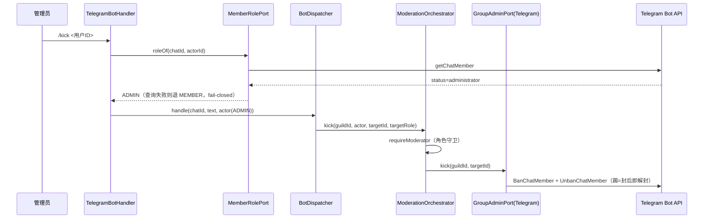

---

**执行状态：** 已闭环。Task 1-4 均已完成；验证通过；交付门检查：GREEN。
rivet-options: [{"label":"A. 群管理动作接线（推荐）","description":"先解真实角色解析（前置阻塞），再落 GroupAdminPort 的 Telegram 实现，再接 /kick /ban /mute /del 命令。用户可见、无外部阻塞。"},{"label":"B. 交易状态变更通知","description":"先做交易状态变更通知（T45）：交付/放款/争议后主动推送给对方，补全上一波的生命周期。更小、与刚交付的功能同源。"},{"label":"C. 先定 C1 解锁 S5","description":"先出 C1 多签语义决策简报——不定它，S5 合约（真实资金层）无法开工，而那是整个产品最大的一块。"}]
---


> **Model: deepseek-flash (cheap)**

> **Status: APPROVED** — 2026-09-24T14:45:45.276Z

> **Status: EXECUTED** — 2026-09-24T14:53:12.208Z

# 群管理动作接线：真实角色解析 + GroupAdminPort 的 Telegram 实现 + 管理员命令

## 需求提炼

**用户指令（本会话，逐字）**：
> 全部推送git 然后继续开发

**目标**：让群里**真能执行处置**——踢出、封禁、定时禁言、删消息，由管理员用命令发起，且权限判定基于**真实的群内角色**。这是项目路线图 G-C 桶（13 项）的入口；S1（Bot 接线）完成后它才具备开工条件。

**非目标（逐条给理由）**：
- **不做 Redis 版反刷屏**（G6）——需基础设施，先落内存版。
- **不做调度器**：定时解禁由调度侧触发，本波只落"设禁言"这一半。
- **不做日志频道**（G16）/ **群信息同步**（G17）/ **数据备份**（G25）——各自独立。
- **不做年龄门槛**（G20/G21）——依赖待决 B4（合规口径）。
- **不改 `ModerationOrchestrator` / `GroupAdminPort` 的既有语义**（角色守卫与联邦旁路已实现且有测试，本波只接线）。

## 现状与承重约束（file:line 均本会话实测）

1. `GroupAdminPort`（踢/封/禁言/删消息）已在 tgg-core 定义（`tgg-core/src/main/java/com/tg/escrow/core/GroupAdminPort.java:35`），但**只有测试 fake**（`WarningOrchestratorTest`、`ModerationOrchestratorTest`），**零生产实现**——全仓 grep 无 `implements GroupAdminPort`。
2. 编排层 `ModerationOrchestrator`（角色守卫 + 联邦旁路）已实现且有测试：`:52` 端口字段、`:56`/`:64` 构造器、`:73 kick`、`:79 ban`、`:85 mute`、`:95 deleteMessage`、`:105 requireModerator`、`:126 federationKick`。但 `tgg-app/src/main` 对它**零引用**（grep 空）——又一个"接线孤儿"。
3. `WarningOrchestrator`（`:38` 类、`:49` 构造器、`:73 handle`）依赖 `ModerationOrchestrator` + `WarningPolicy`，同样未接线。
4. **前置阻塞**：`tgg-app/src/main/java/com/tg/escrow/TelegramBotHandler.java:99` 把角色**硬编码**为 `MemberRole.MEMBER`；`:40` 的注释自陈「真实角色需调 getChatMember（上线接入时升级）」。不解决它，管理员命令会被 `requireModerator` **一律拒绝**——接了线也点不动。
5. `BotDispatcher` 只路由 `tradeHandler` + 违禁词 + 自动回复（`BotDispatcher.java:92`），**无管理员命令入口**。
6. 角色模型：`MemberRole` = MEMBER(0) / ADMIN(1) / OWNER(2)，`isAtLeast` 比较（`MemberRole.java:36/39/42/51`）。
7. 适配器测试范式：`TelegramBotReplyAdapterTest` 用 Mockito `mock(TelegramClient.class)` + `ArgumentCaptor` 断言发出的 API 对象。**mock 第三方库边界**是本仓既有做法，与"mock 掉自家中间层"不是一回事。

## 方案设计

### 数据流



### 权限与守卫（不重复实现第二套）

| 命令 | 允许方 | 判定点 |
|---|---|---|
| `/kick <用户ID>` | 管理员及以上 | `ModerationOrchestrator.requireModerator` |
| `/ban <用户ID>` | 管理员及以上 | 同上 |
| `/mute <用户ID> <时长>` | 管理员及以上 | 同上 + 时长必须为正 |
| `/del <消息ID>` | 管理员及以上 | `deleteMessage` 自身守卫 |

**角色查询失败一律退 MEMBER**——权限只能收紧不能放松；查询失败而升权等于给了越权通道。

## 反证/复现

- **边界断裂的物理证明（本波 RED 基线）**：写一条端到端测试——管理员发 `/kick 2002`。**今天必红**：`BotDispatcher` 不认该命令 → 落到违禁词/自动回复分支 → 返回 `null`（不响应）。且即便把命令路由上，`TelegramBotHandler` 硬编码的角色会让编排层**一律拒绝**——两条断点都要先用红灯证出来。
- **权限反证**：普通成员发 `/kick` → 被拒，且**断言 `GroupAdminPort` 零调用**（只断言文案会漏掉"文案拒绝了、动作却执行了"）。
- **fail-closed 反证**：角色查询抛异常 → 退 MEMBER → 命令被拒（不得升权）。
- **参数反证**：缺目标 ID / 禁言时长非正 → 用法说明，且端口零调用。
- **未打扰反证**：`BotDispatcher` 的交易路由与"违禁词优先于自动回复"两条既有不变量仍绿；`ModerationOrchestrator`/`GroupAdminPort` 源码零改动。

## 分波执行

### Wave 1 — 真实角色解析（解前置阻塞）
- [x] 写 `MemberRolePortTest` + `TelegramMemberRoleAdapterTest`（RED：端口/适配器不存在 → 编译失败）
- [x] 新增端口 `MemberRolePort`（tgg-core）：`MemberRole roleOf(long chatId, long userId)`
- [x] 新增 `TelegramMemberRoleAdapter`（tgg-app）：`getChatMember` → 映射 `creator→OWNER / administrator→ADMIN / 其余→MEMBER`；**异常或未知状态 → MEMBER（fail-closed）**
- [x] `TelegramBotHandler` 改为经该端口取角色（端口为 null 时退 MEMBER，保持既有测试可通过）
- [x] 测试覆盖：四种状态的映射、查询抛异常退 MEMBER、null 依赖

**验证**：`mvn -q -pl tgg-app -am test` 全绿。

### Wave 2 — GroupAdminPort 的 Telegram 实现
- [x] 写 `TelegramGroupAdminAdapterTest`（RED：适配器不存在 → 编译失败）
- [x] 新增 `TelegramGroupAdminAdapter implements GroupAdminPort`：kick→`BanChatMember`+`UnbanChatMember`；ban→`BanChatMember`；mute→`RestrictChatMember`(untilDate)；deleteMessage→`DeleteMessage`
- [x] 失败一律抛 `TggException`（不静默——处置失败必须让调用方知道）
- [x] 测试照 `TelegramBotReplyAdapterTest`：mock `TelegramClient` + `ArgumentCaptor` 断言 API 对象与参数（含 untilDate 换算、chatId 字符串化）

**验证**：`mvn -q -pl tgg-app -am test` 全绿。

### Wave 3 — 管理员命令接线
- [x] `BotDispatcherTest` 增例（RED：`/kick`/`/ban`/`/mute`/`/del` 不被识别）
- [x] `BotDispatcher` 增管理员命令路由（复用既有调用约定）：非管理员 → 明确回执；参数缺失 → 用法；编排层异常 → 转述
- [x] `BotWiring` 装配 `MemberRolePort` / `GroupAdminPort` / `ModerationOrchestrator` 三个 Bean；`TelegramBotHandler` 注入角色端口
- [x] 集成测试（**真实 `ModerationOrchestrator` + 真实守卫 + 记录型 fake `GroupAdminPort`**，非 mock 中间层）：管理员可执行、普通成员被拒且端口零调用、查询失败退 MEMBER

**验证**：`mvn -q test` 全绿。

### Wave 4 — 收口
- [x] 全量回归 `mvn test`（基线 704 绿）
- [x] `git diff --stat` 确认 `ModerationOrchestrator.java` / `GroupAdminPort.java` 与迁移文件**零改动**
- [x] `BotDispatcher` 帮助文案纳入管理员命令；HANDOFF 记录"未在真机验证"

**验证**：`mvn -q test` 全量绿；`git diff --stat` 对上述文件为空。

## 部署前置与遗留
- 部署前置：无新迁移、无新配置项（角色由 Telegram API 实时取）。
- 遗留（明确标注，不假装完成）：① 真实 Telegram 群内角色查询**未在真机验证**（需 bot 在群内且有管理员）；② 定时解禁需调度器；③ `WarningOrchestrator`（警告累计）未在本波接线，留在下一波。

## 7. Execution closure

已闭环：Task 1-4 均已完成并通过验证。

最终验证记录：

```bash
mvn test（全量，726 绿，BUILD SUCCESS，exit 0）
mvn -pl tgg-app -am test（125 绿）
git diff --stat（ModerationOrchestrator/GroupAdminPort/EscrowOrder/迁移 为空 = 未打扰）
```

交付门检查：GREEN。

备注：Wave 1–4 全部落地：角色解析（解前置阻塞）、GroupAdminPort 的 Telegram 实现、/kick /ban /mute /del 命令与装配。全量 mvn test 726 绿（起点 704，+22）。ModerationOrchestrator/GroupAdminPort/EscrowOrder/迁移 零改动（已实测）。真机未验证。
