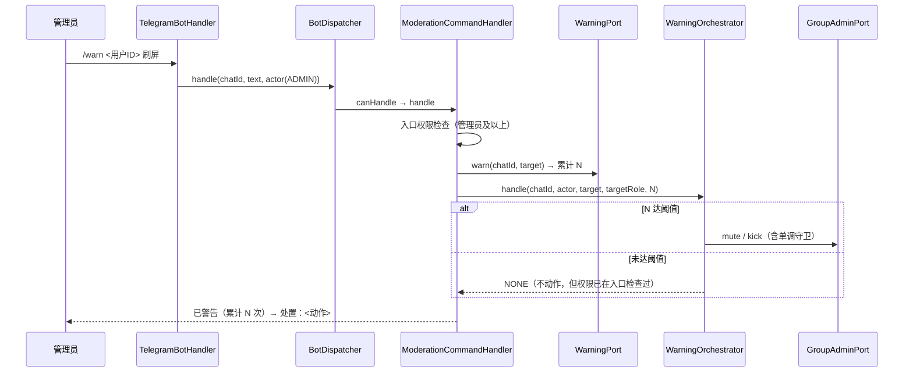

---

**执行状态：** 已闭环。Task 1-3 均已完成；验证通过；交付门检查：GREEN。
rivet-options: [{"label":"A. 警告累计接线 + 修权限缺口（推荐）","description":"修权限缺口（NONE 动作也须管理员）+ /warn /unwarn 命令 + 装配。小而完整，是上一波计划自记的遗留项。"},{"label":"B. 交易状态变更通知","description":"先做交易状态变更通知（T45）：交付/放款/争议后主动告知对方——补全生命周期体验。"},{"label":"C. 先定 C1 解锁 S5","description":"先出 C1 多签语义决策简报：不定它 S5 合约（真实资金）无法开工。"}]
---


> **Model: deepseek-flash (cheap)**

> **Status: APPROVED** — 2026-09-24T14:55:38.716Z

> **Status: EXECUTED** — 2026-09-24T14:58:27.839Z

# 警告累计接线：修正 WarningOrchestrator 权限缺口 + /warn /unwarn 命令

## 需求提炼

**用户指令（本会话）**：
> 继续开发

**目标**：把 `WarningOrchestrator`（警告累计 → 阈值判罚）接上线，提供 `/warn <用户ID> [理由]` 与 `/unwarn <用户ID>`，并**修掉侦察中发现的一处权限缺口**。

**非目标**：
- 不改 `ModerationOrchestrator` / `GroupAdminPort` 的既有语义（上一波刚接线，冻结）。
- 不做警告的自动过期（需调度器）。
- 不做警告记录的可视化/审计页（需 Web 层）。

## 现状与承重约束（file:line 均本会话实测）

1. `WarningOrchestrator`（tgg-core）已实现且有测试，但 `tgg-app/src/main` **零引用**——又一接线孤儿。构造器 `WarningOrchestrator(WarningPolicy, ModerationOrchestrator, Duration defaultMuteDuration)`（`WarningOrchestrator.java:49`）。
2. `handle(long guildId, CommandActor actor, long targetId, MemberRole targetRole, int currentWarnings)` 返回 `Action`（`WarningOrchestrator.java:73`）。**当前警告数由调用方提供**——即持久化责任在调用方。
3. **权限缺口（本波要修的）**：`handle` 内部只在判罚为 `MUTE`/`KICK` 时才调用 `moderation.mute/kick`——而权限与单调守卫**只存在于那两个方法内部**。当累计数未达阈值（`action == NONE`）时**不做任何权限检查**，于是**普通成员也能给他人累计警告**。这是一处 latent defect。
4. `WarningPort`（`tgg-escrow/src/main/java/com/tg/escrow/moderation/WarningPort.java`）已在盘：`int warn(long guildId, long userId)`（记录并返回累计数）、`int countOf(...)`、`void clear(...)`。JPA 实现与 Bean 生产者均已存在（`ModerationPersistenceConfig.warningPort(WarningRepo)`）。
5. `warnings` 表已存在（`V2__init_moderation.sql`，`warn_count` + 唯一索引）。**本波无新迁移**。
6. 上一波已就位：`ModerationCommandHandler`（`/kick /ban /mute /del`）、`MemberRolePort`（真实角色，fail-closed 退 MEMBER）、`ModerationOrchestrator` Bean。
7. `WarningPolicy.actionFor(int warnings)` 给出判罚动作（NONE/MUTE/KICK）。

## 方案设计



### 权限缺口怎么修（关键设计决策）

**在 `WarningOrchestrator.handle` 入口加管理员检查**（而非只在命令层加）。理由：命令层检查会被绕过（任何未来调用方都可能直接调 `handle`），而「警告是一项处置行为」这一约束属于编排层自身的不变量。修在编排层，命令层只需照常转述。

### 诚实边界

判罚若因单调守卫失败（如目标是同级管理员），**警告已累计但处罚未执行**。回执必须两件都说，不能只报成功——否则管理员会以为人已被禁言。

## 反证/复现

- **权限缺口的 RED（先证明缺陷存在）**：对现状的 `WarningOrchestrator` 写一条测试——**普通成员**（MEMBER）对他人 `handle(..., currentWarnings=0)`（未达阈值）→ **今天会正常返回 NONE 且不抛**，即"任何人都能记警告"。测试期望 `TggException`，故**必红**。这条红灯就是缺陷的可执行证据。
- **越权反证**：修好后，普通成员发 `/warn` → 拒，且 `WarningPort` **零调用**（只断言文案会漏掉"文案拒绝了、警告却真记上了"）。
- **阈值反证**：累计达阈值 → 落到 MUTE/KICK，且 `GroupAdminPort` 被真实调用。
- **单调守卫反证**：目标角色不低于执行者 → 处罚被拒；但**警告计数仍如实回报**（不谎报已处罚）。
- **未打扰反证**：`ModerationOrchestrator`/`GroupAdminPort`/`EscrowOrder` 与迁移零改动；上一波的 `/kick /ban /mute /del` 用例仍绿。

## 分波执行

### Wave 1 — 修权限缺口（tgg-core）
- [x] 写 `WarningOrchestratorTest` 增例（RED：普通成员 + 未达阈值 → 应抛而非静默放过）
- [x] `WarningOrchestrator.handle` 入口加 `requireAdmin`（actor 角色 ≥ ADMIN，否则抛 TggException）
- [x] 确认既有用例（管理员路径）仍绿

**验证**：`mvn -q -pl tgg-core -am test` 全绿。

### Wave 2 — /warn /unwarn 命令接线
- [x] `ModerationCommandHandlerTest` 增例（RED：`/warn` `/unwarn` 不被识别）
- [x] `ModerationCommandHandler` 增 `warn`/`unwarn` 分支（依赖 `WarningPort` + `WarningOrchestrator`）
- [x] 回执含「累计 N 次」与判罚动作；判罚失败时**两件都说**
- [x] `BotWiring` 装配 `WarningPolicy` / `WarningOrchestrator` Bean（默认禁言时长走配置 `tgg.warning.default-mute`）；`BotDispatcher` 帮助文案纳入

**验证**：`mvn -q -pl tgg-app -am test` 全绿。

### Wave 3 — 收口
- [x] 全量回归 `mvn test`（基线 726 绿）
- [x] `git diff --stat` 确认 `ModerationOrchestrator.java` / `GroupAdminPort.java` / `EscrowOrder.java` / 迁移**零改动**
- [x] HANDOFF 记录「真机未验证」与遗留

**验证**：`mvn -q test` 全量绿；上述 diff 为空。

## 部署前置与遗留
- 部署前置：新增可选配置 `tgg.warning.default-mute`（默认禁言时长）；**无新迁移**。
- 遗留：① 真机未验证；② 警告自动过期需调度器；③ `/warn` 的「理由」参数本波只做记录展示，未落库（`warnings` 表无理由列，加列属独立改动）。

## 7. Execution closure

已闭环：Task 1-3 均已完成并通过验证。

最终验证记录：

```bash
mvn test（全量，735 绿，BUILD SUCCESS，exit 0）
mvn -pl tgg-core -am test（236 绿，含缺陷复现用例）
mvn -pl tgg-app -am test（132 绿）
git diff --stat（编排层/端口/订单/迁移 为空 = 未打扰）
```

交付门检查：GREEN。

备注：Wave 1–2 落地：修掉 WarningOrchestrator「未达阈值时零权限检查」的越权缺口（RED 先复现后修），/warn /unwarn 命令接线与装配。全量 mvn test 735 绿（起点 726，+9）。ModerationOrchestrator/GroupAdminPort/EscrowOrder/迁移 零改动。
