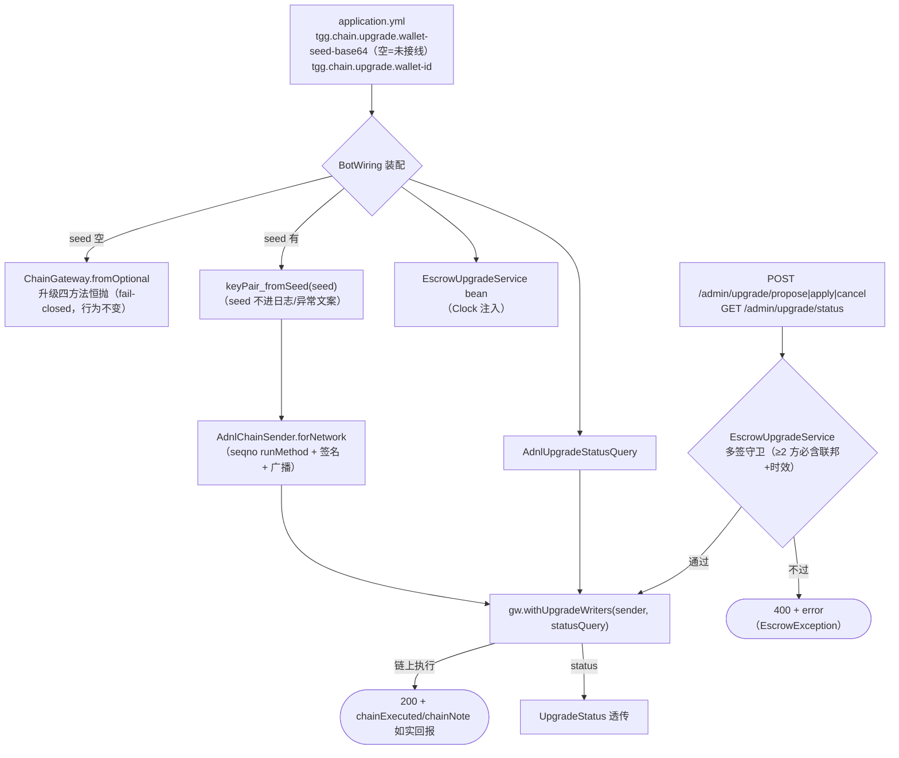

> **Model: mimo-v2.6-pro (strong)**

**执行状态：** 已闭环。Task 1-3 均已完成；验证通过；交付门检查：GREEN。

> **Status: APPROVED** — 2026-09-30T09:41:47.635Z

> **Status: EXECUTED** — 2026-09-30T10:04:20.045Z

# 遗留修复——升级写链栈装配闭环（BotWiring 接线 + /admin/upgrade 操作面 + 验证登记）

> 背景：⑥ 合约升级入口（`9ddbf2f`/`1c84fbb`/`459663d`，计划已 EXECUTED）交付时留了三件遗留，本计划收口其中可在本地闭合的两件：**写链栈未装配**（`withUpgradeWriters` 是死接缝，升级操作面停在 acton CLI）与**验证登记欠账**（新能力未按项目约定登记 `docs/ONLINE-VERIFICATION.md`）。第三件（合约未部署、真机链路）本地不可闭合，转为登记条目。

## 需求提炼

**用户原话**：「继续推进开发修复遗留问题」。

**目标**：
1. 把已建成的升级写链栈**接进生产装配**：`BotWiring` 按配置接 `withUpgradeWriters`（`AdnlChainSender.forNetwork` + `AdnlUpgradeStatusQuery`），配置为空时保留 fail-closed（升级方法恒抛「写链栈未接线」，行为不变）。
2. 补**升级操作面**：`/admin/upgrade/propose|apply|cancel|status` 管理端点——链下多签守卫（`EscrowUpgradeService`）在前、链上执行（`ChainGateway` 三方法）在后，回执 `chainExecuted` 如实回报（AdminVerdictController 同款纪律）。
3. **验证登记**：`docs/ONLINE-VERIFICATION.md` 登记升级能力的三条本地不可得验证项（签名载荷口径、真机 Propose→Apply 链路、upgradeStatus 栈序）。
4. 口径欠账顺手修：`ChainSettings` javadoc 漂移、`CODE-VS-SPEC` 用例数 stale 行。

**非目标**：
- 不动合约（contracts/ 无改动——升级语义已定案）。
- 不做真机部署/真机验证（本地不可得，登记即止）。
- 不做 resolveDispute 的写链接通（独立事项；本计划只用同一 `ChainMessageSender` 接缝，不动该 stub 语义）。
- 不给 seed 加 LogSanitizer 自动遮蔽（正则知识面问题，独立事项；本计划以「seed 不进任何日志/异常文案」的代码纪律防御）。

## 问题与根因

**表面问题**：⑥ 交付报告的遗留说「BotWiring 未装配写链栈」——升级能力建成但用户（运维）实际触达不了。

**根因两层**：
1. **死接缝**：`ChainGateway.withUpgradeWriters`（`tgg-chain/.../ChainGateway.java:75`）是为装配预留的口子，但 `BotWiring.chainGateway`（`tgg-app/.../BotWiring.java:171-174`）只调 `ChainGateway.fromOptional`，从未有人调 `withUpgradeWriters`——`requireSender()`（`ChainGateway.java:146-149`）恒抛，升级四方法恒不可用。建造与装配是两个交付物，上一轮只交付了前者。
2. **操作面缺位**：即使装配完成，升级动作也没有调用方——项目管理面先例（`AdminVerdictController`）证明「裁决/升级这类结构化联邦操作走 `/admin/**` API 而非 Bot 命令」，升级缺这层。且链上发送的钥匙（联邦钱包私钥 seed）此前**无任何配置入口**（`FederationKeyPair` 全仓零生产引用），不补配置面则装配无从谈起。

## 现状锚点（本会话 + 三侦察交叉核对，实施时逐条复核）

| 事实 | 锚点 |
|---|---|
| Clock bean 已有（全应用唯一生产时钟源） | `tgg-app/src/main/java/com/tg/escrow/BotWiring.java:145-146` |
| chainGateway bean 未接写链栈 | `BotWiring.java:171-174` |
| `withUpgradeWriters` 死接缝 + fail-closed 语义 | `tgg-chain/src/main/java/com/tg/escrow/chain/ChainGateway.java:75,146-149` |
| `EscrowUpgradeService` 无生产 bean（构造 `(Clock)`） | `tgg-escrow/src/main/java/com/tg/escrow/escrow/EscrowUpgradeService.java:45` |
| partySignatureVerifier bean 已有（未配公钥→恒 false fail-closed） | `BotWiring.java:421-426` |
| yml `tgg.chain` 段现状（jetton-master/testnet 两键） | `tgg-app/src/main/resources/application.yml:42-51` |
| LogSanitizer 不遮 Ed25519 seed（仅 Bot Token 形态） | `tgg-core/src/main/java/com/tg/escrow/core/LogSanitizer.java:73` |
| AdminVerdictController 模式（构造注入/EscrowException→400/chainExecuted 如实回报） | `tgg-app/src/main/java/com/tg/escrow/AdminVerdictController.java:86-96,128-141,155-156` |
| `/admin/**` 通配鉴权自动覆盖新端点（SecurityConfig 注释明说不必改） | `tgg-app/src/main/java/com/tg/escrow/SecurityConfig.java:70,78` |
| 测试模板：直调单测（`AdminVerdictControllerTest:96-100`）+ `@WebMvcTest` 切片验收（`AdminVerdictEndpointAcceptanceTest:75-101`）+ 全上下文 IT | `EscrowPersistenceIT.java:77-88`（failsafe 才跑） |
| ChainGateway 可 `withUpgradeWriters` 注入 recording 替身验消息内容 | `tgg-chain/src/test/java/com/tg/escrow/chain/ChainGatewayUpgradeTest.java:56-114` |
| `AdnlChainSender.forNetwork` + `seqnoFromResult` 已补全（本会话修复，**待补测试**） | `tgg-chain/src/main/java/com/tg/escrow/chain/AdnlChainSender.java`（forNetwork/seqnoFromResult/close） |

## 设计



### 装配契约（T2/T3）

- 新配置键（`application.yml` 的 `tgg.chain` 段内，仿 jetton-master 注释惯例）：
  - `tgg.chain.upgrade.wallet-seed-base64`：联邦钱包 v5r1 私钥 seed（32 字节 Base64）。**空默认、只走环境变量**（`TGG_CHAIN_UPGRADE_WALLET_SEED`）——密钥不给示例值；任何日志/异常文案不得包含 seed 或其片段。
  - `tgg.chain.upgrade.wallet-id`：默认 `0x29A9A317`（v5r1 标准 id）。
- 装配逻辑（`BotWiring.chainGateway` 增参）：seed 空白 → 原样 `fromOptional`（fail-closed 不变）；seed 有 → `TweetNaclFast.Signature.keyPair_fromSeed(Base64 解码)`（32 字节长度校验，非法**启动期抛**——「配错是真错误」同 ChainSettings 惯例）→ `AdnlChainSender.forNetwork(testnet, walletId, keyPair, clock)` + `new AdnlUpgradeStatusQuery(testnet)` → `withUpgradeWriters`。
- 新增 `EscrowUpgradeService` bean（依赖已有 `Clock`）。
- seed 解析失败的异常文案只说「长度/编码非法」，**不回显内容**。

### 操作面契约（T5）——失败码定案（方案取舍）

`AdminUpgradeController`（`/admin/upgrade`，鉴权自动覆盖）：

| 端点 | 请求体 | 成功 | 失败码 |
|---|---|---|---|
| POST `/propose` | `{contractAddress, newCodeBoc(base64), signatures{party:hex}, issuedAt}` | 200 + `chainExecuted/chainNote` | 请求非法（坏 base64/hex/缺字段）400；守卫拒绝（EscrowException）400 |
| POST `/apply` | `{contractAddress, codeHashHex, signatures, issuedAt}` | 同上 | 同上 |
| POST `/cancel` | 同 `/apply` | 同上 | 同上 |
| GET `/status?contract=` | — | 200 + `{codeHashHex, proposedAt, hasProposal}` | 查询失败 502（对标 AdminChainController 的 provider 不可用） |

- **`chainExecuted` 语义**（与 AdminVerdictController 同款，不搬 AdminChainController 的 503/502）：守卫通过后调 `ChainGateway`，`ChainUnavailableException` → **200 + `chainExecuted=false` + `chainNote`**——多签业务已成立，链上执行如实报告，绝不假装已上链。
- `newCodeBoc` 解析用 `Cell.fromBoc`——**catch 裸 `Error`**（ton4j 已实证：非法 boc 抛 `java.lang.Error`，`catch(Exception)` 拦不住）→ 400。
- `codeHashHex` 语义：propose 绑定 `newCode.hash()`；apply/cancel 绑定被操作提案的 hash（四维防挪用由 `UpgradeApproval.canonicalBytes` 保证）。
- controller 构造注入 `EscrowUpgradeService` + `ChainGateway`（照 AdminVerdictController 的 null 守卫惯例）。

### 验证登记（T8）

`docs/ONLINE-VERIFICATION.md` 新增三条（每条三要素：怎么验的可复制命令 / 期望观察 / 为什么本地不可得）：
1. **签名载荷口径核对**：真机钱包验签——推定口径是「签 `createExternalTransferBody(config).hash()`」（`AdnlChainSender` 类注释「签名载荷口径（推定，真机核对项）」），若真机验签失败先改签 body 原字节。
2. **Propose→Apply 真机链路**：testnet 全流程（propose → 等 72h → apply → 合约 code hash 变化）。
3. **upgradeStatus 栈序核对**：`tos[0]=proposedAt/tos[1]=codeHash` 口径（`AdnlUpgradeStatusQuery` 类注释「栈序口径」）。

### 口径修（T9）

- `ChainSettings.java:36` javadoc「尚未被生产代码消费」→ 对齐现状（BotWiring 已消费）。
- `CODE-VS-SPEC` 用例数 stale 行（26 passed 处）→ 对齐 acton test 实测（47）；行号实施时 grep 定位。

## 方案取舍

| 决策点 | 采纳 | 被弃 | 理由 |
|---|---|---|---|
| 升级操作面形态 | `/admin/**` REST（AdminVerdictController 同构） | Bot 命令 | 签名集是结构化数据非聊天文本；裁决先例已定 |
| chainExecuted 失败语义 | 200 + `chainExecuted=false`（Verdict 同款） | 503/502（ChainController 同款） | 多签业务已成立、仅链上执行未果——如实回报优先于状态码表达 |
| status 查询失败 | 502 | 200+false | 纯查询无「业务已成立」语义，对标 ChainController 的 provider 不可用 |
| 密钥转换路径 | `TweetNaclFast.Signature.keyPair_fromSeed(seed)` 直转 | 经 `FederationKeyPair` 中转 | 二者密钥体系不同（BouncyCastle vs TweetNaCl）；FederationKeyPair 全仓无生产引用，不引入第二套装配 |
| seed 长度非法 | 启动期抛（配错=真错误） | 静默忽略 | ChainSettings「没配 vs 配错」惯例：空=未启用，错=启动失败 |
| seqno/广播/签名接缝 | `forNetwork` 单 client 三端口 | 散装配三个类 | 复用同一 ADNL 连接（AdnlJettonWalletQuery 的懒建连/裸 Error 兜底同款） |

## 反证/复现（瑶光）

1. **worker 锚点独立复核**：三侦察的全部关键锚点（BotWiring:171-174/145-146/421-426、ChainGateway:75/146-149、SecurityConfig:70/78、AdminVerdictController:128-141）在实施时逐条 read_file 复核后才引用（external-source-verification）。
2. **死接缝复现（RED）**：T2 实现前先跑一条断言——当前 `ChainGateway.fromOptional(...)` 实例调 `proposeUpgrade` 必抛「写链栈未接线」（现成证据：`ChainGatewayUpgradeTest.unwiredGatewayFailsClosedOnAllUpgradeActions` 已钉）；T2 后该行为**保持**（seed 空路径回归）+ 新增 seed 有路径的接线断言（GREEN）。
3. **seqnoFromResult 变异分辨力**：T1 测试先落（RED：方法未测）→ 覆盖 tiny/big 整数/空结果/坏 boc（裸 Error → ChainUnavailableException）；变异（去掉 Error 兜底）必须红。
4. **上下文装配硬门（memory 教训）**：surefire 全绿 ≠ Spring 上下文能装配——T4/T7 后必须 `mvn verify` 跑到 `EscrowPersistenceIT`（Running 行确认真跑，非空跑）。
5. **seed 不泄露检查**：grep 新增代码——`wallet-seed`/seed 变量不得出现在任何 log/异常拼接/toString。
6. **待验证假设**（不预设成立，实施时探测）：① `TweetNaclFast.Signature.KeyPair.getSecretKey/getPublicKey()` 访问器名（javap 未及，编译器定）；② `RunMethodResult.result` 对 seqno 返回的栈形态（`seqnoFromResult` 测试以合成 boc/真 mock 不可得——按 AdnlUpgradeStatusQuery 同款离线钉解析逻辑）。

## 回归清单（改动前后必须仍成立）

| # | 回归断言 | 验证 |
|---|---|---|
| R1 | seed 未配置时升级四方法仍恒抛「写链栈未接线」（fail-closed 不变） | `ChainGatewayUpgradeTest` 全绿 + T2 新增 seed 空装配用例 |
| R2 | 既有 `/admin/verdict`、`/admin/chain`、`/admin/words` 行为不变 | `AdminVerdictControllerTest`/`AdminChainControllerTest`/`AdminEndpointSecurityTest` 全绿 |
| R3 | `/admin/**` 未配置凭据仍 401 | `AdminEndpointUnconfiguredSecurityTest` 全绿 |
| R4 | Spring 全上下文可装配（新 bean 不破坏） | `EscrowPersistenceIT`（mvn verify）绿且 Running 行可见 |
| R5 | 合约面零回归（contracts/ 无改动） | `acton test` 47 passed |

## 验证清单（测什么 / 看什么）

| 用例 | 场景 | 期望可见结果 |
|---|---|---|
| SEQ-1~4 | `seqnoFromResult`：tiny/big 整数/空 boc/坏 boc | 前两者返回正确值；后两者抛 `ChainUnavailableException`（坏 boc 的裸 Error 被兜） |
| WIRE-1 | seed 空装配 | 升级四方法恒抛「写链栈未接线」 |
| WIRE-2 | seed 有装配（32 字节合法 Base64） | `withUpgradeWriters` 被接上（探针断言 sender 非 null 行为：调用不再抛「未接线」） |
| WIRE-3 | seed 长度非法 | 启动期抛，异常文案不含 seed 内容 |
| CTRL-1~3 | propose/apply/cancel：守卫通过 + recording ChainGateway | 200 + `chainExecuted=true`；UpgradeApproval 四维正确 |
| CTRL-4 | 守卫拒绝（伪造签名） | 400 + error 含「多签」 |
| CTRL-5 | 链未接线 | 200 + `chainExecuted=false` + chainNote 含「写链栈未接线」 |
| CTRL-6 | 坏 newCodeBoc（非法 base64/boc） | 400（**不是 500**——裸 Error 兜底） |
| CTRL-7 | GET status 透传 | 200 + `{codeHashHex, proposedAt, hasProposal}` |
| HTTP-1 | @WebMvcTest 切片：JSON 反序列化（issuedAt 字段名）+ Basic 鉴权 | Jackson 字段钉住；无凭据 401 |
| IT-1 | EscrowPersistenceIT | mvn verify 真跑、上下文装配成功 |

## 分波执行

> TDD 序：每任务先落测试（RED）再实现（GREEN）；T1 先钉住本会话已修的 forNetwork/seqnoFromResult。

### Wave 1 · 装配与工厂

- [x] T1 `tgg-chain`：`AdnlChainSenderTest` 补 SEQ-1~4（seqnoFromResult 纯逻辑 + Error 兜底变异点）；forNetwork 构造冒烟（不触网断言）
- [x] T2 `tgg-app` `BotWiring`：`EscrowUpgradeService` bean + `chainGateway` 接 `withUpgradeWriters`（seed 空=fail-closed 不变 / seed 有=keyPair_fromSeed→forNetwork+AdnlUpgradeStatusQuery）；WIRE-1~3 用例（seed 不进日志/异常文案）
- [x] T3 `application.yml`：`tgg.chain.upgrade.wallet-seed-base64`（空默认，`TGG_CHAIN_UPGRADE_WALLET_SEED`）+ `wallet-id`（默认 0x29A9A317）+ 注释惯例
- [x] T4 装配回归：`EscrowPersistenceIT` 可装配（本地确认 @SpringBootTest 切片跑法，最终在 Wave 3 的 verify 收口）

**本波验证要点**：typecheck=`mvn -pl tgg-chain,tgg-app -am compile` exit 0；测试=`mvn -pl tgg-chain,tgg-app -am test` 全绿（含 SEQ/WIRE 新用例与既有 ChainGatewayUpgradeTest fail-closed 回归）。波间硬门禁执行这两个。

### Wave 2 · 操作面

- [x] T5 `AdminUpgradeController`：四端点 + `UpgradeApproval` 组装 + `EscrowUpgradeService` 守卫 + `ChainGateway` 执行（失败码契约见「操作面契约」；Cell.fromBoc catch Error）
- [x] T6 `AdminUpgradeControllerTest`（直调单测 CTRL-1~7，模板 AdminVerdictControllerTest）
- [x] T7 `AdminUpgradeEndpointAcceptanceTest`（@WebMvcTest 切片 HTTP-1 + 鉴权，模板 AdminVerdictEndpointAcceptanceTest）

**本波验证要点**：typecheck=`mvn -pl tgg-app -am compile` exit 0；测试=`mvn -pl tgg-app -am test` 全绿（CTRL-1~7 + HTTP-1 + 既有 Admin*Test 回归）。波间硬门禁执行这两个。

### Wave 3 · 登记与收尾

- [x] T8 `docs/ONLINE-VERIFICATION.md`：登记三条（签名载荷口径/真机链路/栈序）三要素格式
- [x] T9 口径修：`ChainSettings.java:36` javadoc + `CODE-VS-SPEC` 用例数 stale 行
- [x] T10 全量验证 + `deliver_task` 提交（含 seed 不泄露 grep 复核）

**本波验证要点**：typecheck=`~/.acton/bin/acton test`（47 passed，合约零改动回归 R5）+ `TELEGRAM_BOT_TOKEN=123456:dummy-for-it TGG_DB_NAME=tgg_escrow_verify mvn -B verify` 全绿含 `EscrowPersistenceIT`（R4 硬门：输出须见 IT 的 Running 行，非空跑）。波间硬门禁执行这两个。

## 风险

- **seed 泄露面**：LogSanitizer 不遮 Ed25519 seed——代码纪律防御（不进日志/异常/toString）+ T10 grep 复核兜底。
- **`keyPair_fromSeed`/访问器 API 名待编译器定**（待验证假设①）——编译迭代成本低。
- **真机行为照旧未验证**：`forNetwork` 三端口接的是真实网络出口，验收止于离线契约 + IT 装配（登记条目覆盖真机面）。

## 7. Execution closure

已闭环：Task 1-3 均已完成并通过验证。

最终验证记录：

```bash
~/.acton/bin/acton test
TELEGRAM_BOT_TOKEN=123456:dummy-for-it TGG_DB_NAME=tgg_escrow_verify mvn -B verify
```

交付门检查：GREEN。

备注：三波全过：Wave 1 装配（SEQ 变异反证 + WIRE 零触网观测点）/ Wave 2 操作面（CTRL 11 + HTTP 6）/ Wave 3 登记（B7-B9）+ 全量 verify 1082+4 IT（EscrowPersistenceIT 真跑 4 passed）。偏离：team_orchestrate 第三次同因失败（scope.files 解析缺陷）改自执行；顺手修了 ChainSettings javadoc 与 CODE-VS-SPEC 四处口径。
