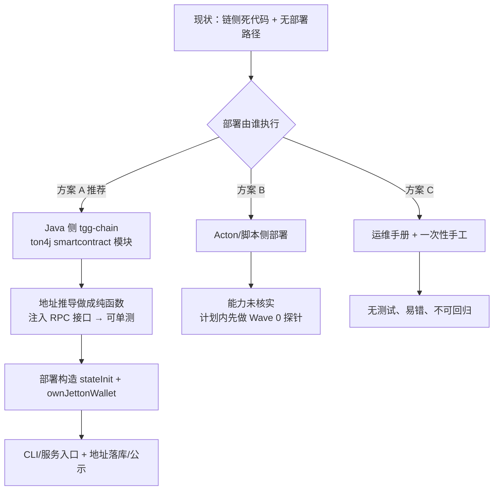

> **Model: deepseek-flash (cheap)**

> **Status: APPROVED** — 2026-09-27T07:36:38.256Z

# 部署流程从零建立：S5 合约上线路径 + jetton 钱包地址推导

## 需求提炼

**用户原话**：「继续开发」（承前：HANDOFF §十一 把「部署路径接线」列为下一步首位——
`ownJettonWallet` 目前只由测试写入，生产侧无写入方）。

**目标**：让 S5 托管合约具备**可执行的部署路径**——部署时把 `ownJettonWallet`（jetton 计价托管的
合规锚点）按 `(jetton master, 本合约地址)` 链下算好写入 storage，使 jetton 计价托管**可上线**。

**非目标（本计划明确不做）**：合约安全审计；主网真金部署；争议/仲裁（待 C1）；Java 侧 Wave 2/4；
`.rivet/backups/` 清理（破坏性操作，需另行确认）。

## 现状（每条带锚点与核验状态）

| 事实 | 证据（锚点） | 核验 |
|---|---|---|
| 链侧**无任何生产实现** | `implements ChainSource` 全仓零匹配；测试里 3 处匿名实现 | ✅ 我本人 grep |
| `ChainSource` 只读（`name()`/`observeBalance()`），**无部署能力** | `tgg-chain/.../ChainSource.java:43/47/55` | ✅ 我本人读 |
| tgg-chain **被依赖但不被调用**（死代码） | `tgg-app` 零 import `com.tg.escrow.chain` | 🟡 scout，**已抽查**（我 grep 到 0 处实现，未逐文件核 import） |
| **无部署脚本**（Tolk 侧无 scripts/，全仓 .sh/.ts 与合约无关） | glob `**/*.{sh,ts,js,mjs}` 仅 1 个 CI 钩子 | 🟡 scout |
| 部署消息构造**已存在**但在 wrapper 里、仅测试用 | `wrappers/EscrowContract.gen.tolk:34/44`（`fromStorage`/`deploy`） | ✅ 我本人读 |
| **Java 配置零链上字段** | `tgg-app/src/main/resources/*.yml` grep `address\|chain\|ton\|jetton\|contract\|master` = 零匹配；`BotWiring.java:104-472` 33 处 `@Value` 全为业务参数 | ✅ 我本人 grep（两处独立） |
| **SPEC 要求部署并公示地址** | `docs/requirements/SPEC.md` §8「**必须执行**：部署 Tolk 合约并公示地址」 | ✅ 我本人读 |
| 文档**引用不存在的类型** | `docs/ONLINE-VERIFICATION.md:39` 写 `HttpChainSource`，全仓零 `.java` 匹配 | ✅ 我本人 grep |
| 官方 Java SDK = `ton-blockchain/ton4j`（未归档，2.1.0，**GPL-3.0**） | GitHub API；`org.ton.ton4j:smartcontract:2.1.0` Maven Central 200（对照 junit/slf4j 均 200） | ✅ 我本人实测 |
| ton4j 有 `JettonMinter`/`JettonWallet` 类 | **外部仓库** `github.com/ton-blockchain/ton4j` 的文件 `smartcontract/jetton-example.md`（**非本项目路径**，本项目内不存在此文件） | 🟡 搜索来源，**未读原文** |
| 标准推导法 = master 的 `get_wallet_address(owner)` get-method | docs.ton.org（搜索摘要） | 🟡 搜索来源，**未读原文** |

## 方案（三选一）

- **方案 A（推荐）**：在 `tgg-chain` 用 ton4j `smartcontract` 模块实现**地址推导**与**部署构造**。
  关键设计：**推导逻辑做成纯函数，链上查询走注入的接口**——这样**不依赖真实网络即可单测**，
  与仓库既有 `BalanceCrossVerifier`（注入 `List<ChainSource>`）的风格一致。
- **方案 B**：用 Acton 自身部署——**可行性未核实**（计划模式下 bash 被禁，无法跑 `acton --help`）。
  若可行，优点是复用已生成的 wrapper；缺点是部署仍需 RPC + 私钥（最终仍要一个客户端）。
- **方案 C**：手工/运维手册——最省事但**无测试、不可回归**，与仓库"每个能力要能被验证"的基调冲突。

## 反证 / 复现

**计划期内我已复现（可复核）**：
1. `implements ChainSource|HttpChainSource` → **零匹配**（grep，全仓 `.java`）：既证明无生产实现，
   也证明 `ONLINE-VERIFICATION.md:39` 是**陈旧引用**（该文档项本身需要修）。
2. `tgg-app/src/main/resources/*.yml` 对 `address|chain|ton|jetton|contract|master` **零匹配**；
   `BotWiring` 的 33 处 `@Value` 逐一列出后无链上参数 → "配置侧零链上字段"成立。
3. `org.ton.ton4j:smartcontract:2.1.0` 返回 **200**，同轮对照 `junit`/`slf4j` 也 200 →
   证明可取；而聚合件 `org.ton.ton4j:ton4j` **404** → 只有模块件可取。

**计划期内无法复现、明确标为待验证假设（不当结论）**：
- **Acton 是否具备部署能力**：计划模式禁用 bash，`acton --help` 未跑 → Wave 0 首项补做。
- **ton4j 中 jetton 钱包地址推导的确切 API**（类/方法签名）：仅得自搜索摘要，未读其源码/示例原文。
- **部署地址的落库位置**：Java 侧是否已有可承载合约地址的实体字段/表列（含 Flyway 迁移）——未查。
- **jetton master 地址来源**（配置项 vs 硬编码；主网/测试网差异）——未定。
- **scout 的"tgg-chain 完全不被调用"**：我只核到"零实现"，未逐文件核 `tgg-app` 的 import。

## Wave 0：核验与决策（只读，产出一页结论，不改产品代码）

- [ ] 跑 `~/.acton/bin/acton --help` 与各子命令，判定**方案 B 是否可行**（记录原始输出）。
- [ ] 读 ton4j `smartcontract` 模块的源码/`jetton-example.md`，定位**地址推导的确切 API**（类+方法）。
- [ ] 查 Flyway 迁移与实体，确认**合约地址落库位置**是否存在承载点。
- [ ] 定 **jetton master 地址来源**（配置键名 + 主网/测试网取值）。
- [ ] 定案：A/B/C 选一（默认 A）。

**验证命令**：`grep -rn "create table" <迁移目录> | head`；`rg "JettonWallet|get_wallet_address" <ton4j 源码>`；
`~/.acton/bin/acton --help`。**准出**：五项各有结论或明确标注"未定 + 阻塞方"。

## Wave 1：地址推导纯函数 + 配置项（可离线单测）

- [ ] 新增配置：jetton master 地址、TON 端点（`tgg.chain.*`），带默认值与校验。
- [ ] 新增 `JettonWalletAddressResolver` 接口（输入：master + owner；输出：wallet 地址）+
      ton4j 实现 + **测试替身**。
- [ ] 单测：已知输入→已知地址的**定值断言**（用测试网真实数据对账）；异常路径（RPC 不可用、
      返回非法地址）**fail-closed**，不返回 0 或缓存。
- [ ] 在 `tgg-chain` 补 `ChainSource` 的**真实实现**（读能力），消除"只有抽象"的现状。

**验证**：`mvn -pl tgg-chain -am test`。**准出**：新单测全绿 + 既有 805 项无回归。

## Wave 2：部署构造 + 端到端验证

- [ ] 用推导结果组装部署消息（stateInit + `EscrowExtra.ownJettonWallet`），与 Tolk wrapper 的
      布局**逐字段对齐**（把 wrapper 当规格读）。
- [ ] 在本地网络（localnet/模拟网）跑一次**真实部署 + 入金**，断言合约内 `ownJettonWallet`
      与推导值一致。
- [ ] 反例：锚点未写入（零地址）时，jetton 入金必须**必然失败**（fail-closed），并补测试。

**验证**：`mvn -pl tgg-chain -am verify` + localnet 脚本输出。**准出**：端到端绿灯或明确标注未验证项。

## Wave 3：接线、公示与文档

- [ ] 部署入口（CLI/服务）落在 `tgg-app` 装配点（`BotWiring`/`BotRunner` 风格），失败即大声报错。
- [ ] 部署后地址的**记录与公示**（落实 SPEC §8「公示地址」）。
- [ ] 修掉 `ONLINE-VERIFICATION.md:39` 的 `HttpChainSource` 陈旧引用；更新 HANDOFF §十一。

**验证**：`mvn verify` 全绿 + 文档锚点复读。**准出**：SPEC §8 该项可勾选或标注阻塞。

## 风险与约束

1. **许可耦合（不可逆）**：ton4j 是 **GPL-3.0**，与仓库 AGPL-3.0 兼容，但**堵死**将来改宽松许可
   （B5/A0-6 的同一条约束链）。引它 = 同时把"衍生必须开源"钉死。
2. **部署需要真金与私钥**：Wave 2 之后的真实部署涉及 TON 费用与密钥管理，属运维决策，需你确认。
3. **未审计即上主网**：SPEC §B6 审计项未做；本计划只到"可部署 + 可验证"，**不主张主网可用**。
4. **网络依赖**：地址推导依赖 master 的 get-method，部署时须能访问节点；离线环境不可完成。
