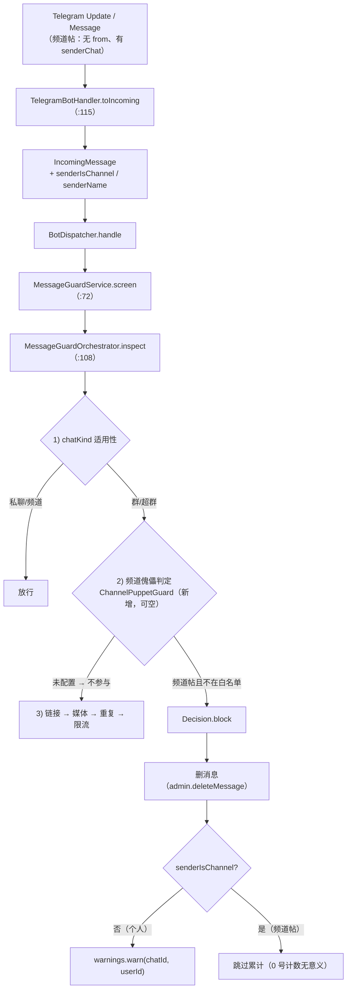

---

**执行状态：** 已闭环。Task 1-3 均已完成；验证通过；交付门检查：GREEN。
rivet-options: [{"label":"A：模型层承载 + 编排层判定（推荐）","description":"扩消息模型承载频道身份 + 判定进编排链 + 处置侧不累计个人警告；默认不启用，判定可穷举测试"},{"label":"B：只在胶水层就地判定","description":"在 TelegramBotHandler 里就地判定，不动模型——改动更小，但治理判定漏到胶水层、无法编排级穷举测试，且与既有「判定/处置分离」分层冲突"},{"label":"C：仅修异常，不接守卫","description":"只让频道帖不再抛异常，GM-12 守卫仍不接线——半个闭环"}]
---


> **Model: deepseek-flash (cheap)**

> **Status: APPROVED** — 2026-09-28T18:55:19.852Z

> **Status: EXECUTED** — 2026-09-28T19:01:40.455Z

# 频道傀儡防御接线（GM-12）——并修掉频道帖被整条跳过的前提缺口

## 需求提炼

**用户原话**：「继续推进开发」——延续既有路线：把"有实现类但零引用"的能力接上真实链路。

**目标**（两件，后一件是前一件的前提）：

1. 让 `ChannelPuppetGuard`（对应 GM-12）真正上场：群内以**频道身份**发的消息，不在白名单即删除；
2. 修掉它上场的前提缺口：当前消息模型**拒绝**承载"发送者是频道"，这类消息在入站转换阶段就抛异常，
   于是整条消息（内容安全判定与命令处理）**根本不被处理**。

**为什么是这一项**：`docs/CODE-VS-SPEC.md` §7「Wave 1.2 决策记录」对五个零引用类逐项给了结论，
其中**唯一判定为「接上」**的就是 `ChannelPuppetGuard`，且已写明前置条件——
"必须先补 fail-safe 默认"，修法与 `LinkFilter` 的「未配置 vs 配了但为空」同族。
其余四项（`AdminRegistry` / `FeatureToggle` / `JoinOnboarding` / `ReplayGuard`）明确不接，本单元不碰。

**非目标**：

- 不碰 §7 已定「不接」的四项；不改 `MemberRolePort` / `WarningOrchestrator` 的语义
- **不改变默认行为**：白名单**未配置 = 不启用**该防御（与 `tgg.guard.repeat.threshold: 0` 同惯例）
- 不新增第三方依赖、不新增表、不动合约、不做线上部署与真机核销

## 现状（实测，锚点已核对工作树）

| 事实 | 证据 |
|---|---|
| `ChannelPuppetGuard` 生产零引用 | `grep -rn "ChannelPuppetGuard" tgg-*/src/main` → 0（仅自己的测试引用） |
| 消息模型没有"发送者是否频道"这一维 | `tgg-core/.../core/IncomingMessage.java:52`（组件仅 chatId/userId/messageId/text/mediaKind/fileName/mimeType/chatKind） |
| `userId == 0` 被构造期拒绝 | `IncomingMessage.java:70-72` |
| **频道帖因此必抛** | `tgg-app/.../TelegramBotHandler.java:124`（`getFrom()==null → 0L`）→ `toIncoming:115` 抛 `TggException` → `consume:234` 整条消息不处理 |
| 判定链现状 | `MessageGuardOrchestrator.inspect:108`：chatKind 适用性 → 链接 → 媒体 → 重复 → 限流 |
| 装配惯例 | `BotWiring.java:412`（linkFilter bean）`:447`（orchestrator）`:459`（service）；配置在 `application.yml` 的 `tgg.guard.*`，默认关闭 |
| 外部 API 可用 | `Message.getSenderChat() → Chat`、`Chat.getTitle()/getUserName()`（`javap` 实测 telegrambots-meta 10.3.0） |

## 数据流



## 分波执行

### Wave 1 · core：消息模型 + 编排判定（TDD）

- [x] **RED**：新增 `IncomingMessageTest` 用例（频道帖可构造 / 个人消息缺 userId 仍拒 / 两者互斥校验）；
      在 `MessageGuardOrchestratorTest` 加频道判定用例（白名单命中→放行、未命中→拦、guard 为空→不参与）
      → 跑 `mvn -B -pl tgg-core -am test -Dtest='IncomingMessageTest,MessageGuardOrchestratorTest'`，
      **记录首次失败形态与退出码**
- [x] `IncomingMessage`：新增 `senderIsChannel`（boolean）与 `senderName`（可空）；
      校验改为「个人消息必须有 userId；频道消息须显式标注 provider 身份」——既非频道又无 userId 仍拒（fail-closed）
- [x] `MessageGuardOrchestrator`：新增可空依赖 `ChannelPuppetGuard`，作为**第 2 条判定**
      （chatKind 适用性之后、链接之前：身份伪造比内容可疑更根本）
- [x] 便捷构造 `text(...)` 与 7 参构造保持默认"个人消息"语义，使既有调用点零改动

**验证要点**：`mvn -B -pl tgg-core -am test` 全绿；`MessageGuardOrchestratorTest` 用例数只增不减

### Wave 2 · app：适配器 + 处置 + 装配（TDD）

- [x] **RED**：`TelegramBotHandlerTest` 加频道帖用例（构造带 `senderChat`、无 `from` 的 `Message` →
      `toIncoming` **不再抛**且 `senderIsChannel=true`、`senderName` 取自 `getTitle()`）；
      `MessageGuardServiceTest` 加频道帖用例（删消息但**不**累计警告）
- [x] `TelegramBotHandler.toIncoming`：读 `message.getSenderChat()` 填充两个新字段；
      `consume` 侧对频道帖的 actor 构造（无个人发送者时不伪造 userId）
- [x] `MessageGuardService.screen`：频道傀儡命中时**删消息但不 `warn(chatId, 0)`**（理由写进注释）
- [x] 装配：新增配置键 `tgg.guard.allowed-channels`（env `TGG_GUARD_ALLOWED_CHANNELS`）——
      **未配置 = 不启用**（bean 返回 null 或空 Optional）；**配了但为空串 = 全拦**（与 `LinkFilter` 修法同族）；
      `BotWiring` 接线并把可空 guard 注入 orchestrator

**验证要点**：`mvn -B -pl tgg-app -am test -Dtest='TelegramBotHandlerTest,MessageGuardServiceTest,BotDispatcherTest'` 全绿

### Wave 3 · 文档收口 + 全量回归

- [x] `docs/CODE-VS-SPEC.md`：GM-12 判定更新（C→A 或按实测描述）+ §2.3/§4 计数重算（区域限定 awk）+ §2.5 清单更新
- [x] `docs/ONLINE-VERIFICATION.md`：新增真机核销项（频道帖被删 / 未配置时行为不变）
- [x] `README.md`：配置面补 `TGG_GUARD_ALLOWED_CHANNELS`
- [x] 全量 `mvn -B verify`：**用例数 ≥ 900 + 4 IT**、0 failure

**验证要点**：全量绿 + 文档三处与实测一致

## 反证 / 复现

| 断言 | 复现命令 | 期望 |
|---|---|---|
| 频道帖**当前必抛**（本单元要修的缺口） | 新增用例：`Message` 带 `senderChat`、无 `from` → 调 `toIncoming` | **RED**：抛 `TggException`（"发送者未提供"）——修好后转 GREEN |
| `ChannelPuppetGuard` 生产零引用 | `grep -rn "ChannelPuppetGuard" --include=*.java tgg-*/src/main \| wc -l` | 0 |
| 未配置白名单**不改变行为** | 不配 `tgg.guard.allowed-channels` 跑全量 | 现有 guard 用例全绿；用例数只增不减 |
| 频道帖修好后**仍不放行傀儡** | 新用例：频道帖 + 白名单不含该频道名 → blocked；白名单含（含 `@` 前缀/大小写差异）→ allow | 绿（`ChannelPuppetGuard` 的 7 条既有用例已钉住匹配容错） |

## 风险与规避

- **误删正当频道帖**（群内以频道身份发帖正当且常见）：由「未配置 = 不启用」兜住——默认零行为变化；
  白名单语义必须区分「未配置」与「配了但为空」（前者不装守卫、后者全拦），与 `LinkFilter` 曾经的误删修法同族。
- **签名变更波及构造点**：`new IncomingMessage(` 实测 6 处（1 生产 + 5 测试）→ 用 `mvn -B test-compile` 让编译器点名逐个同步，
  不用"默认值重载"省事（那会让"忘传频道身份"静默退化成"个人消息"）。
- **警告计数污染**：频道帖没有个人发送者，`warn(chatId, 0)` 会让 0 号背上警告 → 频道帖跳过累计。
- **判定顺序**：放在链接之前（身份伪造优先）——若认为"内容优先"更合适，此处可调，但不影响其余设计。

**验收证据**（每波逐条核销）：TDD（RED→GREEN）→ 全量 `mvn -B verify` 用例数不回退（基线 900 + 4 IT）→ scoped 提交 → push。

## 7. Execution closure

已闭环：Task 1-3 均已完成并通过验证。

最终验证记录：

```bash
TELEGRAM_BOT_TOKEN=123456:dummy-for-it mvn -B verify → BUILD SUCCESS，916 用例 + 4 IT，0 failure
mvn -B -pl tgg-core -am test → 284 用例全绿
mvn -B -pl tgg-app -am test -Dtest=TelegramBotHandlerTest,MessageGuardServiceTest,BotDispatcherTest → 41/41 绿
回滚验证：toIncoming 传旧身份值 → TelegramBotHandlerTest.channelPostIsMappedInsteadOfThrowing 复现 TggException（缺口的红线）
```

交付门检查：GREEN。

备注：三波全部完成并推送（提交 4fb4f8a）。发现并修掉了计划外的一处前提缺口：频道帖（无 from、有 senderChat）此前在 IncomingMessage 构造期抛异常 → 整条消息从未进入判定；回滚验证确认该缺口可复现（旧行为下新用例红在 TggException「发送者未提供」）。另增补两条计划外防护：频道帖不路由业务命令（避免 0 号用户执行下单）、处置时不累计个人警告。
