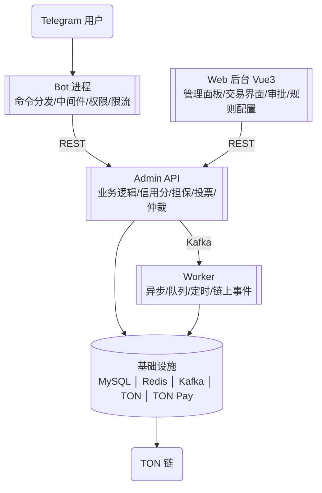

# Telegram 群管理 + 担保交易系统 — 需求规格（合并优化版）

> ⚠️ **第 4 节各表的状态标注（✅/⬜）已于 2026-09-25 判定为不可采信**，原因有二：① 当时即漏标
> （如 ET-33/ET-34 标 ⬜ 而代码早已落地 `AmountTierPolicy`/`RiskPrompt`/`PendingTradeRegistry`）；
> ② "有类即 ✅" 的口径把**零引用孤儿也记成完成**（如 `SilenceWindow` 当时无任何生产调用点）。
> **落地情况以 [`docs/CODE-VS-SPEC.md`](../CODE-VS-SPEC.md)（实测重建版）为准**——该文档按
> "是否接线、用户能否用到"重新判定，并逐项给出实测证据与证据级别。

> **本文档是唯一权威需求规格**。它合并了用户先后提交的 14 份材料（V2.0 / TON Connect / TON Pay+Tolk /
> x402+ENACT / Fragment+Permit / 架构工程 / V3.0 / 冲突审查 / 风险提示 / 交互细节 / 生态对齐 /
> 通知优化 / 信用排名 / V6.0），并**应用了逐份独立核验的全部发现与优化建议**。
> 分份明细保留在 `docs/requirements/01`–`14`（作为溯源），**冲突时以本文档为准**。
>
> 编制日期：2026-09-24　基线：`mvn test` **314 项全绿**（代码侧，见第 12 节）
> 　　⚠️ 基线已过时：2026-09-25 实测为 `mvn verify` **805 用例 + 4 个 IT 全绿**，HEAD `14bbf6d`。

---

## 0. 阅读须知

### 0.1 编号约定（本次优化的重要决定）
编号在历史材料中**变更过三次**：V2.0 `G/T` → V3.0 重排 `T` → **V6.0 换为 `GM/ET`**。
**本文档冻结采用 V6.0 的 `GM-xx / ET-xx` 体系**（理由：有模块前缀、分区清晰、最易检索），此后不再变更。
既有代码注释保留旧编号，通过**附录 A 的映射表**桥接。**引用编号一律以本文档为准。**

### 0.2 本文档相对原始材料的优化（即"深度优化"清单）
| # | 优化 | 说明 |
|---|---|---|
| 1 | **编号冻结** | 三次变更导致代码/文档引用全面失准；冻结于 `GM/ET` |
| 2 | **去重** | ET-63（与 ET-60 完全重复）删除；ET-74（与 GM-13 重复）合并；ET-72 与 ET-75 归一为一处定义 |
| 3 | **补漏** | Ephemeral Messages 原文无编号 → 补为 **GM-36**（见 4.3） |
| 4 | **事实修正** | Spring Boot 锁定 **3.5.16**（非"3.2+"，理由见 2.1）；Tolk 是**从零编写**（非"迁移"）；TON Pay 接入**前置依赖 Web 层** |
| 5 | **冲突消解** | 第 6 节把历史"冲突报告"的结论固化为**设计约束**（而非并列两个说法） |
| 6 | **设计补强** | 补入核验发现的安全约束：哈希加盐、不制造无限授权面、状态优先级不变量、三通知维度分离 |
| 7 | **现状标注** | 每项功能标注 ✅已落地 / ⬜未做（对照真实代码，见第 12 节） |
| 8 | **待决集中** | 第 11 节集中列出需拍板事项，避免散落 |

---

## 1. 项目定位与边界

| 项 | 内容 |
|---|---|
| 定位 | **开源项目**；开发者只提供代码/文档/许可证/免责声明，**不参与运营** |
| 运营者 | 自行申请牌照、合规运营、数据处理、税务 |
| 唯一链 | **TON**（独家条款） |
| 许可证 | **AGPL 3.0**（强制派生作品开源） |
| 核心能力 | 群管理（基础） + 担保交易（群成员自由交易） |
| 规模 | **115 项**（群管理 35 + 担保交易 80） |

**明确的非目标**（历史决策，保持不变）：不做多链；不做 Web 交易界面以外的运营工具；
开发者不持有密钥、不接触生产环境、不决定商业参数。

### 1.1 核心原则（经核验修正后）
只做两件事（群管理 + 担保交易）｜只采用 TON｜开发者不参与运营｜**合约中无开发者提款函数**｜
**签名在用户设备、服务器不碰私钥**｜免保证金｜单笔限制（同一买方同时最多 1 笔进行中）｜
群成员投票（信用良好者参与、排除利益关联）｜仲裁员质押（投错没收）｜人性化保障｜防黑产。

> **修正说明**：原材料的「签名在用户设备」曾被理解为与"官方钱包托管"冲突（见 `02` 与待决 F）。
> 经核验，Telegram 现行默认钱包 **Gram 是自托管**（原「Wallet in Telegram」更名 **Walt** 才是更广平台），
> **该张力不成立**。但若引入 Walt（交易/衍生品）作高级选项，需重新评估。

---

## 2. 技术栈与决策记录

### 2.1 技术栈（含事实修正）
| 组件 | 选型 | 修正/说明 |
|---|---|---|
| 语言 | Java 21 LTS | — |
| 框架 | **Spring Boot 3.5.16（刻意锁定，勿升 4.x）** | ⚠️ **修正**：原文写"3.2+"。真实原因：Boot 4.x 用 Jackson 3，与 TelegramBots 10.x 的 Jackson 2 注解不兼容，症状是 Update 反序列化**静默失败**、handler 永不执行 |
| Bot 框架 | TelegramBots | — |
| 数据库 | MySQL 8.0 | 迁移由 Flyway 管理（可移植 DDL） |
| 缓存 | Redis 7.0 | 黑名单/交易状态/投票 |
| 队列 | Kafka（可选） | 五进程间异步 |
| 区块链 | TON（ton4j + TON Connect 2.0） | — |
| 支付 SDK | TON Pay（可选） | ⚠️ 接入**前置需 Web/HTTP 端点**（项目当前无 Web 层） |
| 合约语言 | **Tolk** | ⚠️ 措辞修正：FunC 已停止维护，本项目**从零用 Tolk 写**（无 FunC 合约可"迁移"） |
| 限流 | Resilience4j | — |
| 监控 | Prometheus + Grafana | — |
| 部署 | Docker + Docker Compose | — |

### 2.2 决策记录（采纳 V6.0 的 ADR 形式，建议落成 `docs/adr/`）
| 决策 | 理由 | 放弃的方案 |
|---|---|---|
| Tolk 替代 FunC | FunC 编译器已停止维护；Tolk Gas 降低 30–50%、强类型消除 `impure` 陷阱 | Solidity（不适用 TON）、FunC（不再维护） |
| TON Pay 可选 | 运营者自选，不强制 | 强制集成（限制灵活性）、完全不集成 |
| 五进程架构 | 各模块独立扩展，Bot 响应不受 Worker 影响 | 单体、三进程 |
| 自研 Tolk 合约 | 免保证金 + 单笔限制 + 群成员投票是独特需求 | 现成模板（不满足） |
| TON 唯一链 | 完全合规（独家条款） | 多链 |
| AGPL 3.0 | 强制运营者回馈社区 | MIT/Apache（允许闭源商用） |
| **（新增建议）哈希加盐** | 防预映像/字典反推（见 6.2） | 无盐哈希 |
| **（新增建议）不制造无限授权面** | 从源头消除 Permit 类钓鱼（见 6.3） | 仅事后教育用户 |

---

## 3. 架构

### 3.1 五进程架构

进程间通信：Bot↔Admin API 用 **REST**；Admin API↔Worker 用 **Kafka**；Web↔Admin API 用 **REST**。

### 3.2 结构性缺口（先于功能，否则功能无处安放）
| # | 缺口 | 说明 |
|---|---|---|
| S1 | **零用户可见表面** | 无 `SpringLongPollingBot` 接线。**需 Bot Token** |
| S2 | 命令层接线 | ✅ 已落地（`TradeCommandHandler`） |
| S3 | Bot 内 6 项入口 | 依赖 S1 |
| S4 | 真实链上源 | 需先核实 TON 确认数语义 |
| S5 | TON 托管合约 | Tolk 从零写；验收含 Gas 报告 + 乱序不越级 |
| S6 | **Web / Admin 层缺失** | 多条需求（TON Pay webhook、违禁词在线管理、五进程、Mini App）都卡在此。**建议显式立项** |

---

## 4. 功能规格（状态：✅已落地 / ⬜未做）

### 4.1 群管理 · 用户管理
| 编号 | 功能 | 优先级 | 状态 |
|---|---|---|---|
| GM-01 | 踢出/封禁/解封 | P0 | ⬜ |
| GM-02 | 禁言/解除禁言（定时） | P0 | ⬜ |
| GM-03 | 警告/清除警告（累计） | P0 | ⬜ |
| GM-04 | 群主自主封禁（独立 API） | P0 | ⬜ |
| GM-05 | 管理员配置（添加/移除） | P0 | ✅ |

### 4.2 群管理 · 内容安全
| 编号 | 功能 | 优先级 | 状态 |
|---|---|---|---|
| GM-06 | 违禁词过滤 | P0 | ✅（逐词 contains；**非** Trie；可加在线管理） |
| GM-07 | 反刷屏（Redis 滑动窗口） | P0 | ⬜ |
| GM-08 | 相同消息 3 次判定 | P0 | ✅ |
| GM-09 | 消息自动删除 | P0 | ⬜ |
| GM-10 | 链接过滤（白名单+短链） | P1 | ✅ |
| GM-11 | 媒体过滤（类型白名单） | P1 | ✅ |
| GM-12 | 频道傀儡攻击防御 | P0 | ⬜ |
| GM-13 | 定期防钓鱼推送 | P1 | ⬜（与 ET-74 合并为一处定义） |

### 4.3 群管理 · 自动化
| 编号 | 功能 | 优先级 | 状态 |
|---|---|---|---|
| GM-14 | 欢迎新成员（模板+变量） | P0 | ✅ |
| GM-15 | 入群验证（策略化 + 60s 超时踢出） | P0 | ✅（状态机已落地；Mini App 交互依赖 S1） |
| GM-16 | 频道订阅前置验证 | P1 | ⬜ |
| GM-17 | 定时任务 + 自动回复 | P1 | ⬜ |
| GM-18 | 静默模式（时段配置） | P2 | ✅ |
| **GM-36** | **Ephemeral Messages（仅单人可见的隐私通知）** | P1 | ⬜ |

> **GM-36 为本次补入**：原材料在"规则/交互"两处提到 Ephemeral Messages（用于维护期倒计时等隐私通知），
> 但**模块清单里没有编号**——不编号就会在实现时漏掉。经核验该能力真实
> （Telegram Bot API 10.2/10.3，群里可发仅单个成员可见的消息）。**注意与"静默发送"区分**：
> 临时=仅单人可见；静默=可见但不响铃。

### 4.4 群管理 · 群组配置
| 编号 | 功能 | 优先级 | 状态 |
|---|---|---|---|
| GM-19 | 功能开关（按群组） | P0 | ✅ |
| GM-20 | 日志频道（操作推送） | P1 | ⬜ |
| GM-21 | 群组信息同步（定期） | P1 | ⬜ |

### 4.5 群管理 · 防黑产
| 编号 | 功能 | 优先级 | 状态 |
|---|---|---|---|
| GM-22 | 滑动窗口检测（1 分钟 >10 人触发） | P0 | ✅ |
| GM-23 | 保护模式（暂时拒绝新申请） | P0 | ✅ |
| GM-24 | 风险评分（语言/头像/username/账号新旧） | P0 | ✅ |
| GM-25 | 高分拒绝 | P0 | ✅ |
| GM-26 | 第二渠道验证 | P1 | ⬜ |
| GM-27 | 账号异常检测（需人工复核） | P1 | ⬜ |
| GM-28 | Bot 防拉群机制 | P0 | ⬜ |

### 4.6 群管理 · 合规与安全
| 编号 | 功能 | 优先级 | 状态 |
|---|---|---|---|
| GM-29 | 年龄确认（COPPA） | P0 | ⬜ |
| GM-30 | 未成年人保护 | P0 | ⬜ |
| GM-31 | 权限系统（角色+校验） | P0 | ✅ |
| GM-32 | 三级限流（用户/群组/全局） | P0 | ✅ |
| GM-33 | 日志脱敏（Token + 用户 ID） | P0 | ✅（**但哈希无盐且仅 24 bit，见 6.2**） |
| GM-34 | 数据备份（MySQL + Redis） | P0 | ⬜ |
| GM-35 | 用户首次使用引导 | P0 | ⬜ |

### 4.7 担保交易 · Bot 内入口
| 编号 | 功能 | 优先级 | 状态 |
|---|---|---|---|
| ET-01 | 交易入口 | P1 | ✅（命令层已落地；Bot 接线待 S1） |
| ET-02 | 交易状态查询 | P1 | ✅ |
| ET-03 | 信用分联动 | P0 | ⬜ |
| ET-04 | 与群管理联动（欺诈触发封禁） | P0 | ⬜ |
| ET-05 | 交易群创建引导 | P0 | ⬜ |
| ET-06 | 交易群机器人公告 | P0 | ⬜ |

### 4.8 担保交易 · Web 平台
| 编号 | 功能 | 优先级 | 状态 |
|---|---|---|---|
| ET-07 | Web 交易界面 | P1 | ⬜ |
| ET-08 | Telegram OAuth（ton_proof） | P1 | ⬜ |
| ET-09 | TON USDT 支付 | P1 | ⬜ |
| ET-10 | TON 合约托管（Tolk） | P1 | ⬜ |
| ET-11 | 资金冻结/释放/退款 | P1 | ⬜ |
| ET-12 | 交易状态机 | P1 | ✅（8 态 + fail-closed 守卫） |
| ET-13 | 超时自动处理 | P1 | ✅ |
| ET-14 | 争议发起与冻结 | P1 | ✅ |
| ET-15 | 多签仲裁（2/3，必含联邦） | P1 | ✅（规则已落地；**语义注意见 6.4**） |
| ET-16 | 多签规则校验 | P1 | ✅ |
| ET-17 | 证据提交（IPFS） | P1 | ⬜ |
| ET-18 | 交易评价（双方互评） | P1 | ✅ |
| ET-19 | 链上事件监听 | P1 | ⬜ |
| ET-20 | 合约审计（第三方） | P0 | ⬜ |
| ET-21 | 时间锁 + 紧急暂停 | P0 | ⬜ |
| ET-22 | KYC 最小化 + 加密 | P0 | ⬜（**待决 B4**） |
| ET-23 | 单笔限制 | P0 | ✅ |
| ET-24 | 单笔冷却期（24h） | P0 | ✅ |
| ET-25 | 争议期间冻结 | P0 | ✅ |
| ET-26 | 维护时间选择（5 选项） | P0 | ✅ |
| ET-27 | 超时自动确认 | P0 | ✅ |
| ET-28 | 维护期争议暂停 | P0 | ✅ |
| ET-29 | 平台费自动划转 | P0 | ⬜（**待决 B1**） |
| ET-30 | 联邦管理员费用划转 | P0 | ⬜（**待决 B1**） |
| ET-31 | TON Pay 集成（可选） | P1 | ⬜（需先有 Web 层） |
| ET-32 | TON Pay Webhook 验证 | P1 | ⬜ |
| ET-33 | 交易金额分层验证 | P1 | ⬜ |
| ET-34 | 交易前风险提示 | P0 | ⬜ |
| ET-35 | 首单保障 | P1 | ⬜（**待决 B2**） |
| ET-36 | 主动推送 | P0 | ⬜ |
| ET-37 | 交易信用可视化 | P1 | ⬜ |
| ET-38 | 交易信用冷启动（新手标识） | P1 | ⬜ |

### 4.9 群聊留痕与投票
| 编号 | 功能 | 优先级 | 状态 |
|---|---|---|---|
| ET-39 | 交易群生命周期（7 天归档） | P0 | ⬜ |
| ET-40 | 交易群静默期 | P0 | ⬜ |
| ET-41 | 群成员投票 | P1 | ⬜ |
| ET-42 | 投票人回避机制 | P0 | ⬜ |
| ET-43 | 争议证据双通道保存 | P0 | ⬜ |
| ET-44 | 投票奖励分配 | P1 | ⬜ |
| ET-45 | 证据时效性（24h） | P0 | ⬜ |
| ET-46 | 仲裁员加入费动态门槛 | P1 | ⬜ |
| ET-47 | 投票截止后 FallbackSettle 兜底 | P1 | ⬜ |

### 4.10 安全增强
| 编号 | 功能 | 优先级 | 状态 |
|---|---|---|---|
| ET-48 | 重放保护（seqno/nonce） | P0 | ⬜ |
| ET-49 | 交易阶段标注 | P1 | ✅ |
| ET-50 | Fake Jetton 验证 | P0 | ⬜ |
| ET-51 | 链上存证 | P0 | ⬜ |
| ET-52 | x402 Proof Hash | P0 | ⬜（**概念可用，不要接 x402 协议**，见 6.5） |
| ET-53 | 交付证明上链 | P0 | ⬜（与 ET-51 归并） |
| ET-54 | 防钓鱼提示 | P1 | ⬜（须含 Permit 类，见 ET-55） |
| ET-55 | Permit Signature 钓鱼防御 | P1 | ⬜ |
| ET-56 | 代理合约可升级性 | P2 | ⬜（默认关闭，**待决 C2**） |
| ET-57 | 预映像攻击防护（哈希前加盐） | P0 | ⬜（**建议同时修 GM-33**，见 6.2） |
| ET-58 | TON 异步消息顺序处理 | P0 | ⬜（Java 侧已有守卫，合约侧待做） |
| ET-59 | 资金流向链上验证 | P0 | ⬜ |

### 4.11 人性化保障
| 编号 | 功能 | 优先级 | 状态 |
|---|---|---|---|
| ET-60 | 争议双方陈述 | P0 | ⬜ |
| ET-61 | 多维度惩罚 | P0 | ⬜ |
| ET-62 | 社区氛围建设（周榜/月报） | P2 | ⬜ |
| ~~ET-63~~ | ~~争议双方陈述~~ | — | **删除（与 ET-60 完全重复）** |

### 4.12 防黑产作弊
| 编号 | 功能 | 优先级 | 状态 |
|---|---|---|---|
| ET-64 | 设备关联检测 | P0 | ⬜ |
| ET-65 | 互刷模式检测 | P0 | ⬜ |
| ET-66 | 新账号交易限制 | P0 | ⬜ |
| ET-67 | 互刷不累加信用 | P0 | ⬜ |
| ET-68 | 可疑交易关系标记 | P0 | ⬜ |
| ET-69 | Comment 钓鱼提示 | P0 | ⬜ |
| ET-70 | 官方不通过 comment 发奖励 | P0 | ⬜ |
| ET-71 | Permit Signature 警示 | P1 | ⬜ |
| ET-72 | 交易对手多样性评分 | P1 | ⬜（**与评分维度 ET-75 归为一处定义**） |
| ET-73 | 账号异常检测 | P1 | ⬜ |
| ~~ET-74~~ | ~~定期防钓鱼推送~~ | — | **合并至 GM-13** |

### 4.13 排名机制
| 编号 | 功能 | 优先级 | 状态 |
|---|---|---|---|
| ET-75 | 交易信用综合评分 | P1 | ⬜（**待决 B3**；模型见 7.2） |
| ET-76 | 交易者等级评定 | P1 | ⬜ |
| ET-77 | 周榜推送 | P1 | ⬜ |
| ET-78 | 月榜推送 | P1 | ⬜ |
| ET-79 | 季度荣誉榜 | P2 | ⬜ |
| ET-80 | 排名隐私控制 | P0 | ⬜ |

---

## 5. 核心规则（冲突消解后的**单一**表述）

| 规则 | 消解后的定义 |
|---|---|
| 免保证金 | 交易无需保证金。**仲裁费/押金另行定义，不得与之混淆**（见下） |
| 单笔限制 | 同一买方同时最多 1 笔进行中交易 |
| 单笔冷却期 | 完成后 24h 内不能发起新交易 |
| 争议期间冻结 | 争议解决前不能发起新交易（**优先级高于冷却期**） |
| 自由交易 | 买卖双方自由选择对象 |
| TON 托管 | 资金由 TON 合约托管，**每笔交易独立地址** |
| 群聊留痕 | 建群拉机器人+双方，机器人记录所有消息（**依赖隐私模式已关闭**） |
| 群聊归档 | 完成 7 天后归档；**服务端记录不随群删除**（争议可追溯） |
| 静默期 | 完成 7 天静默，争议则终止 |
| 群成员投票 | 信用良好者参与；**投票资格分层**（见 6.1） |
| 投票人回避 | 排除与买卖双方近期有交易者 |
| 仲裁员质押 | 投票人质押 1–5 USDT，投错没收 |
| 没收资金分层 | 补偿被挑战方 → 奖励投对者 → 划入仲裁基金 |
| 证据双通道 | 机器人实时记录 + 关键节点上链存证（**互补，不重复**） |
| 证据时效 | 争议发起后 24h 内提交；**该窗口不随维护期暂停** |
| 维护时间选择 | 买家 5 选项，默认 7 天 |
| 超时自动确认 | 买家 N 天未确认 → 自动进入维护期 |
| 维护期争议暂停 | 争议后倒计时暂停；**争议解决后按裁决恢复或执行** |
| **状态优先级（新增，不变量）** | **争议 > 维护期 > 超时自动确认**——争议期间一切倒计时暂停 |
| 平台费 / 仲裁费**分离**（消解 1.6） | 平台费可配置（默认 0%）；**仲裁费独立存在**，从败诉方押金扣；联邦管理员从**仲裁费**取管理费。**对外文案须写清"平台费≠仲裁费"** |
| 免保证金 vs 仲裁费兜底（消解 1.1） | 兜底顺序：①锁定资金 → ②信用分 → ③限制交易权限 → ④联邦基金垫付。**删除"从保证金扣除"环节**（术语统一：押金≠保证金≠仲裁费） |
| 单笔限制 vs 交易群生命周期（消解 1.2） | **交易群与交易 ID 绑定**；每笔新交易新建群，不复用 |
| 投票人回避 vs 信用冷启动（消解 1.3） | 投票资格分层（见 6.1）+ 观察员角色；**前 3 笔即便同一对手也计信用**，第 4 笔起互刷检测生效 |
| 频道订阅前置 vs 频道傀儡防御（消解 1.5） | 订阅验证**只允许白名单频道**，白名单须通过傀儡防御校验 |
| Gas 费承担（消解待决） | **平台费中预留 Gas 费池**；争议 Gas 不足时按兜底顺序 |
| FallbackSettle | 投票截止未达阈值 → 自动兜底裁决 |
| 重放保护 | 每签名请求绑定唯一 seqno/nonce |
| Fake Jetton 验证 | 预计算并硬编码可信地址；**校验 jetton 发送者合约地址**，不信任 `JettonNotify` 声称 |
| 预映像防护 | **哈希前加盐**（链上 proofHash 与日志脱敏均适用） |
| TON 异步顺序 | 每个状态转换有明确前置条件；**乱序到达不得越级迁移** |

---

## 6. 安全设计（含核验补强）

### 6.1 投票资格分层（消解 1.3，与排名 ET-75 归一）
核心投票人（≥20 笔）权重 3 ｜ 资深投票人（≥10 笔）权重 2 ｜ 普通投票人（≥5 笔）权重 1 ｜
**观察员**（≥1 笔）可讨论、无投票权。**投票人数不足时移交联邦仲裁员**。
> 该分层与排名机制的"钻石 3 / 金牌 2 / 银牌 1"取值一致——**只在一处定义**。

### 6.2 哈希必须加盐（核验实测：项目当前**未加盐**）
`LogSanitizer.maskUserId` 现状为**无盐 SHA-256 且仅保留 24 bit**（已读源码确认）：
- 无盐 → 同一 ID 在任何部署中哈希相同，可**预计算字典**反推；
- 仅 24 bit → 空间 1.7 千万，易枚举且**大用户量下会碰撞**（不同用户显示同一标识）。
**要求**：GM-33 与 ET-57 一并实施——**加部署级盐值（配置项、走环境变量）+ 加长输出（如 48 bit）**；
链上 proofHash 同样加盐（否则"交付凭证"若为常见短语即可被反推）。

### 6.3 **不制造无限授权面**（源自 Permit 钓鱼的根因）
Permit 类钓鱼之所以能成，是因为存在"预先授权、后续免批准"的原语。**本项目合约不应提供**无限额度/
长期授权接口；任何 approve 类操作默认最小额度、默认不启用，且必须让用户看到额度与用途。
——这比事后教育用户"别点无限授权"更根本。

### 6.4 多签语义的真实含义（待决 C1）
ET-15「2/3 必含联邦 + 双方签字无效」的实际后果：有效组合只剩 `{联邦+买方}`/`{联邦+卖方}`/`{三方}`，
**联邦是唯一必备签名方**——即"多签"实质是**联邦一人裁决**，不提供对联邦的制衡。
**采用前应知晓此语义**；若需制衡，须另设机制。

### 6.5 不引入的第三方（核验结论）
- **x402 协议本身**：定位为 AI agent 的 HTTP-402 支付，与"人-人担保交易"场景不符。
  仅借用其**概念**——"买家确认收货时提交可验证的交付凭证哈希"（即 ET-52/53），**命名为 `deliveryProofHash`，勿绑 x402 字样**。
- **要求交出钱包助记词的第三方 SDK**（如市面 Fragment SDK）：与"服务器不碰私钥"直接冲突，**禁用**。
  若需 Stars 能力，走 Telegram 官方 Bot API 的 Stars 支付。
- **Agentic Wallets**（免逐笔授权）：与"用户逐笔确认"的信任模型冲突，**暂不引入**（见待决 M）。

### 6.6 三个通知维度必须分清（易混淆）
| 维度 | 机制 | 用于 |
|---|---|---|
| **可见范围** | 永久消息 / **Ephemeral**（仅单人可见，GM-36） | 关键节点用永久；隐私提示用临时 |
| **是否推送** | `disable_notification`（静默） | 中间进度静默，最终响应推送 |
| **是否留存** | 群内记录 / 链上存证 | 证据保全用永久+上链 |

> 三者**互相独立**：静默 ≠ 临时（静默消息仍可见、仍留存）。

---

## 7. 用户体验原则（贯穿全部模块）

按钮优先｜按钮颜色语义化（**但文字必须自带语义——颜色在新客户端才显示，且色盲用户无法区分**）｜
**点击后立即 `answerCallbackQuery`（S1 硬不变量，否则按钮永久转圈）**｜按钮一次性使用｜
同一流程用**原地编辑**替代发新消息（⚠️ 需持久化 `messageId`，见 9.2）｜通知合并摘要｜
严格遵守免打扰设置｜关键节点主动推送｜错误恢复一键重试（保留已填信息）｜始终提供返回/取消｜
说人话（不用术语）｜Mini App 主题同步（`themeParams.bindCssVars()`）｜返回按钮映射（`BackButton`）。

### 7.1 信用评分模型（ET-75，**待决 B3** 的候选）
综合评分 = 完成数 30% + 争议率（反向）25% + 好评率 20% + 对手多样性 15% + 活跃时长 10%。
等级：💎钻石（≥90 且 ≥50 笔）/ 🥇金牌（≥80 且 ≥20）/ 🥈银牌（≥70 且 ≥10）/ 🥉铜牌（≥60 且 ≥5）/ 🌱新手（<5 笔）。
**须先澄清 5 点**（见 11.B3）：① 等级条件冲突（"评分 90 但 4 笔"算哪个）；② 隐私与交易可见性边界；
③ 周榜推送不得绕过通知模式；④ **排名范围：群内榜还是跨群全局榜**；⑤ 活跃时长基准与"长期稳定"量化。

---

## 8. 部署指引（最小可行）

**必须配置**：Bot Token（BotFather）｜MySQL 8.0｜Redis 7.0｜TON 节点｜Webhook Secret（随机生成）｜
⚠️ **在 BotFather 中关闭隐私模式，然后移除并重新添加 Bot 到群组**——否则 Bot **看不到群内消息**，
「群聊留痕」（ET-39/ET-43）会**静默失效**（Bot 不报错、只是收不到）。**建议 Bot 启动时自检并告警**。

**必须执行**：部署 Tolk 合约并公示地址｜`setWebhook`（含 `secret_token`）｜执行 DDL + 初始化数据｜配置 Gas 费池。

**可选增强**：TON Pay（需先有 Web 层）｜Prometheus + Grafana｜Fragment API（⚠️ 见 6.5，不采用需助记词的 SDK）｜代理合约（默认关闭）。

---

## 9. 测试与验收

### 9.1 测试计划（采纳 V6.0，并补关键项）
原子性（成功/失败/退款/未授权提取）｜单方不履约｜**消息顺序不可预测**（乱序不越级）｜
**Gas 费不足**｜频道傀儡攻击｜**预映像攻击**（加盐后不可反推）｜FallbackSettle｜排名刷分｜
**隐私模式**（关闭后 Bot 能收到所有消息）｜**哈希加盐**（字典攻击不成立）｜
**DISPUTED 永不超时**（已落地测试 ✅）。

### 9.2 因交互需求衍生的**持久化需求**（易漏，单列）
| 需求 | 需要的存储 |
|---|---|
| 原地编辑消息（第 7 节） | `(orderId → chatId, messageId)` 映射 + **V2 迁移** |
| 通知模式配置（all/important） | 用户偏好存储 |
| 在线管理违禁词 | 词库持久化（热更新用快照切换 + fail-safe） |
| 排名 | 历史完成数/争议率/好评率/对手多样性的**聚合查询** |

---

## 10. 合规与交付物

**合规文件**：LICENSE(AGPL-3.0)｜DISCLAIMER.md｜COMPLIANCE.md｜PRIVACY.md｜TERMS.md｜**DPIA.md**｜README.md｜CONTRIBUTING.md。
**交付物**：源代码（Java 多模块）｜DB 脚本｜Tolk 合约+审计报告｜Vue 3 前端｜API 文档｜部署文档（**含隐私模式说明**）｜
架构文档｜安全文档｜合规文档｜测试用例清单｜用户/管理员手册｜免责声明｜许可证。

---

## 11. 待决事项（需你拍板）

| # | 事项 | 影响 |
|---|---|---|
| **J** | **编号冻结在 GM/ET** | 已冻结于本文档；确认后不再变更 |
| **I** | **Web / Admin 层是否立项**（S6） | TON Pay webhook、违禁词在线管理、五进程、Mini App 全卡在此 |
| **L** | 哈希加盐（GM-33 + ET-57） | 不修则脱敏可被反推 |
| **K** | 术语统一（押金/保证金/仲裁费）+ 平台费与仲裁费对外文案 | 改错句子/构成误导 |
| **M** | 是否引入 Agentic Wallets | 改变信任模型 |
| **B1** | 平台费/联邦费比例 | ET-29/30 |
| **B2** | 首单保障形态 | ET-35 |
| **B3** | 信用分模型（含 7.1 的 5 点澄清） | ET-75~80 |
| **B4** | KYC 口径（牌照路径未定则不应采集） | ET-22 |
| **B5** | 许可证（现为 AGPL 3.0） | 分发意图 |
| **C1** | 多签语义（联邦一人裁决？） | S5 合约 |
| **C2** | 合约可升级性（默认关闭） | ET-56 |
| **D** | TON 确认数语义（**未核实**） | S4 |
| **F** | 钱包取向（Gram 自托管已澄清；Walt 待评） | ET-07~11 |
| — | 排名范围（群内/跨群） | ET-75~79 |

---

## 12. 已落地现状（对照真实代码）

**基线**：`mvn test` **314 项全绿**（core 152 / federation 13 / escrow 129 / chain 12 / app 8）。
**已落地 31 项**：GM-05/06/08/10/11/14/15/18/19/22/23/24/25/31/32/33（16 项）
+ ET-01(部分)/02/12/13/14/15/16/18/23/24/25/26/27/28/49（15 项）。
**实施进度**：Wave 1a 完成（群管理 G-B + S2 命令层）；**Wave 1b 及后续待启动**。
**已知代码侧待改进**：GM-33 哈希无盐/24bit；GM-06 非 Trie（词表规模大时性能压力）；
Wave 1b 规格需按第 5 节修订（交易群绑定交易 ID、投票人分层）。

---

## 附录 A. 编号映射（旧 → V6.0）

| 旧编号 | 功能 | V6.0 |
|---|---|---|
| G5 / G7 / G9 / G10 | 违禁词 / 相同消息 / 链接 / 媒体 | GM-06 / GM-08 / GM-10 / GM-11 |
| G11 / G12+G13 / G14 / G15 | 欢迎 / 入群验证+超时 / 功能开关 / 管理员 | GM-14 / GM-15 / GM-19 / GM-05 |
| G19 / G22 / G23 / G24 | 静默 / 权限 / 限流 / 脱敏 | GM-18 / GM-31 / GM-32 / GM-33 |
| G26 / G27 / G28+G29 | 滑动窗口 / 保护 / 风险+拒绝 | GM-22 / GM-23 / GM-24+GM-25 |
| T2 / T12 / T13 / T14 | 状态查询 / 状态机 / 超时 / 争议 | ET-02 / ET-12 / ET-13 / ET-14 |
| T15+T16 / T18 | 多签+校验 / 评价 | ET-15+ET-16 / ET-18 |
| T23–T28 | 单笔/冷却/冻结/维护/确认/暂停 | ET-23–ET-28 |
| **T38** | **交易阶段标注** | **ET-49** |
| S2 | 命令层 | ET-01 |

> 注意：`GM/ET` **不是**序号平移（V6.0 按功能重新分组，如 G15→GM-05、G22→GM-31），**必须按功能名对照**。

## 附录 B. 版本变更史与核验记录

**版本**：V2.0(92项) → V3.0(110项, 重排T) → **V6.0(115项, GM/ET)**。
**核验纠正记录**（14 份材料累计）：
① `BannedWordMatcher` 是逐词 contains，**非** Trie+缓存；
② 冲突 1.1 引用的"从败诉方保证金扣除"**文档中不存在**（原文是"押金"，且"免保证金"与之抵触）；
③ 冲突 1.4 的"死锁"**在代码中不成立**（`TradeTimeoutPolicy` 对未登记状态返回不动作）；
④ "AI 流式响应"**前提不成立**（项目无 AI 功能）；
⑤ 按钮颜色**不可作唯一语义**（旧客户端不显示、色盲无法区分）；
⑥ `02` 的"官方钱包是托管钱包"**已被推翻**（Gram 为自托管）；
⑦ `LogSanitizer` **实测无盐且仅 24 bit**；
⑧ Spring Boot 实为 **3.5.16**（非"3.2+"）。
**重复纠正**：ET-63（=ET-60）、ET-74（=GM-13）、ET-72/ET-75 输入重叠；材料 `12` 有 3 条与 `10` 重复。
