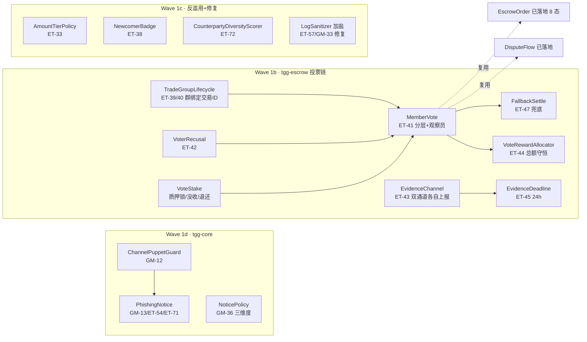

# 完整开发计划（基于 SPEC.md × 实测代码）

> 制定日期：2026-09-24（天梁域）· 规划基准：`SPEC.md`（115 项）+ `docs/CODE-VS-SPEC.md`（31 项已落地实测）
> 代码锚点已与现实核对：`tgg-escrow` 24 类在盘、Wave 1b 目标类全部不存在、`mvn test` 314 全绿（`9120f57`）。

## 需求提炼（托付意图）

**目标**：把剩余 84 项按可开工性排成完整执行计划，立即推进零依赖波次（Wave 1b→1d），
被外部依赖/决策阻塞的 60+ 项列触发条件待解锁。

**非目标**（承袭 SPEC 第 1 节）：不接真实 TON（S5 待 C1）、不做 Web 前端（S6 待立项）、
不决定商业参数（B1–B5）、不引入 Agentic Wallets（M）、不采用需助记词的 SDK。

**验收证据**（每波）：TDD（RED 编译失败 → GREEN）→ 全量 `mvn test` 不低于上一波 → scoped 提交 → push。

## 架构（本计划新增类的落位）

## 分波（任务 ≥4，每波闭环再开下一波）

### Wave 1b — 投票与留痕链（tgg-escrow，纯逻辑零依赖）【立即开工】
| 类 | 编号 | 关键规格（含 08/SPEC 修订） | 测试要点 |
|---|---|---|---|
| `TradeGroupLifecycle` | ET-39/40 | 五态：待建→已关联→留痕中→静默期→已归档；**群与交易 ID 绑定**（每笔新交易新建群、不复用，08-1.2） | 绑定唯一性、7 天归档/静默、争议终止静默 |
| `VoterRegistry` | ET-41 | **分层**：≥20 笔权重 3 / ≥10 权重 2 / ≥5 权重 1 / **观察员 ≥1 笔无投票权**（08-1.3）；投票人数不足移交联邦 | 分层边界、观察员不可投票、人数不足兜底 |
| `VoterRecusal` | ET-42 | 与买卖双方近期有交易者排除；窗口可配置 | 边界窗口、买卖双方自身排除 |
| `VoteStake` | — | 质押锁/没收/退还三态守卫；1–5 USDT 范围 | 三态迁移 fail-closed、越界拒绝 |
| `MemberVote` | ET-41 | 发起/计票/加权结果判定；参与门槛；**投票截止**（含 Fallback 触发） | 加权计票、门槛、截止语义 |
| `FallbackSettle` | ET-47 | 截止未达阈值 → 自动兜底裁决（默认退款，可配） | 未达阈值兜底、达标不兜底 |
| `VoteRewardAllocator` | ET-44 | 押金分配给投对者 + 管理费划转联邦；**总额守恒**（分出 > 收入抛异常） | 守恒不变量、空获奖者、按权重分 |
| `EvidenceChannel` | ET-43 | 双通道（群内记录 + 可选上链）**各自成功/失败分别上报**，一条失败不静默丢另一条 | 部分失败可观察、全成功 |
| `EvidenceDeadline` | ET-45 | 争议后 24h 提交窗口，**不随维护期暂停**；超时视为放弃 | 闭区间边界、暂停不影响 |

*验证*：`mvn -pl tgg-escrow -am test` 全绿 → 全量 `mvn test` ≥314 → scoped 提交 → push。

### Wave 1c — 反滥用 + 质量修复（tgg-escrow / tgg-core）【1b 后】
| 类/修改 | 编号 | 关键规格 | 测试要点 |
|---|---|---|---|
| `AmountTierPolicy` | ET-33 | ≤100 正常；100–1000 二次确认；≥1000 额外验证（阈值可配） | 三档边界（含等号归属定死） |
| `NewcomerBadge` | ET-38 | 前 3 笔标"新手"；**前 3 笔即便同一对手也计信用**，第 4 笔起互刷检测生效（08-2.1） | 第 3/4 笔边界、同一对手前 3 笔 |
| `CounterpartyDiversityScorer` | ET-72 | 同一对手 >60% 交易 → 标可疑 | 60% 边界、多对手均摊 |
| `LogSanitizer` 修复 | ET-57/GM-33 | **加部署级盐值（配置注入）+ 输出加长（48 bit）**（SPEC 6.2，实测现状无盐/24bit） | 盐值生效（同 ID 不同盐不同哈希）、碰撞空间、兼容不改公开签名 |

### Wave 1d — 群管理纯逻辑（tgg-core）【1c 后】
| 类 | 编号 | 关键规格 | 测试要点 |
|---|---|---|---|
| `ChannelPuppetGuard` | GM-12 | 删以频道名义发送的消息，白名单控制 | 白名单放行、傀儡删除、白名单为空 fail-closed |
| `PhishingNotice` | GM-13/ET-54/ET-71 | 防钓鱼文案库（含 **Permit Signature 警示**、comment 钓鱼、账号劫持）；**合并 GM-13/ET-74 为一处定义** | 文案含三类、周取模轮换 |
| `NoticePolicy` | GM-36 | **三维度决策**：可见范围（永久/临时）×是否推送（响铃/静默）×是否留存——互不混淆（SPEC 6.6） | 静默≠临时、关键节点恒永久+留存 |
| `JoinOnboarding` | GM-35 | 首次使用引导流程状态机 | 四态守卫、可跳过语义 |
| `AnomalyDetector` | GM-27/ET-73 | 行为突变检测（阈值可配）→ **仅标可疑、需人工复核**（不做自动处罚） | 突变判定、正常换设备不误杀 |

### Wave 2+（阻塞待解锁，触发条件列明）
| 波 | 内容（约 60 项） | 触发条件 |
|---|---|---|
| Wave 2 · S1 Bot 接线 | GM-01/02/04/09/20/21/28 + ET-01 收口 + 通知推送链（ET-36/62/77~79） | **A2 Bot Token** + `GroupAdminPort`（接口可先写） |
| Wave 3 · 持久化 | GM-03（warnings 表）/ 违禁词在线管理 / messageId 映射 / 用户偏好（SPEC 9.2） | V2 Flyway 迁移（可移植 DDL） |
| Wave 4 · S6 Web 层 | ET-07/08/22/31/32/34/37 + Mini App（GM-15 交互） | **I 立项决定** + S1 |
| Wave 5 · S5 合约 | ET-10/11/17/19/20/21/48/50~53/56/58/59 + S4 | **C1 多签语义** + D（TON 确认数核实） |
| Wave 6 · 商业规则 | ET-03/04/29/30/33 上线/35/60/61/64~71 | **B1/B2/B3/B4** 拍板 |
| Wave 7 · 排名 | ET-75~80 | **B3**（5 点澄清）+ 聚合查询（Wave 3） |

## 验证口径（逐波核销）

1. **TDD**：先写测试（RED：目标类不存在→编译失败，退出码 1）→ 实现 → GREEN。
2. **每波**：`mvn -pl tgg-escrow -am test` 或 `-pl tgg-core -am test` 全绿 → **全量 `mvn test`**（≥314 不回退）→ 提交信息含新增测试数 → push。
3. **不变量专项**：VoteRewardAllocator 总额守恒、VoteStake 三态 fail-closed、EvidenceDeadline 闭区间、LogSanitizer 加盐生效。
4. **无法执行的验收**（明示未验证）：Telegram 用户级验收（需 S1+token）、链上行为（需 S5）。

## 回归清单（不得回退）
`EscrowOrderTest`（8 态守卫）· `TradeAdmissionGateTest`（三规则）· `EscrowTradeServiceTest`（被拒不落单）·
`TradeTimeoutPolicyTest`（**DISPUTED 永不超时**，31ca60f）· `FederationKeyPairTest`（Ed25519 契约）·
tgg-core 全部 152 项（含 G-A/G-B）· tgg-app 8 项（S2 集成）。
