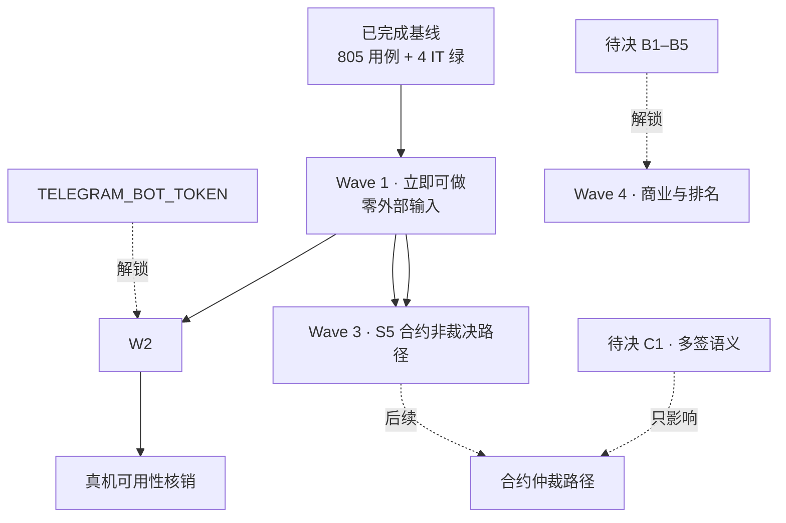

# 开发计划（2026-09-25 · 实测重建版）

> **取代** `2026-09-24-full-dev-plan.md`（已完全消耗：其 Wave 1b–1d 的 17 个类实测全部已存在）。
> 规划基准不是文档转述，而是**实测**：HEAD `7f38d6b`、main 164 类 / test 107 类、
> `mvn verify` **805 用例 + 4 个 IT 全绿**、落地判定见 `docs/CODE-VS-SPEC.md`
> （**该文的计数会随审计更新，不要在本页写死数字**——初稿写死过一次，审计后即失效）。

## 需求提炼

**目标**：在"文档已重建、现状已实测"的基础上，把剩余工作排成**可开工、可验收**的顺序——
优先推进**不依赖任何人拍板、不依赖任何凭证**的项；把必须依赖外部输入的项显式挂上触发条件，
不再让它们混在"待办"里制造虚假进度感。

**非目标**（承袭 SPEC 与既有约束）：不接真实资金（S5 未部署前，一切"资金"仅为状态登记）；
不引入调度器（项目既定非目标，改用**惰性判定**，见 Wave 1.1）；不改商业参数（B1–B5 待拍板）；
不新增第三方依赖；不重写 14 份溯源材料。

**验收证据**（每波逐条核销）：TDD（RED→GREEN）→ 全量 `mvn verify` 测试数不回退 → scoped 提交 → push。

## 现状基线（实测，2026-09-25）

| 结构项 | 状态 | 证据 |
|---|---|---|
| S1 Bot 接线 | ✅ 已完成 | `BotWiring` / `BotDispatcher` / `TelegramBotHandler`；`/escrow …` 命令链通 |
| S2 命令层 | ✅ 已完成 | `TradeCommandHandler`（含 ET-34 两步流 `PendingTradeRegistry`） |
| S3 Bot 内 6 项入口 | 🟡 部分 | ET-01/02 已接线；ET-03/04/05/06 为 C 级（有类未接线） |
| S4 真实链上源 | ❌ 未做 | `BalanceCrossVerifier` 在，但无 `HttpChainSource` |
| S5 TON 合约 | ❌ 仅骨架 | `contracts/EscrowContract.tolk` 可编译（Acton v1.2.0），资金逻辑未写、未部署 |
| S6 Web/Admin | ✅ 部分完成 | `TradeApiController` / `TradeInviteController` / `WebAppInitDataVerifier`；无前端页面 |
| 真机核销 | ⚠️ 0/3 | `ONLINE-VERIFICATION.md` 的 A9/A10/A11 全部未验（缺 token） |

## 依赖与阻塞图

**读图要点**：C1 只决定**仲裁**语义，而托管/交付/放款/退款**不依赖它**——所以 S5 不必整体等 C1
（这是本次规划相对旧计划的关键调整：旧计划把整个 Wave 5 挂在 C1 上，把可做的工作一起冻住了）。

## Wave 1 · 立即可做（零外部输入）

### 1.1 「缺调度器」逐项判定并收口
**为什么先做这个**：`CODE-VS-SPEC.md` 里大量 C 级项把"缺调度器"列为阻塞，但**这个阻塞被高估了**——
本会话已证明可用**惰性判定**替代（`JoinBurstGuard` 的冷却期解除、`TradeTimeoutPolicy` 的到期结算），
项目也明确不引入调度器。做法：对每个"缺调度器"项判定属于哪一类——
**可惰性化**（下次交互时结算即可，如归档/静默期/到期确认）→ 直接接上；
**真需定时**（无人交互也必须发生，如入群验证 60s 超时踢出、禁言定时解除）→ 单独列出，作为"要么接受降级、要么改非目标"的决策项交用户。

### 1.2 五个「已落地·未接线」项逐项补缺件或明确不接
`AdminRegistry` / `ChannelPuppetGuard` / `FeatureToggle` / `JoinOnboarding` / `ReplayGuard`。
每项的缺件已逐一记录在 `.rivet/HANDOFF.md`（如 `ReplayGuard` 无 nonce 源、`FeatureToggle` 的
fail-closed 对保护类功能是反向的）。**结论必须是"接上"或"明确不接并说明"**，不留悬空。

### 1.3 `LogSanitizer` 加盐（SPEC 6.2 的既有质量缺陷）
无盐 + 仅 24bit → 可字典反推、大用户量碰撞。要求：部署级盐值（配置注入）+ 输出加长。
零依赖、可立即做。

### 1.4 `BannedWordMatcher` 换 Trie（可选，视词表规模）
现有逐词 `contains`，词表大时有性能压力。

> **验证（每小项独立）**：先写 RED（目标类不存在→编译失败，或新断言失败）→ 实现 → `mvn verify`
> 全量不回退（当前基线 805 + 4）→ scoped 提交 → push。

## Wave 2 · 需 `TELEGRAM_BOT_TOKEN`（真机核销）

把 `ONLINE-VERIFICATION.md` 的 A9/A10/A11 逐条核销，并把 `CODE-VS-SPEC.md` 里 30 个 A 级项
各走一遍"用户做什么→看到什么"的真机路径。
**触发条件**：用户提供 token（或授权真机执行）。**未提供时整波标记 blocked**，不得声称已验证。

> **验证**：`ONLINE-VERIFICATION.md` 逐项打勾并记录观察；失败项回写为缺陷。

## Wave 3 · S5 合约（非裁决路径先行，不等 C1）

只做 `fund / deliver / release / refund` 的链上实现与守卫（`impure` 修饰、减法前验余额、
乱序消息不越级迁移）。**仲裁（`dispute / resolve`）留待 C1 拍板**。
依据：C1 只定义多签语义，非裁决路径的正确性不依赖它；`EscrowContract.tolk` 骨架与 Acton 工具链已就绪。

> **验证**：`~/.acton/bin/acton build` exit 0（⚠️ **acton 不在 PATH**，执行须用全路径）→ `~/.acton/bin/acton test` 全绿 →
> `~/.acton/bin/acton simulator` 本地部署跑资金路径 → Gas 基线（`--gas-profile`，对应 ONLINE-VERIFICATION B2）。

## Wave 4 · 需 B1–B5 拍板（商业与排名）

ET-29/30（平台费/联邦费用划转，B1）、ET-35（首单保障，B2）、ET-22（KYC 口径，B4）、
ET-75–80（信用排名，B3 的 5 点澄清）。**逐项都已列在 `UNDECIDABLE-DECISIONS.md`**，拍板即可开工。

> **验证**：每项 TDD + 全量 `mvn verify`。

## 反证 / 复现

本计划的每条基线断言都能被复算或复现，作者已在会话内实测；接手者请自行复算**不要采信本页数字**：

| 断言 | 复现命令 | 期望 |
|---|---|---|
| 805 用例 + 4 IT 全绿 | `TGG_DB_NAME=tgg_verify TELEGRAM_BOT_TOKEN=<合法格式假值> mvn verify` | `BUILD SUCCESS`；surefire 805 + `EscrowPersistenceIT` 4 |
| main 164 / test 107 类 | `find */src/main -name '*.java' \| wc -l` 与同法数 test | 164 / 107 |
| 落地分级计数 A30/B5/C60/D15/E4 | `awk -F'\|' '/^\| (GM\|ET)-[0-9]+/{print $4}' docs/CODE-VS-SPEC.md \| sort \| uniq -c` | 26 A + 4 **A** + 5 B + 60 C + 15 D + 4 E |
| 旧计划已被消耗 | 抽查其 Wave 1b 的类是否存在：`ls tgg-escrow/src/main/java/com/tg/escrow/escrow/MemberVote.java` 等 | 均存在 |
| S5 仅有骨架 | `cat contracts/EscrowContract.tolk` | 主体为注释 + 一个只拒绝入站消息的 `onInternalMessage` |

**已知不可复现项（不得当结论）**：真机行为（A9/A10/A11）——无 token；链上行为——合约未部署。
**本计划的自身局限**：`CODE-VS-SPEC.md` 的分级以"类存在 + 本会话读过的调用链"为证据，
未逐类做行为级核实；E 级（4 项）即"作者没证据"，不等于"没做"。

## 回归清单（不得回退）

`EscrowOrder`（8 态 + fail-closed 守卫）· `TradeAdmissionGate`（三规则）· `TradeTimeoutPolicy`
（**DISPUTED 永不超时**）· `TradeCommandHandler`（ET-34 两步流不可被绕过）· `MemberJoinHandler`
（保护模式真踢 + 踢人失败不谎报）· `JoinSubscriptionGate`（查不清不踢也不放行）· `JoinBurstGuard`
（惰性解除）· `TradeNotifier`（通知失败不回滚迁移）· `FederationKeyPair`（Ed25519 契约）·
`EscrowPersistenceIT`（装配可用——**surefire 看不到 Bean 图，改动 `BotWiring` 必跑它**）。
