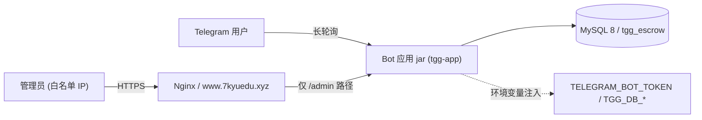

# 服务器部署与功能验证 — 设计文档

> 日期：2026-09-24　状态：**已获用户批准**　范围：部署到 141.164.50.75 并在真实环境验证
> 关联：`docs/ONLINE-VERIFICATION.md`（A 组依赖 Telegram / C 组依赖部署环境）

## 1. 背景与目标

代码侧（553 测试全绿）已具备担保交易核心能力，但从未在真实环境运行过 Bot。
用户提供 Bot Token 与已解析域名 `www.7kyuedu.xyz`（指向 141.164.50.75），要求
「直接在服务器上部署环境进行各种功能验证」。

**目标**：在服务器上跑通应用 + Telegram Bot，逐条核销 ONLINE-VERIFICATION 的 A/C 组。

**非目标**：不引入 Redis（代码未接入）、不做 TON 合约（待决 C1）、不建 Vue 前端（待 npm）、
不决定业务参数（待决 B1–B5）。

## 2. 前提：代码侧必须先补 S1

现状（实测）：`TelegramBotHandler`、`BotDispatcher`、`BotTokenConfig`、`BotReplyPort`（接口）
均在；**缺**：

1. `BotReplyPort` 的真实实现 —— TelegramClient 适配器（`sendText` / `ackCallback`）。
2. 启动装配 —— 读 `TELEGRAM_BOT_TOKEN` → 组装 handler 链 →
   `TelegramBotsLongPollingApplication.registerBot(token, handler)` → 常驻长轮询。

不补这两样，jar 启动后不收发任何消息（当前 `EscrowBotApplication` 仅有 `main`）。

## 3. 服务器环境（宝塔面板，均已核实未装）

| 组件 | 版本 | 说明 |
|---|---|---|
| JDK | `jdk-21.0.2` | 宝塔 JDK 管理器可装；根 pom 锁定 Java 21，勿用 17/25 |
| MySQL | 8.0 | tgg-escrow 用 mysql-connector-j + Flyway |
| Nginx | 最新稳定 | 反代 + 域名 |
| Redis | **不装** | 代码未接入（README 明说），装上为空转 |

内存预算（总 3.3 GiB）：JVM `-Xmx768m` + MySQL ~1 GiB + Nginx ~50 MiB。

## 4. 部署形态

- 构建：本地 `mvn package`（含 S1 补齐后的代码）→ 上传 `tgg-app/target/*.jar`
- 运行：宝塔「网站 → Java项目」注册（JDK21 + 端口 8080）
- 配置：环境变量注入下列 6 项（**不写入仓库任何文件**）：
  - `TELEGRAM_BOT_TOKEN`（Bot 凭证）
  - `TGG_DB_HOST`、`TGG_DB_PORT`、`TGG_DB_NAME`、`TGG_DB_USER`、`TGG_DB_PASSWORD`
    （与 `application.yml` 的占位符键名逐一对应）
- 数据库：建库 `tgg_escrow`，表由 Flyway 启动时自动迁移（V1/V2）

## 5. 安全策略（已定案：方案 a）

`AdminWordController`（`/admin/words`）**当前无鉴权**。用户选定 **Nginx 层限定白名单 IP**：

- Nginx `location /admin/` 加 `allow <部署者出口 IP>; deny all;`
- 该 IP 在实施第 4 波时向用户索取（用户在当地执行 `curl ifconfig.me` 即得），设计阶段不预设
- Bot 走长轮询不需入站端口
- 部署后必须验证：非白名单 IP 访问 `/admin/words` 被拒（403）

## 6. 验证口径

| # | 验证项 | 期望观察 |
|---|---|---|
| V1 | 应用启动 | 日志见 Flyway 迁移成功 + Web 容器起 + Bot 注册成功 |
| V2 | Bot 回执（A1） | 群里发 `/escrow create 2002 100 USDT` → 风险提示；`/escrow confirm …` → 「已创建订单 #N」 |
| V3 | 订单落库 | MySQL 查订单表见对应行 |
| V4 | Admin API 内网 | 白名单 IP curl `/admin/words` 可达 |
| V5 | Admin API 隔离 | 非白名单访问被 Nginx 拒（403） |
| V6 | 隐私模式留痕（A3，可选） | BotFather 关隐私模式 → 移除 → 重入群 → 普通消息可见 |

## 7. 波次

0. 补 S1 代码 + 测试（本地 TDD，可独立验证）→ 提交
1. 装 JDK21 / MySQL / Nginx
2. 建库 `tgg_escrow` + 用户
3. 构建 jar + 上传 + 建 Java 项目 + 配环境变量
4. Nginx 站点 + 域名 + Admin 白名单
5. 启动 + 验证 V1–V5 + 记录 ONLINE-VERIFICATION

## 8. 风险与遗留

- **内存偏紧**：3.3 GiB 跑 JVM+MySQL，需限堆；若加 Redis/前端需升配。
- **Bot Token 敏感**：已明文出现在对话中，建议验证通过后轮换。
- **S1 装配为新增代码**：需 TDD 覆盖（handler 链已有测试，补装配层测试）。
- **Admin 鉴权仅以 Nginx 缓解**：应用层仍无鉴权（C1），若将来公网化需补代码。
