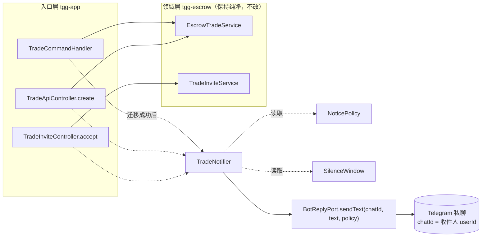

# 交易对手方通知（TradeNotifier）— 设计

> 状态：**待复核**（brainstorming 流程第 5 步产物）
> 日期：2026-09-25
> 落地方式：获批后转为实施计划（plan 工具），再进 TDD

## 1. 目标

让机器人能把**交易状态变化**主动告诉**没有发起该次操作的那一方**——补上担保流程里"对方
不知道发生了什么"的缺口。副产品：`NoticePolicy`（GM-36）与 `SilenceWindow`（G19）两个
零引用类获得真实生产消费者。

## 2. 非目标

- **不做调度器**：不做定时/轮询推送（维护期到期、禁言到期等仍不自动通知）。
- **不做群内公告**：本设计只做**私聊**一对一通知。
- **不改资金语义**：通知只描述"流程状态登记"，沿用既有 `CHAIN_CAVEAT` 的诚实边界。
- **不做重试/去重队列**：一次迁移一次通知，失败即放弃并留痕。

## 3. 现状（实测锚点）

- 出站文本的唯一出口是 `BotReplyPort`（`tgg-app/.../BotReplyPort.java:30`），三个方法
  （`sendText` / `sendTextWithWebApp` / `ackCallback`）全是"回执"语义；生产消费方**只有**
  `TelegramBotHandler` 一处。→ 当前不存在"主动通知"路径。
- `TelegramBotReplyAdapter`（`:47`）构造 `SendMessage` 时**从不设** `disableNotification`。
- 当事人：`EscrowOrder.getBuyerUserId()` / `getSellerUserId()`。
- 迁移入口（全部读实）：
  - `EscrowTradeService`：`initiate`(OPEN) / `cancel`(CANCELLED) / `lock`(LOCKED，仅买方) /
    `deliver`(DELIVERED，仅卖方) / `release`(RELEASED，仅买方) / `refund`(REFUNDED，双方) /
    `dispute`(DISPUTED，双方)。
  - `TradeInviteService.accept` → CONFIRMED（接受者即卖方）。
  - 入口调用方：`TradeCommandHandler`（命令）、`TradeApiController.create`（表单建单）、
    `TradeInviteController.accept`（深链接单）。
- **命令层不存在调用 `markConfirmed` 的路径**：`/escrow confirm` 是买方预览风险后的第二步
  （`pending.consume` 命中后走 `service.initiate`），落 **OPEN**；`CONFIRMED` 只经邀请接单到达。
- 库事实（`telegrambots-meta-10.3.0.jar` 实测）：`SendMessage.disableNotification(Boolean)`
  存在；`objects/ephemeral/EphemeralMessageParameters` 与 `ephemeralMessageParameters(...)`
  及一整族 `EditEphemeralMessage*` / `DeleteEphemeralMessage` 方法存在。

## 4. 事件 → 收件人

**统一规则**：收件人 = 订单当事人中**不等于操作者**的那一方。

```
recipient = (order.getBuyerUserId() == actorId) ? order.getSellerUserId() : order.getBuyerUserId()
```

服务调用成功返回后订单必然已存在（建单亦然），故一条规则覆盖全部迁移，**不依赖命令措辞**。
防呆：`actorId` 若既非买方也非卖方，`TradeNotifier` 不发送并返回 `RECIPIENT_UNREACHABLE`。

| # | 迁移 | 迁移后状态 | 操作者 | 收件人 | 触发入口 |
|---|---|---|---|---|---|
| 1 | 建单 `initiate` | OPEN | 买方 | 卖方 | `/escrow confirm`；`/api/trade/create` |
| 2 | 接单 `accept` | CONFIRMED | 卖方 | 买方 | `/api/trade/accept`（邀请深链） |
| 3 | 托管 `lock` | LOCKED | 买方 | 卖方 | `/escrow lock` |
| 4 | 交付 `deliver` | DELIVERED | 卖方 | 买方 | `/escrow deliver` |
| 5 | 验收放款 `release` | RELEASED | 买方 | 卖方 | `/escrow release` |
| 6 | 退款 `refund` | REFUNDED | 任一方 | 对方 | `/escrow refund` |
| 7 | 争议 `dispute` | DISPUTED | 任一方 | 对方 | `/escrow dispute` |
| 8 | 取消 `cancel` | CANCELLED | 任一方 | 对方 | `/escrow cancel` |

**刻意不通知的路径**：`/escrow create`（仅登记预览、未落单）、`/escrow invite`（未物化订单、
且尚不知对方身份）、`/escrow status`、`/escrow review`（非状态迁移）。

## 5. 通知策略（NoticePolicy / SilenceWindow 的落点）

| 事件 | NoticePolicy | 理由 |
|---|---|---|
| 1 建单 | `progress()`（永久 + 静默 + 留存） | 告知卖方"有交易指向你"，非资金动作 |
| 2 接单 | `progress()` | 告知买方"对方已接单"，非资金动作 |
| 3 托管 | `critical()`（永久 + 推送 + 留存） | 资金语义，必须响铃 |
| 4 交付 | `progress()` | 告知买方"对方已交付，待你验收" |
| 5 放款 / 6 退款 / 7 争议 | `critical()` | 资金语义，必须响铃 |
| 8 取消 | `progress()` | 状态机保证取消只可能来自 OPEN/CONFIRMED，资金未动 |

**静默窗口规则**：`SilenceWindow.isSilenced(now)` 为真时，**只压制非 `critical` 的响铃**；
`critical` 一概不静默。且落地时文案与注释都要点明：`disable_notification` **只影响响铃、
不影响送达**——静默绝不等于信息丢失。于是要调的是"哪些算关键"，而不是"要不要静默"。

## 6. 架构与数据流



**落点为什么在入口层**（而非领域服务内）：`EscrowTradeService` 属 tgg-escrow，注入通知通道会
把"回复 Telegram"这件外部事拖进纯净领域层，并使状态写入与通知失败混在同一调用里、事务语义
含糊。放入口层的代价是多个入口各调一次（本设计同批接 3 处），换来领域层零改动。

## 7. 组件

**新增 `TradeNotifier`（tgg-app）**
- 依赖：`BotReplyPort`、`Clock`、`SilenceWindow`（可缺省 = 不静默）。
- API：`NotificationOutcome notify(EscrowOrder order, long actorId, TradeEvent event)`
- 行为：算收件人 → 取事件的 `NoticePolicy` → 静默窗口判定 → 渲染文案 → 经 `BotReplyPort` 发送。
- 返回 `NotificationOutcome`（`SENT` / `RECIPIENT_UNREACHABLE`）而**不抛异常**——"发给对方失败"
  不是本层要上抛的事。

**新增 `TradeEvent`（tgg-app 枚举）**：8 个取值，各自携带 `policy` 与文案模板；收件人由 §4 规则算出，
不在枚举里硬编码角色。

**改 `BotReplyPort`**：新增 `void sendText(long chatId, String text, NoticePolicy policy)`；
原 2 参方法保留（等价中性策略）→ **现有调用点零改动**。

**改 `TelegramBotReplyAdapter`**：新方法把 `policy.silent()` 映射到 `SendMessage.disableNotification`；
`ephemeral` 本期不翻译（见 §9）。

**改 `TradeCommandHandler`**：`advance(...)` 增一个 `TradeEvent` 参数（5 处内部调用同批改），
迁移成功后调通知；`handleCancel` 与 confirm 分支各补一次。

**改两个 Web 控制器**：`create` / `accept` 成功后调通知；响应体增一个布尔字段告知发起方
"对方是否可达"。

## 8. 错误处理

- **状态迁移永不因通知失败而回滚**：通知发生在服务调用**成功返回之后**，不参与该事务。
- 发送失败 → `TradeNotifier` 捕获 `TggException` → 返回 `RECIPIENT_UNREACHABLE`，并留痕。
- 入口层在 `RECIPIENT_UNREACHABLE` 时**回告发起方**（不静默失败）：
  - 命令路径：回执尾部追加"⚠️ 对方尚未与机器人开始对话，可能收不到通知，建议另行告知"；
  - Web 路径：响应回 `notified: false`。
- 不重试、不入队（见 §2 非目标）。

## 9. 诚实边界与未核实项

**本轮已核实**：`SendMessage.disableNotification` 存在；`telegrambots-meta-10.3.0` **支持**临时消息
（`EphemeralMessageParameters`、`ephemeralMessageParameters(...)`）。→ 但本设计 8 个事件**全部**
落在 PERMANENT 策略上，ephemeral 映射**用不到**，留待将来真有 ephemeral 场景时再补。

**未核实（不得当结论）**："Telegram 机器人只能向曾与它会话的用户发起私聊"——两次抓
`core.telegram.org/bots/api` 均超时，未取得官方原文。**本设计不依赖它成立**：任何发送失败
（对方屏蔽、bot 被删、网络）都走同一条 fail-soft 路径。

**发现的既有缺陷（本设计不修，另行处置）**：`TradeCommandHandler.statusHint` 对 `OPEN` 提示
"`/escrow confirm <卖方ID> <金额> <币种>`（卖方接单）"，但命令层没有卖方接单路径——该提示会把
用户引向一条做不到承诺的命令。

## 10. 验证方式（TDD）

先写 RED（预期失败），再实现至 GREEN：

1. `TradeNotifierTest.buyerLockNotifiesSeller` —— 买方 `lock` 后卖方应收到通知（当前无此路径 → 红）。
2. `TradeNotifierTest.recipientIsAlwaysTheNonActor` —— 8 个事件逐条断言收件人。
3. `TradeNotifierTest.sendFailureDoesNotThrowAndReportsUnreachable` —— 发送抛 `TggException` 时
   返回 `RECIPIENT_UNREACHABLE` 且不冒泡。
4. `TelegramBotReplyAdapterTest.silentPolicySetsDisableNotification` —— `policy.silent()` →
   `SendMessage.disableNotification == true`。
5. `TradeNotifierTest.criticalEventIsNotSilencedInSilenceWindow` —— 静默窗口内 `critical` 仍响铃；
   非 `critical` 被静默。
6. `TradeCommandHandlerTest.lockStillSucceedsWhenNotificationFails` —— 通知失败时回执仍报成功，
   且追加"对方可能收不到"的提示。

GREEN 验收：`mvn -pl tgg-app -am test` → 全量 `mvn verify`（含 `EscrowPersistenceIT`）。

## 11. 回归清单

| 锚点 | 验证方式 |
|---|---|
| 全量 766 绿不降 | `mvn verify` |
| 原 `sendText(chatId, text)` 调用行为不变 | `TelegramBotHandlerTest` |
| 生命周期命令回执文案不变（未新增提示时） | `TradeCommandHandlerTest` |
| Web 入口响应向后兼容（新增字段不破坏既有断言） | `TradeApiControllerTest` / `TradeInviteControllerTest` |
